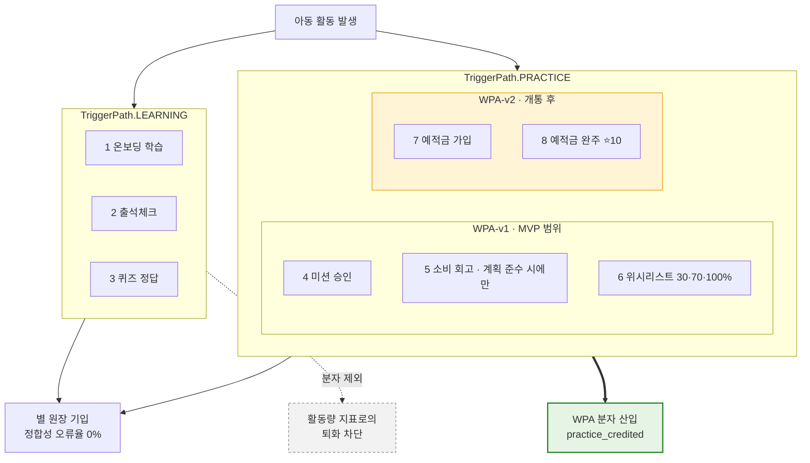
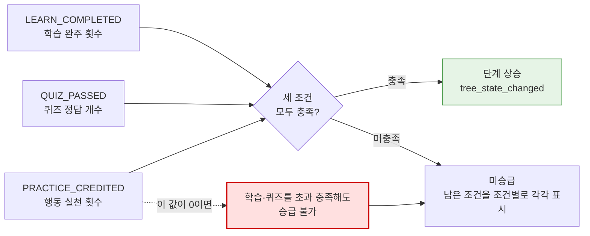
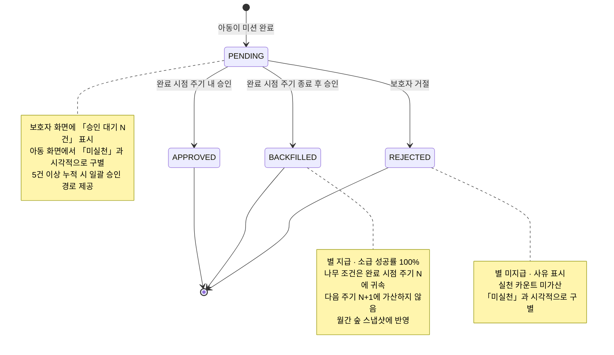
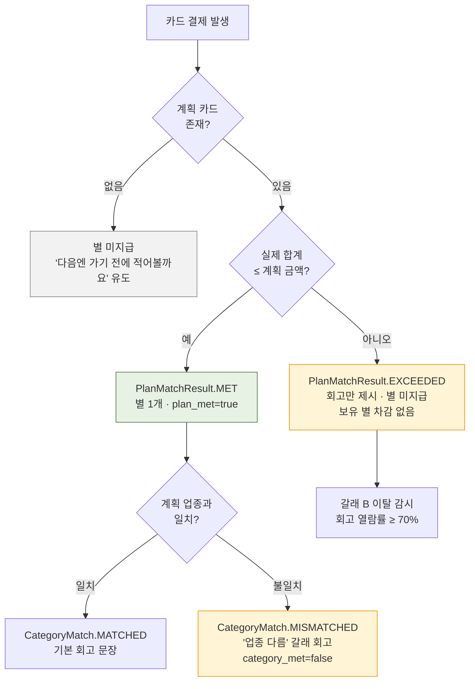

# [SRS 문서] 핀프렌즈 (FinFriends) · 한글

# 소프트웨어 요구사항 명세서 (SRS)

**문서 ID:** SRS-FINFRIENDS-MVP-001

**개정 버전:** 1.0

**날짜:** 2026-08-24

**표준:** ISO/IEC/IEEE 29148:2018 — §1~§7은 사내 축약 양식, §8~§11은 해당 조항에 따른 **부분 확장**

**입력 문서**
- `[PRD]FinFriends-PRD-v1_0.md` — 핀프렌즈 PRD v1.0 (2026-08-24 · `new-rim/finfriends-prd-to-srs` 저장소)
- `2차프로젝트/공용공간/0. 확정 기능 정의/기능정의_v13.md` — v13 확정 사양 (2026-08-20 · 2026-08-21 개정)
- 변환 규격 — `new-rim/finfriends-prd-to-srs` README §1·§2 (축약 포맷 기준선 · 제약 승계 5항)
- `2차프로젝트/프로토타입/` — 화면 10개 (§5 추적성의 화면 열)

> 위 상대 경로는 **본 문서의 위치(`team_pjt/`)** 를 기준으로 한다.

---

## 1. 서론

### 1.1 목적

본 문서는 ISO/IEC/IEEE 29148:2018에 따라, **학습한 금융 지식을 실제 돈 행동으로 잇고 그 변화를 보호자가 읽을 수 있게 하는 아동 금융교육 플랫폼**의 요구사항을 정의한다.

본 시스템의 두 가치 선언은 다음과 같으며, **모든 요구사항은 이 둘 중 하나에 귀속**된다.

- **선언 ①** — 아이에게 **성장이 일어난다** (학습 → 실천)
- **선언 ②** — 그 성장이 보호자에게 **보인다** (실천 → 변화의 증거)

선언 ①은 ②의 전제다. 아이가 실천하지 않으면 보호자 화면은 **거짓말을 하지 않고 비어 있을 뿐**이고, 그 빈 화면이 *"우리 애가 안 하는구나"* 로 읽힌다. 따라서 북극성 지표는 선언 ①에 걸려 있다(§9.1 · ADR-001).

### 1.2 범위

- 4영역(**벌기 · 잘 쓰기 · 모으기 · 불리기**) 학습 커리큘럼 및 퀴즈 — **4/4 전부 금융 주제**
- **실천 판정** — 미션 승인 · 소비 회고 · 위시리스트 달성의 3경로 (MVP 기준)
- **별 지급 엔진** — 트리거 8종 · 차감형 · 주기 초기화 없음 · 저금통과 완전 분리
- **성장 나무 · 월간 숲** — 누적 수치가 아니라 **전월 대비 변화**를 제시하고, 정체 시 **원인을 조건 단위로** 표시
- **소비 계획 카드 및 계획↔실제 업종별 대조** — 결제 **전** 기록 + 결제 **후** 두 갈래 회고(지킴 ⭐1 / 넘김 회고만)
- **보호자 온보딩 및 법정대리인 동의 게이트** — 동의 완료가 아동 화면 진입의 **선행 조건**
- **승인 지연 시 ⭐ 소급 지급** · **아동 3일 미접속 알림**
- 제휴사 위탁 구조(선불업 B안) 기반 **아동 선불카드 충전 · 결제 · 해지**
- **인앱 이벤트 10종** 수집 및 지표 배치

**명시적 범위 제외** — 아래는 누락이 아니라 **결정된 제외**이며, 근거는 §11 ADR에 있다.

| 제외 항목 | 근거 |
| --- | --- |
| **소비 순간 자동 개입**(위치 알림 · 사전 개입 트리거) | ADR-002 — **폐기된 기능**이며 로드맵에도 없다. 사전 수단은 계획 카드가 대신한다 |
| **위치정보 수집 일체** | ADR-002 — 요건을 회피한 것이 아니라 **요건이 발생하지 않는 구조** |
| 앱 외부 현금(세뱃돈 · 친척 용돈) · 친구 기능 · 모의투자 · 미션 사진 인증 | 제품 범위 결정(v13 §11) — 수동 입력 의존은 성장 기록의 정확성을 훼손하고, 뒤 둘은 대체재 동일 기능 + 아동 이미지 리스크 |
| 아동 대상 유료 구독 | ADR-005 — 보호자 · 아동 **모두 무료** |
| 마이데이터 · 표준 오픈뱅킹 연동 | 만 14세 미만 마이데이터 가입 불가(F-01) — **자체 카드 발급 + 폐쇄형 수집** 구조 필수 |

### 1.3 정의, 약어, 축약어

| 용어 | 정의 |
| --- | --- |
| WPA | Weekly Practiced Active — 주간 실천 인정 아동 비율. 본 시스템의 **북극성 지표**. 조작적 정의는 §9.1 |
| 4영역 | 벌기 · 잘 쓰기 · 모으기 · 불리기. 학습 · 나무 · 실천이 **공유하는 고정 분류**이며 화면 표기는 보호자·아동 동일 |
| 실천 트리거 | ⭐ 지급 사건 8종 중 **실천 경로**에 해당하는 것. MVP(WPA-v1)는 미션 승인 · 소비 회고 · 위시리스트 달성 **3종** |
| 학습 경로 | 트리거 1(온보딩 학습) · 2(출석체크) · 3(퀴즈 정답). **WPA 분자에서 제외**된다 |
| 계획 카드 | 결제 **전에** 아동 또는 보호자가 적는 소비 계획 — 어디서 · 업종 · 얼마까지 · 무엇을(선택) |
| 두 갈래 | 계획 준수 시 ⭐1 지급, 계획 초과 시 회고만 제시하고 ⭐ 미지급. **어느 쪽도 보유 별을 차감하지 않는다** |
| 성장 나무 | 4영역 각각의 진행 단계를 보여주는 **보호자 화면 전용** 뷰. 승급 조건은 학습 · 퀴즈 · **실천** |
| 월간 숲 | 월 단위 스냅샷. **전월 대비 델타**를 제시하며 초기화되지 않고 누적된다 |
| 주기 | 나무 성장 조건의 집계 단위. **벌기 · 잘 쓰기 · 모으기는 매달**, **불리기는 적금 시작일~만기**(v13 §3-1) |
| 별 원장 | ⭐ 증감의 **이중 기입** 장부. 현금 전환 필드가 **존재하지 않는다** |
| 소급 지급 | 보호자 승인이 지연돼도 아동의 **완료 시점**을 기준으로 ⭐를 지급하는 것 |
| 정체 | 특정 영역이 **주기 시작 후 14일 이상** 미상승한 상태 |
| AC / AC-E | Acceptance Criteria(수용 기준) / Exception AC(예외 · 실패 경로 수용 기준) |
| PASS · HOLD · FAIL | 모든 지표 · 수용 기준 · 실험의 **3구간 판정**. 통과선 이상 / 그 사이 / 실패선 이하 |
| `k/8` | 표본 8인 인터뷰 지표의 **정수 판정 표기**. 비율 표기를 쓰지 않는다 |
| C_child | 아동 1인당 월 원가. 손익분기 항등식의 우변 |
| MSCW | Must / Should / Could / Won't 우선순위 체계 |
| ADR | Architecture Decision Record — 결정 · 기각한 대안 · 서 있는 가설 · 뒤집히는 조건 · 대가의 기록 |

### 1.4 문서 지위 · 표기 규칙 · 인용 제약

> 입력 PRD가 명시한 제약을 **그대로 승계**한다. 본 절은 원 규격(README §2)의 5개 항을 SRS 안에서 강제하기 위한 절이다.

**① 결정과 수치를 구분한다 — 문서 지위**

| 구분 | 지위 | 해당 절 |
| --- | --- | --- |
| **확정된 결정** | 그대로 구현 대상 | §4.1 우선순위 · §4.2 규제 상수 · §1.2 범위 · §11 ADR 8건 |
| **실측 대기 수치** | 기준선 미확보 — **목표값을 달성한 성과처럼 기술하지 않는다** | §9.4 실험의 기준선 · §9.5 게이트 값의 근거가 되는 현행값 |
| **AC 역산 상한** | 확정된 상한이자 **테스트 대상** — 확정 SLO가 아님(ADR-007) | §4.2 REQ-NF-001 ~ 005 |

**② 등급 표기 승계** — `[A]` 학술·공공통계 · `[관측]` 팀 직접 확인 · `[추론]` 해석·모델값 · `[검증 대기]` 실험에 연결된 미검증 명제 · `[설계 확정]` v13 확정 사양 · ✍️`[합성 가설]` 페르소나·여정·Pain · 🧪`[모의]` 모의 응답(**Evidence 아님**).

**③ 인용 제약 — 이 SRS에서 금지되는 서술**

| # | 쓰지 말 것 | 대신 |
| :-: | --- | --- |
| 1 | 기준선 · 목표 수치를 **성과**로 인용 | *"실측 전 목표값이며 실측 후 확정"* |
| 2 | **「소비 순간 자동 개입」을 제공 기능 또는 로드맵**으로 기술 | *"가기 전에 적고, 쓴 뒤에 맞춰본다"* — 자동 트리거는 **폐기**(ADR-002)이며 로드맵에 없다 |
| 3 | 매장 체류 기반 알림(지오펜싱) 서술 | **사실이 아니다.** 위치정보를 일절 수집하지 않는다 |
| 4 | *"대체재는 확인 기능이 없다"* | *"확인은 됩니다. 그게 성장인지 알 수 없는 것이 문제입니다."* |
| 5 | 기회점수(AOS · DOS)를 *"검증됨"* 으로 인용 | *"합성 가설 위의 분석자 판단값이며 순위 비교용"* |
| 6 | **「유료 전환율」** 을 수익 지표로 | **카드 연결률 · 월 결제액**(무료 확정 · ADR-005) |
| 7 | *"성장했습니다"* 로 효과를 단정 | *"설계상 그렇게 되도록 만들었다"* 까지 |
| 8 | **「금융 순도(4/4 금융)」를 확정 차별점**으로 단정 | 가정 A1이 미검증이다 — E6 판정 전까지 **실천 연결**만 앞세운다 |
| 9 | *"국내 3사 전부 활동량 요약 수준"* 으로 단정 | 경쟁사에 **또래 비교 · 분석 항목이 존재**한다 — E11에서 실제 화면을 확인한 뒤 기술한다 |
| 10 | OECD · PISA 금융이해력 관련 국내 수치 인용 | **한국은 PISA 2022 금융이해력 평가 미참여** — 해당 인용을 쓰지 않는다 |

> 위 10항목은 입력 PRD §9-2의 금지선을 **그대로 승계**한 것이다. SRS 문맥에 맞게 문장만 조정했고, 변환 규격 README §2-3이 강조한 지오펜싱 서술을 3행으로 명시했다.

**④ 미대응 상태를 감추지 않는다** — 소비 직전 **자동** 개입은 **대응 기능이 0개**다. 계획 카드는 **아동 또는 보호자가 먼저 적어야** 작동하므로, 사각지대는 없어진 것이 아니라 **「계획을 적지 않은 소비」로 옮겨간** 것이다(§10.4 R1 · R8 · ADR-002).

---

## 2. 이해관계자

| 역할 | 이름 / 부서 | 책임 |
| --- | --- | --- |
| 제품기획 | 유림 / 기획팀 | 요구사항 확정 및 우선순위 결정 · 본 SRS 승인 |
| 정책·법령 | 병윤 / 기획팀 | 규제 상수(§4.2) 검증 · 법률 검토 과제 관리 · 제외 경로 감사 |
| 경쟁·리뷰 | 하영 / 기획팀 | 대안 대비 벤치마크 · 경쟁사 분기 재점검(E11) |
| 서비스분석 | 혜원 / 기획팀 | 지표 정의 · 측정 경로 설계 · 판정 운영 · 본 SRS 작성 |
| 개발팀 리드 | 개발팀 | 설계 검토 및 승인 · 아키텍처 재검토 트리거 판정 |
| 개발 엔지니어 | 개발팀 | 구현 및 단위 테스트 |
| 개발 온콜 | 개발팀 | 규제 · 정합성 · 보안 알림 1차 수신 및 **30분 내 확인** |
| 제품 담당 | 기획팀 | 북극성 · 실천 · 인정 지표 감시 및 주간 리뷰 |
| 콘텐츠 담당 | 기획팀 | 학습 4영역 원고 · **회고 문장 풀** 관리 및 확장 |
| 사업 담당 | 사업팀 | 제휴 계약 조건 · 수수료율 · 원가(C_child) 감시 |

---

## 3. 시스템 맥락 및 인터페이스

- **클라이언트 애플리케이션** — 단일 앱 내 **두 화면군으로 분리**
    1. **아동 화면** — 온보딩 · 홈(아바타 · 옷장 · 별) · 학습(커리큘럼 · 출석 · 퀴즈) · 내 통장(미션 · 계획 카드 · 계획↔실제 대조 · 위시리스트)
    2. **보호자 화면** — 온보딩 · 동의 · 성장 나무 · 월간 숲 · 아이 통장(보호자용 — 아동 화면의 「내 통장」과 별개 · 충전 · 미션 관리 · 이자율 설정) · 소비 내역 · 마이페이지
    3. 아동 화면 진입은 **보호자의 법정대리인 동의 완료를 선행 조건**으로 한다 (REQ-NF-008)
    4. 🌳 성장 나무는 **아동 화면에 두지 않는다** — 아동의 동기 장치는 옷장이고 실천 유도는 별 지급 규칙이 전담한다 (v13 §3)
- **내부 서비스**
    - **Learning Service** — 4영역 커리큘럼 · 퀴즈 · 출석 · 이수 판정
    - **Practice Service** — 실천 판정(미션 승인 · 소비 회고 · 위시리스트) · 소급 지급 · 주기 귀속
    - **Star Ledger Service** — ⭐ 증감 이중 기입 · 멱등 처리 · 일일 정산 · 옷장 차감
    - **Growth Service** — 나무 단계 · 조건 판정 · 정체 판정 · 월간 숲 스냅샷 · 델타 산출
    - **Plan & Spending Service** — 계획 카드 · 결제 매칭 · 두 갈래 회고 · 문장 풀 · 업종별 집계
    - **Consent & Account** — 보호자 · 아동 계정 · 동의 게이트 · 온보딩 단계 저장
    - **Notification Service** — 72시간 미접속 판정 · 채널 분기 · 발송 시간대 조정
    - **Event Collector** — 인앱 이벤트 10종 적재 · 오프라인 보정 · 지표 배치
    - **Partner Gateway** — 제휴사 연동 어댑터(충전 · 결제 내역 · 카드 발급 · 해지)
- **외부 시스템**
    - **제휴사(선불업 등록 보유)** — 선불전자지급수단 발행·관리 · **선불충전금 100% 별도관리** · 카드 발행 · 가맹점망 · 결제 원장
    - **본인인증 서비스** — 보호자 실명 확인
    - **푸시 알림 인프라** — 미접속 알림 · 승인 알림

> **경계** — 브랜드 · 앱 · 4영역 학습 · 실천 판정 로직은 **본 시스템**이, 선불전자지급수단 발행 · 충전금 별도관리 · 카드 발행 · 가맹점망은 **제휴사**가 담당한다(ADR-004).
> **이용한도와 업종 제한은 제휴사 정책에 종속**되며 본 시스템이 정할 수 없다(REQ-NF-015).
>
> **배포 형상** — 위 내부 서비스 9종은 **배포 단위가 아니라 모듈 경계**다. 전부 **단일 Next.js(App Router) 애플리케이션** 안의 모듈로 구현하며 별도 백엔드 서버를 두지 않는다(§4.4 C-TEC-001 · 002).

---

## 4. 구체적 요구사항

### 4.1 기능 요구사항

| ID | 제목 | 출처 | 우선순위 | 유형 | 검증 방식 | 인수 기준 | 상태 | 담당자 |
| --- | --- | --- | --- | --- | --- | --- | --- | --- |
| **REQ-FUNC-001** | 성장 나무 — 4영역 단계 · 실천 근거 · 정체 원인 | PRD §4-1 F1 · v13 §3-1 | Must Have | Functional | 1) 화면 검수 · 2) 5초 노출 회상 테스트 · 3) 열람률 계측 · 4) 승급 규칙 단위 테스트 | 4영역 각각의 단계와 **진도율 · 퀴즈 정답률 · 미션 수행률**을 실시간 표시하고 **실천 근거를 기본 노출**해야 한다. **주기 초기화는 영역마다 다르다**(§6.2.1). 특정 영역이 **14일 이상 미상승**하면 **미충족 조건을 조건 단위로 전부 표시**한다 → §9 AC-3.1 · ACE-3.1 | Proposed | 개발 엔지니어 |
| **REQ-FUNC-002** | 미션 루프 — 조건·금액 사전 설정 → 승인 → ⭐1 | PRD §4-1 F2 · v13 §2 | Must Have | Functional | 1) 미션 CRUD 테스트 · 2) 승인 상태 전이 테스트 · 3) 화면 검수 | 보호자는 미션 조건과 금액을 **사전 설정**할 수 있어야 하며, 승인 시 ⭐1이 지급되고 **실천 카운트에 가산**되어야 한다. **거절 시 ⭐ 미지급 + 사유 표시**하고 아동 화면에서 **「미실천」과 시각적으로 구별**하며 실천 카운트에 가산하지 않는다. 승인 대기 상태도 「미실천」과 구별되어야 한다 | Proposed | 개발 엔지니어 |
| **REQ-FUNC-003** | 학습 커리큘럼 4영역 · 퀴즈 · 출석 | PRD §4-1 F3 · v13 §8·§9 | Must Have | Functional | 1) 이수 판정 테스트 · 2) 콘텐츠 · 문구 검수 · 3) 완주율 계측 | **4영역 전부가 금융 주제**여야 하며(4/4), 각 영역의 학습 이수와 퀴즈 정답 수가 **나무 승급 조건의 입력으로 기록**되어야 한다. 퀴즈는 **해설을 동반**한다. 「불리기」는 **한 줄 설명과 함께 노출**하고, 실천 경로가 닫힌 동안 **"곧 열려요"** 안내를 표시한다. 출석 스트립에 **끊김 벌칙·감소 연출을 두지 않는다**(P-23) | Proposed | 콘텐츠 담당 |
| **REQ-FUNC-004** | 별 지급 엔진 — 트리거 8종 · 차감형 · 초기화 없음 | PRD §4-1 F4 · v13 §4 | Must Have | Functional | 1) 트리거별 지급 테스트 · 2) 멱등성 테스트 · 3) 원장 이중 기입 감사 · 4) 전환 경로 부재 정적 분석 | **트리거 8종**에 대해 ⭐ 증감을 **이중 기입**해야 한다(트리거별 지급량 §6.2.2). 별은 **차감형**이며 **주기 초기화가 없고**, **현금 충전 · 환급 · 양도 · 거래 경로가 코드에 존재하지 않아야** 한다. **실천 경로 트리거만** 실천 카운트에 가산한다 | Proposed | 개발 엔지니어 |
| **REQ-FUNC-005** | 아바타 · 옷장 | PRD §4-1 F5 · v13 §8 | Must Have | Functional | 1) 별 잔액 연동 테스트 · 2) 에셋 · 스키마 검수 | 아동은 보유 ⭐로 **사전 제작된** 아이템을 교환할 수 있어야 하며, 교환 시 별 원장에 차감이 기입되어야 한다. 홈 화면에 **보유 별과 다음 아이템까지 남은 별**을 표시하고, 잔액 부족 시 잠금 상태를 명시한다. **얼굴 이미지를 수집하지 않는다**(P-13) | Proposed | 개발 엔지니어 |
| **REQ-FUNC-006** | 아동 온보딩 — 학습 → 퀴즈 → ⭐1 → 아이템 제시 | PRD §4-1 F6 · v13 §7 | Should Have | Functional | 1) 퍼널 계측 · 2) 동의 게이트 테스트 · 3) 화면 검수 | 첫 보상 루프가 **5분 이내**에 닫혀야 한다(학습 → 퀴즈 → ⭐1 → **⭐1로 살 수 있는 아이템 제시**). 보호자 동의 미완 상태에서는 **진입이 차단**되어야 한다 | Proposed | 개발 엔지니어 |
| **REQ-FUNC-007** | 보호자 온보딩 5단계 및 법정대리인 동의 | PRD §4-1 F7 · v13 §8 | Must Have | Functional | 1) 단계 재개 테스트 · 2) 동의 게이트 자동 테스트 · 3) 외부 API 실패 시나리오 | 본인인증 → **동의** → 계좌 연결 → 카드 신청 → 자녀 초대·카드 등록을 **세션 분할로 진행**할 수 있어야 하며 재진입 시 **재입력 항목 0건**. **동의 단계는 캐시하지 않고 세션 만료 시 재확인**한다. 카드 신청 외부 API 실패 시 입력값을 **24시간 보존**하고 사유를 사용자 언어로 표시한다 | Proposed | 개발 엔지니어 |
| **REQ-FUNC-008** | 소비 계획 카드 및 계획↔실제 업종별 대조 | PRD §4-1 F8 · v13 §5 | Must Have | Functional | 1) 결제 매칭 정확도 대조(표본 50건) · 2) 두 갈래 분기 테스트 · 3) 작성률 계측 · 4) 문장 풀 잔여율 모니터 | 계획 카드는 **어디서 · 업종 · 얼마까지**를 필수로 받고, 업종은 **카드 승인 업종 코드와 대조 가능한 값**이어야 한다(입력 항목 §6.2.5). 결제 발생 시 자동 매칭하며 **정확도 ≥ 90%**. 판정은 **금액 단독**이고(ADR-008), 계획 카드가 없는 결제는 **⭐ 미지급 + 작성 유도**를 노출한다 → §9 AC-4.1~4.4 | Proposed | 개발 엔지니어 |
| **REQ-FUNC-009** | 월간 숲 — 전월 대비 변화 제시 | PRD §4-1 F9 · v13 §3-2 | Must Have | Functional | 1) 델타 산출 테스트 · 2) 인터뷰 지목 테스트 · 3) 화면 검수 | 4영역 최종 단계 · 학습 · 실천 · 소비 집계를 **한 화면에 정리**하고 **전월 대비 변화 항목을 7개 이상** 렌더해야 한다. 전월 데이터가 없으면 **델타 0으로 렌더하지 않고** 「다음 달부터 비교할 수 있어요」로 대체한다. **「이번 달 획득 별」이 스크롤 없이 노출**되어야 한다(별을 즉시 소진하는 아동의 유일한 누적 증거) | Proposed | 개발 엔지니어 |
| **REQ-FUNC-010** | 승인 지연 시 ⭐ 소급 지급 및 대기 건수 표시 | PRD §4-1 F10 | Should Have | Functional | 1) 소급 시나리오 테스트 · 2) 주기 귀속 테스트 · 3) 화면 검수 | 승인이 지연돼도 **완료 시점 기준으로 ⭐가 소급 지급**되어야 하며 **성공률 100%**. 완료 시점 주기가 종료됐으면 **나무 조건은 그 주기에 귀속**하고 다음 주기에 가산하지 않는다. 보호자 화면에 **「승인 대기 N건」**을 표시한다 → §9 ACE-6.2 · ACE-6.3 | Proposed | 개발 엔지니어 |
| **REQ-FUNC-011** | 아동 3일 미접속 알림 | PRD §4-1 F11 | Should Have | Functional | 1) 배치 판정 테스트 · 2) 오탐 테스트 · 3) 채널 분기 테스트 | 최종 접속 후 **72시간 경과 시 발송률 100%** · 발송 지연 **p95 ≤ 6시간**이며, 알림에 **아동이 멈춘 지점(영역 · 조건)을 함께 표시**한다. **판정 시점에 재접속이 확인되면 발송하지 않는다**(오탐 0건). 푸시 차단 · 앱 삭제 시 채널과 문구를 분기한다(§6.2.6) → §9 AC-7.1~7.3 · ACE-7.1~7.3 | Proposed | 개발 엔지니어 |
| **REQ-FUNC-012** | 위시리스트 — 30 · 70 · 100% 단계 보상 | PRD §4-1 F12 · v13 §6-1 | Should Have | Functional | 1) 단계 도달 테스트 · 2) 순위 변경 제한 테스트 | 목표 금액 대비 **30 · 70 · 100% 도달 시 각각 ⭐1**을 지급하고 해당 지급을 **실천 트리거로 계상**해야 한다. **순위 변경은 월 1회**로 제한한다 | Proposed | 개발 엔지니어 |
| **REQ-FUNC-013** | 소비 내역 — 전월 대비 증감액 및 업종별 집계 | PRD §4-1 F13 | Should Have | Functional | 1) 집계 정확성 테스트 · 2) 화면 검수 | **전월 대비 증감액을 화면 상단**에 두고, 계획 카드가 수집한 **업종 기준으로 주간 · 월간 집계**해야 한다. 본 요구사항은 1차 대상에서 제외된 「지출 통제 목적 보호자」의 **최소 유지 조건**을 겸한다(§8.3) | Proposed | 개발 엔지니어 |
| **REQ-FUNC-014** | 예적금 비교 · 선택 | PRD §4-1 F15 · v13 §6-2 | Could Have | Functional | 1) 법률 검토 통과 · 2) 중개 경로 부재 검증 | **비교 · 선택 경험까지만** 제공하고 **가입 중개를 수행하지 않아야** 한다(P-20). 가입 ⭐1 · 완주 ⭐10이며 개통 시 「불리기」 나무의 주기는 **적금 시작일~만기**가 된다. **법률 검토 통과 전 착수 불가**이며, 미개통 동안 화면에 **"곧 열려요"** 를 표시한다 | Blocked (D2) | 정책·법령 |
| **REQ-FUNC-015** | 카드 없이 학습부터 시작하는 체험 경로 | PRD §4-1 F16 | Could Have | Functional | 1) 잠금 분기 테스트 · 2) 화면 검수 | 카드 배송 대기 중에도 **학습 · 퀴즈 · 별 획득이 가능**해야 하며, 카드가 필요한 기능만 잠기고 **잠금 사유가 표시**되어야 한다 | Proposed | 개발 엔지니어 |
| **REQ-FUNC-016** | 별의 옷장 외 목적지 | PRD §4-1 F17 | Could Have | Functional | 1) 현금 분리선 재검토 통과 · 2) 전환 경로 부재 검증 | 별의 사용처를 확장하되 **현금 · 저금통과의 분리선을 침범하지 않아야** 한다(P-21). **분리선 재검토 전 착수 불가** | Blocked (P-21) | 정책·법령 |
| **REQ-FUNC-017** | 기존 앱 기록 이전 / 병행 사용 | PRD §4-1 F18 | Won't Have | Functional | — | 본 릴리즈에서 구현하지 않는다. 부재가 결함으로 오인되지 않도록 획득 메시지를 「이전」이 아니라 **「지금부터」** 프레임으로 제시한다 | Deferred | 제품기획 |

**우선순위 집계** — Must Have **8** · Should Have **5** · Could Have **3** · Won't Have **1** = **17건** *(위치 알림 · 사전 개입 트리거 2건 삭제 반영 · ADR-002)*

### 4.2 비기능 요구사항

> **규제가 1순위 비기능 요구사항이다.** 아동 대상 금융 서비스에서 REQ-NF-008 ~ 015는 설계 변수가 아니라 **상수**이며, 성능 · 가용성보다 우선한다.

| ID | 제목 | 출처 | 우선순위 | 유형 | 검증 방식 | 인수 기준 | 상태 | 담당자 |
| --- | --- | --- | --- | --- | --- | --- | --- | --- |
| **REQ-NF-001** | 화면 렌더 응답 시간 | PRD §5-2 (AC 역산) | Must Have | Performance | 진입~첫 페인트 p95 · 주간 | 성장 나무 **p95 ≤ 1,250 ms**(5초 노출 회상 테스트의 25% 상한) · 월간 숲 **p95 ≤ 2,000 ms**(60초 과업의 3% 상한). **확정 SLO가 아니라 수용 기준에서 역산한 상한**이며, 초과하면 해당 수용 기준이 성립하지 않는다. **3일 연속 초과 시 아키텍처 재검토** | Proposed | 개발팀 리드 |
| **REQ-NF-002** | ⭐ 지급 반영 지연 | PRD §5-2 (AC 역산) | Must Have | Performance | 지급 확정~화면 반영 p95 · 일간 | **p95 ≤ 800 ms** — 실천 완료와 **동일 세션 내 반영**이 전제이므로 1초 내 체감이 요구된다 | Proposed | 개발 엔지니어 |
| **REQ-NF-003** | 오프라인 재연결 후 반영 | PRD §5-2 · US-2 AC-E1 | Must Have | Reliability | 재연결~반영 p95 · 일간 | **≤ 60초** 내 반영되어야 하며 **⭐ 중복 지급 0건**(멱등 키). 주차 귀속은 **`client_ts` 기준**이다 | Proposed | 개발 엔지니어 |
| **REQ-NF-004** | 월 가용성 | PRD §5-2 · ADR-004 | Must Have | Reliability | 5분 단위 프로브 · 월간 | **≥ 99.0%**(잠정 하한). 본 시스템의 가용성 목표는 **제휴사 SLA를 초과할 수 없으므로**, SLA 확인 후 `min(자체 목표, 제휴사 SLA)`로 갱신한다 | Proposed | 사업 담당 |
| **REQ-NF-005** | API 오류율 | PRD §5-2 | Should Have | Reliability | (5xx + 타임아웃) / 전체 요청 · 일간 | **≤ 0.5%**. **3일 연속 초과 시 원인 특정 전까지 릴리즈를 중단**한다 | Proposed | 개발 담당 |
| **REQ-NF-006** | 별 원장 정합성 | PRD §5-2 · ADR-003 | Must Have | Reliability | 이중 기입 대조 + 일일 정산 배치 diff | **오류율 0% — 협상 불가.** 아동이 모은 것을 잃는 경험이므로 허용 오차가 없으며 **재설정 트리거를 두지 않는다.** 불일치 1건 이상 시 **30분 내 확인 · 1시간 내 원인 특정** | Proposed | 개발 온콜 |
| **REQ-NF-007** | ⭐ 소급 지급 성공률 | PRD §5-2 · US-6 | Must Have | Reliability | 자동 테스트 + 상태 전이 로그 | **100% — 협상 불가.** 보호자의 지연이 아동의 실패로 기록되어서는 안 된다 | Proposed | 개발 엔지니어 |
| **REQ-NF-008** | 법정대리인 동의 게이트 | P-05 · P-22 | Must Have | Compliance | 동의 미완 진입 시도 자동 테스트 · 실시간 감시 | 동의 완료 전 아동 화면 진입을 **100% 차단**해야 한다. 아동 화면은 **첫 진입부터 개인정보 처리가 시작되므로 순서 자체가 규제 요건**이다. 차단 이벤트는 **1건 이상 발생 시 즉시 알림**(S6) | Proposed | 정책·법령 |
| **REQ-NF-009** | 아동 데이터 최소 수집 | P-13 · P-19 · PRD §5-3 | Must Have | Compliance | 스키마 스캔(일 1회 + 배포 시) · 로그 정규식 · 패킷 검사 | **위치 좌표 필드 0건**(S1) · **얼굴 이미지 필드 0건**(S2). 위치정보를 수집하지 않으므로 만 14세 미만 개인위치정보 요건이 **발생하지 않는 구조**여야 한다 — 위치 기능이 재도입되면 본 행을 규제 상수로 복원한다. 학습 · 실천 데이터는 아동 식별정보와 **분리 저장**하고 **결합 조회 0건**(S3) | Proposed | 정책·법령 |
| **REQ-NF-010** | 별과 저금통의 완전 분리 | P-01 · P-21 · ADR-003 | Must Have | Compliance | 정적 분석 **CI 게이트** + 전환 경로 부재 감사 | 별↔저금통 **전환 경로를 코드에 두지 않아야** 한다. **기능 플래그로 막는 방식은 허용되지 않으며**(플래그는 켜질 수 있다), 전환 함수·API 심볼이 검출되면 **빌드를 실패**시킨다(S4) | Proposed | 개발 담당 |
| **REQ-NF-011** | 아동 계정 종속성 | PRD §5-3 · v13 §11 | Must Have | Security | 인증 로그 감사(일 1회) | 아동 계정은 **보호자 계정에 종속**되어야 하며 **독립 로그인 시도 0건**(S5). 외부 공유 · 친구 기능을 제공하지 않는다 | Proposed | 개발 온콜 |
| **REQ-NF-012** | 금융상품 중개 회피 | P-20 | Must Have | Compliance | 구현 전 법률 검토 통과 · 중개 경로 부재 검증 | 예적금 **가입 중개를 수행하지 않아야** 한다. 검토 미통과 시 **REQ-FUNC-014를 착수하지 않는다** | Blocked (D2) | 정책·법령 |
| **REQ-NF-013** | 해지 시 전액 환불 | P-11 | Must Have | Compliance | 해지 플로우 테스트 | 해지 시 잔액이 **전액 환불**되어야 한다 | Proposed | 사업 담당 |
| **REQ-NF-014** | 아동용 알기 쉬운 고지 | P-12 | Must Have | Usability | 문구 검수 + 아동 이해도 확인 세션 | 4영역 명칭은 보호자 · 아동에게 **동일**하게 제시하고, 「알기 쉬운 언어」는 **한 줄 설명**이 담당해야 한다. 개인정보 보호법 제22조의2 제3항에 따른 **법정 의무**다 | Proposed | 콘텐츠 담당 |
| **REQ-NF-015** | 제휴사 정책 종속 및 데이터 수집 구조 | P-17 · P-18 · F-01 · ADR-004 | Must Have | Design Constraint | 제휴 계약서 확인 · 아키텍처 리뷰 | 카드 **한도 · 업종 제한은 제휴사 정책에 종속**되며 본 시스템이 정하지 않는다. 만 14세 미만은 마이데이터 가입이 불가하므로 표준 오픈뱅킹 연동을 전제하지 않고 **자체 카드 발급 + 폐쇄형 수집** 구조여야 한다 | Proposed | 사업 담당 |
| **REQ-NF-016** | 아동 1인당 월 원가 관리 | PRD §5-4 · ADR-005 | Should Have | Cost | 월간 원가 집계 · 청구서 대조 · 호출 로그 | 손익분기 항등식 **`월 결제액 × 수수료율 ≥ C_child`** 를 만족해야 한다. 수수료율 확정 전에는 **우변(원가)만 선행 관리**하며, 임계치와 초과 시 대응은 **§4.3 B1~B5**를 따른다. **3D 에셋은 사양 확정 전 제작 착수 금지**(B4) | Proposed | 사업 담당 |
| **REQ-NF-017** | 운영 모니터링 및 대응 SLA | PRD §5-5 | Must Have | Operability | 알림 발송 · 수신 · 에스컬레이션 리허설 | 모든 감시 항목에 **계산식 · 알림 기준 · 수신자 · 대응 SLA · 에스컬레이션**이 정의되어야 한다. **규제 · 정합성 · 보안 계층은 1건 이상 발생 시 즉시 알림 · 30분 내 확인**이며 **2시간 미해결 시 서비스 일시 중단**으로 에스컬레이션한다 | Proposed | 개발 온콜 |
| **REQ-NF-018** | 확장성 — 트리거 · 영역 · 문구 풀 | PRD §4-1 · §5-2 | Could Have | Maintainability | 코드 리뷰 · 확장 시나리오 테스트 | 실천 트리거 추가(WPA-v1 → v2), 회고 문장 풀 확장, 알림 채널 추가가 **열거형 확장만으로** 처리되어 분기 로직 변경이 최소화되어야 한다 | Proposed | 개발 엔지니어 |

**집계** — 기능 **17건** · 비기능 **18건** = **35건**. 이 중 **협상 불가 불변값 2건**(REQ-NF-006 · 007)과 **규제 상수 8건**(REQ-NF-008 ~ 015)은 재설정 트리거를 두지 않는다.

### 4.3 감시 항목 정의 — 보안(S) · 원가(B)

> §4.2가 참조하는 코드의 정의다. **S 항목은 전부 허용 오차 0**이다 — 아동 데이터라 「낮게 유지」가 아니라 **「없음」**이 기준이다.

**보안 · 규제 감시 (REQ-NF-008 ~ 011 · 017)**

| # | 항목 | 소스 | 임계치 | 점검 주기 | 수신자 |
| :-: | --- | --- | :-: | :-: | --- |
| **S1** | 서버 스키마 · 로그에 **좌표 필드 유입** | 스키마 스캔 + 로그 정규식 | **0건** | 일 1회 + 배포 시 | 개발 온콜 + 정책·법령 |
| **S2** | **얼굴 이미지 필드** 존재 | 스키마 스캔 | **0건** | 배포 시 | 개발 온콜 |
| **S3** | **아동 식별정보 ↔ 학습 · 실천 데이터 결합 조회** | 쿼리 감사 로그 | **0건** | 일 1회 | 정책·법령 |
| **S4** | **별↔저금통 전환 코드 경로** 존재 | 정적 분석(전환 함수 · API 심볼) | **0건** | 배포 시 — **CI 게이트** | 개발 담당 |
| **S5** | 아동 계정 **독립 로그인 시도** | 인증 로그(보호자 세션 부재) | **0건** | 일 1회 | 개발 온콜 |
| **S6** | **동의 미완 상태 아동 진입** | `consent_gate_blocked` | **0건** | 실시간 | 개발 온콜 + 정책·법령 |

> **S4는 CI 게이트다** — 전환 경로가 코드에 나타나면 **빌드를 실패**시킨다. 「기능 플래그로 막기」를 금지한 이유가 여기서 강제된다.

**원가 감시 (REQ-NF-016)** — 손익분기 항등식 `아동 1인당 월 결제액 × 수수료율 ≥ C_child` 의 **우변은 우리가 통제하고 지금 계측할 수 있다.** 좌변의 수수료율만 D1 대상이므로, **수수료율을 몰라도 원가 상한 관리는 즉시 시작한다.**

| # | 항목 | 계산식 / 소스 | 임계치 | 주기 | 초과 시 대응 |
| :-: | --- | --- | :-: | :-: | --- |
| **B1** | 아동 1인당 월 원가 `C_child` | (클라우드 + 본인인증 상각 + 제휴 고정비) ÷ 활성 아동 수 | 수수료율 확정 전까지 **관측 + 추세만** | 월간 | 3개월 연속 상승 → 원가 구조 재설계 |
| **B2** | 클라우드 월 비용 | 청구서 + 태그별 집계 | 전월 대비 **+30%** | 월간(주간 예측) | 원인 특정 전까지 신규 증설 보류 |
| **B3** | 본인인증 호출 | 호출 건수 ÷ 온보딩 완료 건수 | **≤ 1.2회/건** | 주간 | 재시도 남용 — 온보딩 UX 점검 |
| **B4** | 3D 에셋 제작비(일회성) | 종수 × 벌수 × 단가 | 🔴 **사양 확정 전 제작 착수 금지** | 게이트 | **D4 해소가 선행 조건** |
| **B5** | 결제 수수료 수입 | 월 결제액 × 수수료율 | D1 확정 후 **B1 대비 비율**로 감시 | 월간 | 손익분기 미달 2개월 → 제휴 조건 재협상 |


### 4.4 기술 스택 제약 (C-TEC)

> §4.1 · §4.2가 **무엇을 만들지**를 규정한다면, 본 절은 **무엇으로 만들지**를 고정한다. 요구사항과 스택이 충돌하는 지점은 §4.5에 전수 정리했다.

| ID | 제약 | 적용 범위 | 검증 방식 |
| --- | --- | --- | --- |
| **C-TEC-001** | 모든 서비스는 **Next.js(App Router)** 기반 단일 풀스택 프레임워크로 구현한다. **프론트엔드와 백엔드를 별도 분리하지 않는다** | §3 내부 서비스 9종 전부 | 저장소 구조 검토 — **배포 단위 1개** 확인 |
| **C-TEC-002** | 서버 측 로직(DB 접근 · 외부 API 호출)은 **Server Actions 또는 Route Handlers**로 구현하며 **별도 백엔드 서버를 두지 않는다** | 실천 판정 · 별 원장 · 결제 매칭 · 제휴사 연동 · 이벤트 적재 | 코드 리뷰 — 독립 서버 프로세스 **0개** |
| **C-TEC-003** | 데이터베이스는 **Prisma + Supabase(PostgreSQL)** 를 사용한다. 로컬 개발은 로컬 Supabase, 배포는 Supabase로 **인프라 설정 복잡도를 최소화**한다 | §6.4 전 테이블 | 마이그레이션 이력 · 스키마 대조 |
| **C-TEC-004** | UI · 스타일링은 **Tailwind CSS + shadcn/ui** 를 사용하여 일관된 디자인 코드를 강제한다 | 아동 · 보호자 전 화면 | 컴포넌트 검수 — 외부 UI 라이브러리 반입 여부 |
| **C-TEC-005** | AI 호출 기능이 포함된 경우, 자체 AI 서버 없이 **Vercel AI SDK**로 Next.js에서 외부 API를 호출한다 | 🔵 **현 판본 적용 대상 없음** — §4.5 (C) | 도입 시 코드 리뷰 |
| **C-TEC-006** | 외부 AI 서비스는 **Google Gemini API**를 기본으로 하며, **환경 변수 교체만으로 모델을 바꿀 수 있도록** SDK 표준 인터페이스를 준수한다 | 🔵 동일 | 도입 시 환경 변수 교체 테스트 |
| **C-TEC-007** | 배포 · 인프라 관리는 **Vercel**로 단일화하고, **별도 CI/CD 설정 없이 Git Push만으로** 배포를 자동화한다 | 전 릴리즈 | 배포 파이프라인 검토 |

### 4.5 스택 경계 검토 — 요구사항 35건 전수 대조

> 요구사항이 **먼저 확정된 결정**이고 스택은 구현 수단이므로, 충돌은 **감추지 않고 선택지와 함께** 남긴다(§1.4 ④와 같은 원칙).
> 결과 — **스택 밖 6건 · 스택 내 구현 지침 필요 7건 · 적용 대상 없음 2조항 · 나머지는 스택 안에서 그대로 구현 가능**.

#### (A) 🔴 현 스택으로 구현할 수 없는 항목 6건 — 결정 필요

| # | 요구사항 | 스택을 벗어나는 지점 | 저촉 조항 | 선택지 |
| :-: | --- | --- | :-: | --- |
| **X1** | REQ-FUNC-011 **미접속 알림** | 알림 **수신자는 보호자**이므로 아동 기기 조건과는 무관하다. 다만 웹 푸시는 **iOS에서 홈 화면 설치(PWA) + Safari 16.4 이상**을 요구해 **설치하지 않은 보호자에게는 도달하지 않고**, ACE-7.1이 요구하는 **문자 대체 발송은 외부 발송 사업자**가 필요하다 | C-TEC-001 · 007 | ① 웹 푸시 + 앱 내 배너로 축소하고 **AC-7.1의 「발송률 100%」를 「발송 시도 100% · 도달률 별도 집계」로 재정의** ② 문자 사업자 1곳을 스택 예외로 승인 ③ 다음 판본으로 이월 — **R7(아동 정지를 보호자가 늦게 인지)이 되살아난다** |
| **X2** | REQ-FUNC-005 **3D 아바타 · 회전** | Tailwind · shadcn/ui는 **3D 렌더러가 아니다.** three.js / react-three-fiber 등 별도 런타임이 필요하다 | C-TEC-004 | ① **2D 스프라이트 또는 Lottie로 사양 변경** — D4(3D 사양 미결)와 함께 결정하면 **제작비 B4도 함께 내려간다** ② 3D 렌더 라이브러리 1종을 예외 승인 |
| **X3** | REQ-NF-003 · ACE-2.1 **오프라인 재연결** | 서버 렌더 웹앱에는 **오프라인 쓰기 큐가 없다.** Service Worker · 로컬 저장소 · 동기화 큐(PWA 구성)가 필요하다 | C-TEC-001 | ① **PWA 구성을 예외 승인** ② **온라인 전용으로 축소** — ACE-2.1을 폐기하고 REQ-NF-003을 「재접속 시 재시도」로 완화. **`client_ts` 주차 귀속 규칙(§6.1)도 함께 무의미해진다** |
| **X4** | **정기 배치 5종** — 72시간 미접속 판정(REQ-FUNC-011) · 별 원장 일일 정산(REQ-NF-006) · WPA 주간 배치(§9.1) · 스키마·로그 일 1회 스캔(S1 · S3 · S5) · 문장 풀 잔여율(ACE-5.1) | **Next.js에는 스케줄러가 없다.** Vercel Cron은 무료 요금제에서 **일 1회**라 **발송 지연 p95 ≤ 6시간을 만족하지 못한다** | C-TEC-001 · 007 | ① **Supabase `pg_cron`** — C-TEC-003 범위 안이라 스택을 넓히지 않는다 · **권장** ② Vercel 유료 요금제의 Cron |
| **X5** | REQ-NF-017 **온콜 알림 · 에스컬레이션** | 「1건 이상 시 즉시 알림 · 30분 내 확인 · 2시간 미해결 시 서비스 중단」을 강제하려면 **앱 밖 알림 채널(메신저 · 메일)** 이 필요하다 | C-TEC-001 | ① 아웃고잉 Webhook 1개를 예외 승인 ② 알림을 **앱 내 운영 화면으로 축소**하고 대응 SLA를 **사람이 보증하는 절차**로 하향 — 규제 계층(S6)에는 권장하지 않는다 |
| **X6** | REQ-FUNC-007 **보호자 본인인증** | 국내 본인인증 사업자 연동이 필요하고, 일부 사업자는 **고정 IP 화이트리스트**를 요구해 서버리스 배포와 맞지 않는다 | C-TEC-001 · 007 | ① **제휴사 카드 발급 플로우에 본인인증을 위임** — ADR-004의 위탁 범위를 넓히는 안이며 **D1에서 함께 확인** · **권장** ② IP 고정이 불필요한 사업자로 한정 |

#### (B) 🟠 스택 안에서 되지만 구현 방식을 못박아야 하는 항목 7건

| # | 요구사항 | 쟁점 | 구현 지침 |
| :-: | --- | --- | --- |
| **Y1** | §3 내부 서비스 9종 | 별도 배포 단위로 오독될 수 있다 | **모듈 경계로만 읽는다.** 단일 앱 내 디렉터리 분리이며 배포 단위는 1개다(§3 배포 형상) |
| **Y2** | REQ-NF-009 **분리 저장** | 단일 데이터베이스에서 「아동 식별정보 ↔ 학습 · 실천 데이터 분리」를 어떻게 보증하나 | PostgreSQL **스키마 분리 + RLS**로 구현하고 Prisma multi-schema를 쓴다. **결합 조회 0건은 쿼리 감사 로그(S3)로 검증**한다 |
| **Y3** | §6.4 `app_events` **주차 파티셔닝** | Prisma는 파티션 테이블을 관리하지 않는다 | 파티션 생성 · 회전은 **raw SQL 마이그레이션**으로 두고, Prisma는 **읽기 모델만 매핑**한다 |
| **Y4** | REQ-NF-010 **S4 CI 게이트** | 「CI/CD 설정 없이」와 충돌하는 것처럼 보인다 | 별도 CI를 두지 않고 **`prebuild` 스크립트에 정적 검사**를 넣어 **Vercel 빌드 자체가 실패**하게 한다 — **C-TEC-007과 충돌하지 않는다** |
| **Y5** | 제휴사 연동 · 결제 웹훅(§6.1) | 외부 호출 허용 범위가 **AI로만** 읽힐 수 있다 | **C-TEC-002의 Route Handlers 범위**로 처리한다. C-TEC-005 · 006은 **AI 호출에만** 적용된다 |
| **Y6** | REQ-NF-006 **별 원장 정합성 0%** | 서버리스 동시 실행 · 커넥션 풀러 환경에서 이중 기입을 어떻게 보증하나 | **단일 트랜잭션 + `idempotency_key` 유니크 제약**으로 보증한다. Supabase 풀러는 트랜잭션 모드를 쓰되 **마이그레이션은 직결 포트**를 사용한다 |
| **Y7** | REQ-NF-001 **렌더 p95 상한** | 서버리스 **콜드 스타트**가 1,250 ms 상한을 잠식할 수 있다 | 나무 · 숲 화면은 **서버 컴포넌트 + 캐시**를 기본으로 하고, **콜드 스타트 발생률을 관측 항목에 추가**한다 |

#### (C) 🔵 적용 대상이 없는 조항 — C-TEC-005 · 006

현 판본의 요구사항 **35건 중 AI 호출을 요구하는 항목은 0건**이다. 회고 문장은 **사전 작성된 문장 풀에서 비복원 추출**하고(§6.3 규칙 11 · ACE-5.1), 아바타는 **사전 제작 에셋**이다.

따라서 두 조항은 **현 판본에 적용 대상이 없으며**, 회고 문장 생성 등에 AI를 도입할 때 비로소 적용된다. 도입 시에는 **아동에게 노출되는 생성물**이므로 REQ-NF-014(알기 쉬운 고지)의 문구 검수를 **생성 파이프라인에도 적용**해야 한다.


### 4.6 스택 초과·쟁점 항목의 권장 구현 기술

> 스택 확장을 **두 종류로 구분**한다 — **① npm 라이브러리 추가**는 여전히 단일 Next.js 앱 안이므로 C-TEC-001을 깨지 않는다. **② 외부 SaaS 추가**는 계약 · 비용 · 아동 데이터 이동이 생기므로 **정책·법령 검토를 함께 받는다.**

#### (A) 스택 초과 6건 — 권장 기술

| # | 항목 | **권장 기술** | 확장 유형 | 근거 |
| :-: | --- | --- | :-: | --- |
| **X1** | 미접속 알림 | **Web Push(VAPID) + `web-push`** — Service Worker로 수신, 발송은 Route Handler. 앱 내 배너를 항상 병행. 문자 대체가 필요하면 **국내 SMS/알림톡 사업자 1곳**(예: NHN Cloud · Solapi), 문자를 포기하면 **이메일(Resend)** | ① 라이브러리 · *(문자·메일은 ② SaaS 1건)* | 웹 푸시는 자체 인프라가 필요 없어 **스택 안에서 끝난다.** iOS 미설치 보호자만 배너·메일로 흡수하면 SaaS 없이도 성립한다 |
| **X2** | 아바타 | **Lottie(`lottie-react` · dotLottie)** 로 2.5D 전환 — 3D를 유지해야 하면 **react-three-fiber + drei(three.js)** 에 GLB 에셋, `next/dynamic`으로 클라이언트 전용 로드 | ① 라이브러리 | Lottie는 **에셋이 벡터라 저사양 기기에서 안정적**이고 D4의 제작 물량·B4 선불 비용을 함께 낮춘다. 3D 유지는 렌더러 · 에셋 파이프라인 · 용량이 모두 늘어난다 |
| **X3** | 오프라인 | **Serwist**(next-pwa 후속)로 Service Worker 구성 + **Dexie.js(IndexedDB)** 로 실천 이벤트 큐 적재, 재진입 시 flush | ① 라이브러리 | 서버가 이미 `idempotency_key` 유니크 제약을 갖고 있어(REQ-NF-003 · Y6) **클라이언트 큐만 얹으면 중복 지급 0건이 유지**된다 |
| **X4** | 정기 배치 5종 | **Supabase `pg_cron` + `pg_net`** — DB에서 스케줄을 돌리고 HTTP로 `/api/cron/*` Route Handler를 호출한다. 호출은 **시크릿 헤더로 인증** | 확장 없음 · *(C-TEC-003 범위)* | 배치 **로직은 Next.js 안에 남고**(C-TEC-002) 스케줄만 DB가 담당하므로, Vercel 요금제와 무관하게 **6시간 이하 주기**를 만들 수 있다 |
| **X5** | 온콜 알림 | **Slack Incoming Webhook**(또는 Discord) 1개 — Route Handler에서 `fetch` POST. 알림 본문에 **아동 식별정보를 넣지 않는다** | ② SaaS 1건 | HTTP 한 방향 호출이라 SDK도 서버도 필요 없다. 다만 규제 계층(S6) 알림이 나가므로 **본문 최소화가 조건**이다 |
| **X6** | 보호자 본인인증 | **① 제휴사 카드 발급 플로우에 위임**(권장) — 불가 시 **PortOne · 토스 본인인증처럼 브라우저 SDK + 서버 토큰 검증** 방식 사업자로 한정 | ② SaaS 1건 · *(위임 시 0건)* | 위임하면 카드 발급에서 어차피 하는 본인확인과 **중복이 사라진다.** 직접 붙일 경우 **고정 IP 화이트리스트를 요구하지 않는 방식**만 서버리스와 맞는다 |

#### (B) 스택 내 쟁점 7건 — 구현 기술 명세

| # | 항목 | **사용 기술** |
| :-: | --- | --- |
| **Y1** | 모듈 경계 | Next.js **App Router route group**(`(child)` · `(guardian)`)과 `src/modules/*` 디렉터리로 분리. 배포 단위는 1개 |
| **Y2** | 분리 저장 | PostgreSQL **스키마 분리**(`identity` · `activity`) + **RLS**, Prisma `multiSchema`. 결합 조회 차단은 **DB 역할 분리**로 강제하고 감사 로그(S3)로 검증 |
| **Y3** | 이벤트 파티셔닝 | `app_events`는 **선언적 파티셔닝**을 raw SQL 마이그레이션으로 관리(`prisma migrate` 커스텀 SQL). 파티션 생성·회전은 X4의 `pg_cron`에 등록 |
| **Y4** | S4 CI 게이트 | `package.json`의 **`prebuild` 스크립트**에서 금지 심볼 정적 검사(ripgrep 또는 ESLint 커스텀 룰 `no-restricted-imports`) → 검출 시 **Vercel 빌드 실패** |
| **Y5** | 제휴사 연동 | **Route Handlers**로 호출·수신. 결제 웹훅은 **서명 검증 + 멱등 처리** 후 `payment_settled`로 적재 |
| **Y6** | 별 원장 정합성 | Prisma **`$transaction`** + `idempotency_key` **유니크 제약**. 앱은 Supabase 풀러(트랜잭션 모드), **마이그레이션은 직결 포트**(`DATABASE_URL` / `DIRECT_URL` 분리) |
| **Y7** | 렌더 p95 | **서버 컴포넌트 + `revalidate` 캐시**를 기본값으로. 계측은 **Vercel Speed Insights** 또는 `web-vitals`로 p95를 적재하고 **콜드 스타트 발생률**을 함께 본다 |

> **인증** — 보호자 계정은 **Supabase Auth**(C-TEC-003 범위)를 쓰고, 아동 계정은 **독립 로그인 없이 보호자 세션 하위 프로필**로 둔다(REQ-NF-011 · S5).
> **결론 — 예외 승인이 필요한 외부 SaaS는 최대 3건**(문자 또는 메일 · Slack Webhook · 본인인증)이며, **X6를 제휴사에 위임하고 X1을 이메일로 처리하면 2건까지 줄어든다.** 나머지는 전부 라이브러리 추가 또는 현 스택 범위 안이다.

---

## 5. 추적성 매트릭스

> **화면** 열은 `2차프로젝트/프로토타입/` 의 실제 아트보드 파일이다. **「미작성」은 설계 누락이 아니라 프로토타입 미구현**이며, 요구사항 자체는 §9의 수용 기준으로 확정돼 있다.

| 요구사항 ID | 모듈 | 구현 단위 | 화면 (프로토타입) | 테스트 케이스 ID |
| --- | --- | --- | --- | --- |
| REQ-FUNC-001 | Growth Service | GrowthTreeRenderer · StallReasonResolver · CycleResetScheduler | `Tree.dc.html` | TC-FUNC-001 |
| REQ-FUNC-002 | Practice Service | MissionApprovalService | `Bank.dc.html` | TC-FUNC-002 |
| REQ-FUNC-003 | Learning Service | CurriculumService · QuizEvaluator · AttendanceTracker | `Learn.dc.html` | TC-FUNC-003 |
| REQ-FUNC-004 | Star Ledger Service | StarLedgerEngine · TriggerDispatcher · IdempotencyGuard | `Main.dc.html` | TC-FUNC-004 |
| REQ-FUNC-005 | Star Ledger Service | AvatarWardrobeService | `Main.dc.html` | TC-FUNC-005 |
| REQ-FUNC-006 | Learning Service | ChildOnboardingFlow | `Onboarding.dc.html` | TC-FUNC-006 |
| REQ-FUNC-007 | Consent & Account | ConsentGateService · OnboardingStepStore | `ParentOnboarding.dc.html` | TC-FUNC-007 |
| REQ-FUNC-008 | Plan & Spending Service | PlanCardService · PaymentMatcher · RetroBrancher · SentencePool | `Plan.dc.html` · `Review.dc.html` | TC-FUNC-008 |
| REQ-FUNC-009 | Growth Service | MonthlyForestSnapshot · DeltaCalculator | `Forest.dc.html` | TC-FUNC-009 |
| REQ-FUNC-010 | Practice Service | BackfillGrantService · CycleAttributionResolver | **미작성** *(성장 나무에 편입 예정)* | TC-FUNC-010 |
| REQ-FUNC-011 | Notification Service | InactivityDetector · ChannelFallbackRouter | **미작성** | TC-FUNC-011 |
| REQ-FUNC-012 | Practice Service | WishlistTracker | `Bank.dc.html` | TC-FUNC-012 |
| REQ-FUNC-013 | Plan & Spending Service | SpendingLedgerView · CategoryAggregator | `Spending.dc.html` | TC-FUNC-013 |
| REQ-FUNC-014 | Learning Service | SavingsCompareService | `Bank.dc.html` *(잠금 배지)* | TC-FUNC-014 |
| REQ-FUNC-015 | Consent & Account | TrialPathRouter | — | TC-FUNC-015 |
| REQ-FUNC-016 | Star Ledger Service | StarRedemptionService | — | TC-FUNC-016 |
| REQ-FUNC-017 | — *(본 릴리즈 미구현)* | — | — | — |
| REQ-NF-001 | Growth Service | RenderLatencyMonitor | — | TC-NF-001 |
| REQ-NF-002 | Star Ledger Service | GrantLatencyMonitor | — | TC-NF-002 |
| REQ-NF-003 | Event Collector | OfflineReplayHandler · IdempotencyGuard | — | TC-NF-003 |
| REQ-NF-004 | Partner Gateway · Platform | AvailabilityProbe | — | TC-NF-004 |
| REQ-NF-005 | Platform | ErrorRateMonitor | — | TC-NF-005 |
| REQ-NF-006 | Star Ledger Service | LedgerReconciliationBatch | — | TC-NF-006 |
| REQ-NF-007 | Practice Service | BackfillGrantService | — | TC-NF-007 |
| REQ-NF-008 | Consent & Account | ConsentGateService · ConsentBlockAuditor | `ParentOnboarding.dc.html` · `Onboarding.dc.html` | TC-NF-008 |
| REQ-NF-009 | Platform | SchemaScanner · PiiSeparationAuditor | — | TC-NF-009 |
| REQ-NF-010 | Star Ledger Service | ConversionPathStaticCheck *(CI 게이트)* | — | TC-NF-010 |
| REQ-NF-011 | Consent & Account | ChildSessionGuard | — | TC-NF-011 |
| REQ-NF-012 | Learning Service | SavingsCompareService *(중개 경로 부재 검증)* | `Bank.dc.html` | TC-NF-012 |
| REQ-NF-013 | Partner Gateway | RefundService | — | TC-NF-013 |
| REQ-NF-014 | 전 서비스 | CopyReviewChecklist | 전 화면 | TC-NF-014 |
| REQ-NF-015 | Partner Gateway | PartnerPolicyAdapter | — | TC-NF-015 |
| REQ-NF-016 | Platform | CostAggregator | — | TC-NF-016 |
| REQ-NF-017 | Platform | AlertRouter · EscalationPolicy | — | TC-NF-017 |
| REQ-NF-018 | 전 서비스 | *(열거형 확장 규약)* | — | TC-NF-018 |

**추적성 집계** — 요구사항 **35건 중 34건**이 모듈 · 구현 단위 · 테스트 케이스를 갖는다. 미할당 1건(REQ-FUNC-017)은 **Won't Have 확정분**이다.

---

## 6. 부록

### 6.1 인터페이스 목록

> 본 시스템은 **공개 REST API를 제공하지 않는다.** 외부 경계는 **제휴사 인터페이스**이고, 내부 계측 경계는 **인앱 이벤트**다.

| 구분 | 방향 | 명칭 | 입력 → 출력 · 제약 |
| --- | --- | --- | --- |
| **제휴사(선불업)** | 요청 | 충전 요청 | 보호자_id · 금액 → 충전 결과 · 잔액. **한도는 제휴사 정책 종속**(P-17) |
| **제휴사(선불업)** | 조회 | 결제 내역 조회 | 아동 카드 id · 기간 → 거래 목록(시각 · 금액 · 가맹점 분류). 🔴 **업종 코드 상세도가 계획 대조 정확도를 좌우**한다 |
| **제휴사(선불업)** | 요청 | 카드 발급 신청 | 보호자 온보딩 카드 신청 단계에서 호출. 실패 시 입력값 **24시간 보존** |
| **제휴사(선불업)** | 요청 | 해지 · 환불 | 아동 카드 id → 환불 결과. **전액 환불 필수**(P-11) |
| **본인인증** | 요청 | 보호자 실명 확인 | 온보딩 **건당 1회 기준** · 1.2회 초과 시 알림(B3) |
| **푸시 인프라** | 발송 | 미접속 · 승인 알림 | 차단 시 **앱 내 배너 → (동의 시) 문자**로 폴백 |

**인앱 이벤트 10종** — 모든 이벤트에 `idempotency_key`(중복 방지)와 `client_ts` / `server_ts`(오프라인 보정)를 **필수**로 둔다. **오프라인 발생 이벤트는 `client_ts` 기준으로 주차에 귀속**한다.

| 이벤트 | 발생 시점 | 필수 필드 | 산출 지표 |
| --- | --- | --- | --- |
| `practice_credited` | 실천 트리거로 ⭐ 지급 확정 | `child_id` `trigger_code` `earned_at` `awarded_at` `approval_mode` `tree_slot` | **WPA 분자** · 7일 내 첫 실천 인정률 · 실천 경로 도달 |
| `star_ledger_entry` | 별 증감 확정 | `child_id` `delta` `trigger_code` `balance_after` `idempotency_key` | 정합성 오류율 · 멱등 검증 |
| `tree_state_changed` | 나무 단계 · 조건 갱신 | `child_id` `slot` `stage_before` `stage_after` `cond_learn` `cond_quiz` `cond_practice` `stall_days` | 월말 영역 성장률 · 정체 일수 |
| `tree_view_opened` | 보호자 나무 진입 | `parent_id` `dwell_ms` `evidence_expanded` `stall_reason_shown` | 실천 근거 · 정체 원인 열람률 |
| `forest_view_opened` | 보호자 숲 진입 | `parent_id` `year_month` `delta_items_rendered` `dwell_ms` | 보호자 확인 시간 · 익월 재방문 · **델타 항목 수** |
| `retro_viewed` | 회고 진입~이탈 | `child_id` `sentence_id` `dwell_ms` `plan_amount` `actual_amount` `plan_met` `category_met` `star_granted` | 회고 체류 중위 · 동일 문장 재노출률 · 갈래별 열람률 |
| `approval_state_changed` | 승인 / 거절 / 소급 | `mission_id` `state` `delay_hours` `cycle_id` | 소급 성공률 · 48h 초과 대기 비율 |
| `inactivity_notified` | 미접속 알림 발송 | `parent_id` `child_id` `last_session_at` `sent_at` `opened_at` `channel` | 탐지 일수 · 채널별 발송 · 열람률 |
| `onboarding_step` | 온보딩 단계 진입 / 완료 / 이탈 | `parent_id` `step` `state` `resumed` | 온보딩 퍼널 · 단계 이탈률 |
| `consent_gate_blocked` | 동의 미완 아동 진입 차단 | `parent_id` `attempted_at` | 🔴 **규제 알림 — 1건 이상 시 즉시** |

### 6.2 데이터 모델 정의

> 값의 **정의**는 표로, 값 사이의 **관계 · 상태 전이 · 판정 순서**는 다이어그램으로 제시한다.
> 상수명은 구현 식별자이며, 괄호 안 한글은 화면 표기가 아니라 의미 설명이다.

#### 6.2.1 학습 영역 — `LearningTopic`

학습 · 나무 · 실천이 공유하는 **고정 4영역**이다. 영역을 늘리거나 줄이면 세 곳이 함께 바뀐다.

| 상수 | 화면 표기 | 한 줄 설명 | 실천 경로 | 주기 초기화 | 근거 |
| --- | --- | --- | :-: | --- | --- |
| `EARN` | 💰 벌기 | 일하면 돈이 생겨요 | 개통 | **매달** | REQ-FUNC-002 |
| `SPEND` | 🛒 잘 쓰기 | 진짜 필요한 걸까? | 개통 | **매달** | REQ-FUNC-008 |
| `SAVE` | 🐷 모으기 | 안 쓰고 두면 쌓여요 | 개통 | **매달** | REQ-FUNC-012 |
| `GROW` | 🌱 불리기 | 모아두면 저절로 늘어나요 | **미개통** | **적금 시작일~만기** | REQ-FUNC-014가 Could Have이며 법률 검토 대기 |

> **주기가 영역마다 다른 이유** — 적금은 여러 달에 걸쳐 부어야 완성되는 행동이므로 매달 초기화하면 진행이 끊긴다. 상품 기간을 그대로 한 주기로 삼는다(v13 §3-1).
> **초기화되는 것은 나무뿐이다** — ⭐ 별과 🌲 월간 숲은 초기화되지 않는다.

#### 6.2.2 ⭐ 지급 트리거 — `StarTrigger` · `TriggerPath`

경로 구분이 **북극성 지표 산출의 기준**이다. 학습 경로를 분자에 넣으면 *접속만으로 실천 지표가 오르는* 활동량 지표로 퇴화한다.

| 코드 | 상수 | 경로 | 지급 | 4영역 | WPA 분자 |
| :-: | --- | :-: | :-: | :-: | :-: |
| 1 | `ONBOARDING_LEARN` | LEARNING | ⭐1 | — | 제외 |
| 2 | `ATTENDANCE` | LEARNING | ⭐1 | — | 제외 |
| 3 | `QUIZ_CORRECT` | LEARNING | ⭐1 | 전체 | 제외 |
| 4 | `MISSION_APPROVED` | PRACTICE | ⭐1 | 벌기 | **v1 산입** |
| 5 | `SPENDING_RETRO` | PRACTICE | ⭐1 — **계획 준수 시에만** | 잘 쓰기 | **v1 산입** |
| 6 | `WISHLIST_REACHED` | PRACTICE | 30 · 70 · 100% 각 ⭐1 | 모으기 | **v1 산입** |
| 7 | `SAVINGS_JOINED` | PRACTICE | ⭐1 | 불리기 | v2 산입 |
| 8 | `SAVINGS_DONE` | PRACTICE | **⭐10** | 불리기 | v2 산입 |



> **트리거 8종 중 수동 판정은 미션 승인 1종뿐**이고 나머지 7종은 자동이다 — 보호자 승인 병목이 8분의 1로 좁혀져 있다.
> **v1 → v2 전환 시** 시계열을 단절 표기하고 전환 후 4주간 두 값을 병기한다(§7.1).

#### 6.2.3 나무 승급 조건 — `TreeCondition`

세 조건의 **논리곱**이며, 실천 조건이 0이면 나머지 둘을 초과 충족해도 승급하지 않는다(ADR-006).



> **예시 조건**(v13 §3-1) — 새싹 → 나무 = 학습 완주 **3회** + 퀴즈 정답 **5개** + **행동 실천 1회**.
> 단계 수와 단계별 수치, 매달 조건 상승 여부는 **미결**이며 프로토타입 착수 전에 확정한다(§10.2 D6).

#### 6.2.4 미션 승인 상태 — `ApprovalState`

`BACKFILLED`는 **⭐는 지급하되 나무 조건은 완료 시점 주기에 귀속**되는 상태다. 이 분기가 없으면 지연 승인이 다음 주기 나무를 부풀린다.



#### 6.2.5 계획↔실제 대조 — `PlanMatchResult` · `CategoryMatch`

⭐ 판정은 **금액 단독**이다. 업종 일치는 회고 문장을 분기하는 **관측 항목**이며 ⭐를 차단하지 않는다(ADR-008).



| 열거형 | 상수 | ⭐ 지급 | 의미 |
| --- | --- | :-: | --- |
| `PlanMatchResult` | `MET` | **지급** | 계획 준수 — `plan_met=true` |
| `PlanMatchResult` | `EXCEEDED` | 미지급 | 계획 초과 — 회고는 동일하게 제시, **보유 별 차감 없음** |
| `PlanMatchResult` | `NO_PLAN` | 미지급 | 계획 카드 없음 — 대조 화면을 만들지 않고 작성 유도 |
| `CategoryMatch` | `MATCHED` | *(무관)* | 계획 업종과 일치 |
| `CategoryMatch` | `MISMATCHED` | *(무관)* | 계획 업종과 불일치 — 회고 분기 대상, **⭐를 차단하지 않음** |

**계획 카드 입력 항목** — `where`(어디서 · 필수) · `category`(업종 · 필수) · `limit_amount`(얼마까지 · 필수) · `items`(무엇을 · 선택) · `author`(작성 주체 = 보호자/아동 · 기록).
업종 분류 예시 — 문구 · 간식·음료 · 장난감 · 게임·앱 · 도서 · 그 밖.

#### 6.2.6 알림 채널 — `NotificationChannel`

푸시 차단 시 폴백하며, **차단 계정은 탐지 지표 산출에서 별도 집계**한다.

| 상수 | 조건 | 지표 처리 |
| --- | --- | --- |
| `PUSH` | 푸시 권한 허용 | 정상 집계 |
| `IN_APP_BANNER` | 푸시 차단 | 차단 상태 계측 · **별도 집계** |
| `SMS` | 푸시 차단 + 문자 수신 동의 | 차단 상태 계측 · **별도 집계** |
| `REINSTALL_GUIDE` | 아동이 앱 삭제 | **다른 이벤트 코드**로 적재 |

#### 6.2.7 판정 구간 — `Verdict`

모든 지표 · 수용 기준 · 실험에 공통 적용한다. 임계치는 §9.1 · §9.4에 있다.

| 상수 | 구간 | 행동 |
| --- | --- | --- |
| `PASS` | 통과선 이상 | 다음 게이트로 진행 |
| `HOLD` | 통과선 미달 ~ 실패선 초과 | 표본 **+4** 후 재판정. **2회 연속 HOLD는 FAIL로 간주**하며 그 사이 로드맵을 변경하지 않는다 |
| `FAIL` | 실패선 이하 | 지정된 재설계를 실행하고 다음 판본에 반영 |

### 6.3 비즈니스 규칙 요약

1. **동의 선행** — 법정대리인 동의가 완료되기 전에는 아동 화면에 진입할 수 없다. 동의는 **캐시하지 않으며** 세션 만료 시 재확인한다
2. **실천 필수 승급** — 나무 승급은 학습 · 퀴즈 · 실천 **세 조건을 모두** 요구하며, **실천 0건이면 학습 · 퀴즈를 초과 충족해도 승급하지 않는다**
3. **주기 분리** — 벌기 · 잘 쓰기 · 모으기는 **매달**, 불리기는 **적금 시작일~만기**로 초기화한다. **초기화되는 것은 나무뿐**이며 별과 숲은 누적된다
4. **경로 분리 집계** — ⭐ 트리거 중 학습 경로(1 · 2 · 3)는 **WPA 분자에서 제외**한다 — 접속만으로 실천 지표가 오르는 것을 차단한다
5. **별의 불가역성** — 별은 차감형이며 주기 초기화가 없고, 현금 충전 · 환급 · 양도 · 거래 경로가 **코드에 존재하지 않는다**
6. **두 갈래 회고** — 실제 합계가 계획 금액 이하면 ⭐1을 지급하고, 초과하면 회고 문장만 제시하며 ⭐를 지급하지 않는다. **어느 경우에도 보유 별을 차감하지 않는다**(벌칙이 아니라 미지급이다)
7. **금액 단독 판정** — 계획↔실제 판정은 금액 기준으로만 하며, 업종 불일치는 회고 문장을 분기하되 ⭐를 차단하지 않는다
8. **계획 없는 소비** — 계획 카드가 없는 결제는 대조 화면을 만들지 않고 **작성 유도를 노출**하며 ⭐를 지급하지 않는다
9. **소급 귀속** — 승인이 지연돼도 ⭐는 완료 시점 기준으로 지급한다. 완료 시점 주기가 종료됐으면 **나무 조건은 그 주기에 귀속**하고 다음 주기에 가산하지 않으며 월간 숲 스냅샷에 반영한다
10. **정체 판정 유예** — 정체는 **주기 시작 후 14일이 경과한 건에만** 적용한다. 주기 초기화 직후의 미충족 상태를 정체로 표시하지 않는다
11. **회고 문장 비복원** — 회고 문장은 풀에서 **비복원 추출**하며, 잔여 20% 이하 시 운영 알림을 발송하고 재사용 전에 **풀 확장을 요구**한다
12. **빈 화면 처리** — 실천 기록 0건 또는 전월 데이터 부재 시 **델타 0으로 렌더하지 않고** 안내 문구로 대체한다 — 빈 화면이 **앱 결함이나 아동의 태만으로 오독되는 경로**를 차단한다
13. **오탐 금지** — 미접속 알림은 72시간 판정 시점에 재접속이 확인되면 발송하지 않는다
14. **위치정보 부재** — 위치 좌표를 수집 · 저장 · 판정하지 않는다. 이는 옵션이 아니라 **구조**이며 스키마 · 로그 스캔으로 상시 검증한다

### 6.4 데이터베이스 스키마 개요

```sql
-- 핵심 테이블 요약
guardian_accounts     -- 보호자 계정 · 법정대리인 동의 상태/일시 · 알림 시간대 설정
child_accounts        -- 아동 계정 · 보호자 종속 · 생년(만 나이) · 기기 유형(모집 분류 전용)
learning_progress     -- 4영역별 학습 완주 횟수 · 퀴즈 정답 수 · 출석 이력
practice_credits      -- 실천 판정 원장 (WPA 산출의 원천) · 판정 방식 · 승인 지연 시간
star_ledger           -- 별 증감 이중 기입 · 트리거 코드 · 잔액 · 멱등 키 (현금 전환 필드 없음)
tree_states           -- 영역별 단계 · 조건 충족(학습/퀴즈/실천) · 주기 시작일 · 정체 일수
forest_snapshots      -- 월간 스냅샷 · 전월 대비 델타 · 총 획득 별 (누적 · 초기화 없음)
plan_cards            -- 계획 카드 (어디서 · 업종 · 금액 상한 · 품목 · 작성 주체)
spending_records      -- 결제 원장 대조 · 계획 매칭 결과 · 업종 일치 여부 · 회고 문장 id
wishlists             -- 목표 금액 · 단계 도달(30·70·100%) 이력 · 순위 변경 이력(월 1회)
app_events            -- 인앱 이벤트 10종 (대용량 · 주차 파티셔닝 · client_ts 귀속)
```

> **구현 스택** — 위 테이블은 **Prisma 스키마로 정의하고 Supabase(PostgreSQL)** 에 배치한다(C-TEC-003). `app_events`의 파티셔닝만 raw SQL 마이그레이션으로 관리한다(§4.5 Y3).
> **스키마 금지 항목** — 위치 좌표 · 얼굴 이미지 · 별↔저금통 전환 필드. 세 항목은 **일 1회 스캔과 배포 시 게이트**로 부재를 검증한다(REQ-NF-009 · 010).

---

## 7. 향후 개선 사항

현재 MVP는 **결정론적 실천 판정**과 **결제 후 대조**에 초점을 둔다. 다음은 향후 판본에서 계획된 확장이다.

### 7.1 WPA-v2 전환 — 「불리기」 실천 경로 개통

- REQ-FUNC-014를 개통하고 실천 트리거를 **3종 → 5종**으로 확장한다
- 선행 조건 — 금융상품 중개업 해당 여부에 대한 **법률 검토 통과**(REQ-NF-012 · D2)
- 전환 시 **시계열을 단절 표기**하고 전환 후 4주간 WPA-v1 · v2를 **병기**한다. 그러지 않으면 정의 변경에 따른 상승을 성과로 오독한다

### 7.2 잔여 기능 개통

- **카드 없는 체험 경로**(REQ-FUNC-015) — 배송 대기 구간의 진입 장벽 완화
- **별의 옷장 외 목적지**(REQ-FUNC-016) — 현금 분리선 재검토 통과가 선행 조건
- **기존 앱 기록 이전**(REQ-FUNC-017) — 외부 앱 데이터 이관 경로가 확보되는 경우에 한한다

### 7.3 자동 사전 개입의 재검토

- 소비 순간 자동 개입은 **폐기된 기능**이며 **현재 로드맵에 없다**(ADR-002)
- 재검토는 **계획 카드 작성률이 검증된 이후에만** 착수한다. 온라인 · 충동 결제 대응 수단이 **현재 0개**인 상태가 함께 해소되어야 한다
- 재도입 시 **REQ-NF-009의 위치정보 관련 규제 상수를 복원**해야 한다

### 7.4 확정 SLO 전환

- §4.2의 성능 · 가용성 값은 수용 기준에서 역산한 **상한**이다(ADR-007)
- 프로토타입 실측 후 확정 SLO로 교체하되 **상한을 조이는 방향으로만** 갱신한다. 실측치가 상한보다 나쁘면 값을 늦추지 않고 **재설정 트리거를 발동**한다
- 가용성은 제휴사 SLA 확인 시 `min(자체 목표, 제휴사 SLA)`로 갱신한다

### 7.5 종단 관찰과 외부 검증

- 실천 증가가 실제 소비 · 저축 행동 변화로 이어지는지를 **3개월 종단 관찰**(E10)로 확인한다
- 지표 3종(사려다 멈춘 횟수 · 가격 비교 횟수 · 저축률)이 개선되지 않으면 **「성장」의 정의 자체를 재작성**한다(ADR-001 · 006이 함께 흔들린다)
- 종단 결과 확보 후 **외부 검증 파트너 탐색**을 장기 과제로 둔다 — 그 전까지 효과를 성과로 단정하지 않는다(§1.4 ③-7)

---

# 확장 절

> 아래 §8~§11은 입력 PRD가 이미 보유한 내용 중 **§1~§7의 축약 양식으로 담기지 않는 것**을, ISO/IEC/IEEE 29148:2018의 **해당 조항 구성에 따라** 확장한 절이다. 각 장 머리에 근거 조항을 명시한다.
> **PRD에 기술되지 않은 내용은 추가하지 않았다.**

---

## 8. 대상 사용자 특성

> **근거** — ISO/IEC/IEEE 29148:2018 **9.6.6 User characteristics**. 특정 요구사항을 진술하는 것이 아니라, **왜 그 요구사항이 §4에서 특정되었는지의 이유**를 기술한다.

### 8.1 주 보호자 유형 2인 ✍️[합성 가설]

| | **유형 H1 — 성장 확인형** | **유형 H2 — 시간 제약형** |
| --- | --- | --- |
| **특성** | 39세 · 교사 · 자녀 만 8세(초2). 경쟁 앱 8개월 사용 · 자녀 전용 태블릿 · 요청에 **당일 응답** | 42세 · 자영업(주 6일 · 07~20시) · 자녀 만 9세(초3). **현금 용돈 3년** · 자녀 기기는 **키즈워치** · 확인 주 1회 |
| **핵심 요구(Job)** | 배운 것이 **실제 돈 행동으로 이어졌는지**를 짧은 시간에 확인하고 싶다 | 쓰기 전에 한 번 멈추게 하고, **그 선택이 기록으로 남게** 하고 싶다 |
| **대체재 한계** | 기존 앱의 학습 현황 — *"보고도 모른다"* | 현금 봉투 — *"볼 것이 없다"*(기록 0건) |
| **진입 후크** | 🌳 성장 나무 · 🌲 월간 숲 | 📝 계획 카드 · 계획↔실제 대조 **(나무가 아니다)** |
| **이탈 트리거** | 나무 **2주 이상 정체** → 자녀 탓이 아니라 **앱 불신**으로 조용히 이탈 | 확인할 것이 없으면 즉시 이탈 |
| **진입 장벽** | 기록 이전 불가(8개월치 자산) | **시간** — 영업 중 배송 수령 · 등록 |
| **이 특성이 낳은 요구사항** | REQ-FUNC-001(정체 원인 표시) · REQ-FUNC-009(전월 대비 변화) · REQ-FUNC-010(대기 N건) | REQ-FUNC-007(세션 분할 온보딩) · REQ-FUNC-008(계획 카드) · REQ-FUNC-013(업종별 집계) |

> **두 유형은 같은 세그먼트 안에 있다** — 모수를 각각 더해 읽지 않는다.
> **두 유형 모두 자녀에게 전용 스마트폰이 없다.** 이것이 자동 알림 기반 설계를 성립시키지 않은 관측 근거이며(ADR-002), 계획 카드가 **보호자 기기에서도 작성 가능**해야 하는 이유다.

### 8.2 아동 사용자 특성

- 만 8~9세 · 초등 저학년. **독립 로그인을 수행하지 않으며** 보호자 계정에 종속된다(REQ-NF-011)
- **전용 스마트폰을 전제하지 않는다** — 키즈워치 · 공유 기기 가정이 포함된다
- 이 연령대 아동에게 나무 4개와 진도율 · 정답률을 함께 제시하면 **정보 과부하**가 된다 → 성장 나무를 아동 화면에 두지 않고, 아동의 동기 장치는 **옷장**, 실천 유도는 **별 지급 규칙**이 전담한다(§3)
- 학습 진도가 느린 아동은 **출석 ⭐가 유일한 초기 별**이 되는 구간이 존재한다 — 별 지급 조건 설계 시 **진입 지체와 학습 회피 사이의 절충**이 필요하다(§10.2 D5)
- 회고 단계에서 아동이 하는 것은 **[확인했어요] 한 번**이다. 회고 작성 · 이유 선택 · 감정 입력을 요구하지 않으며 **문장은 앱이 제시**한다
- 고지 · 문구는 **아동이 이해할 수 있는 언어**여야 한다(REQ-NF-014 · 법정 의무)

### 8.3 범위 밖 사용자

| 유형 | 왜 범위 밖인가 | 그럼에도 유지하는 것 |
| --- | --- | --- |
| **지출 통제 목적 보호자** | 요구가 **「지출 감축」**이라 두 선언과 **성공 기준 자체가 다르다** | REQ-FUNC-013(전월 대비 증감액)이 최소 유지 조건을 충족할 수 있다 — **포기가 아니라 1차 대상 제외** |
| 습관관리형 · 잠재관심형 | 3차 · 후순위 확장 대상 | 별도 문서 |
| 승인 지연이 상시인 보호자 | 주 대상 프레임 밖이나 **여정상 최우선 문제** | REQ-FUNC-010(소급 지급)이 대응 — 한 규칙으로 「인정」 문제군이 함께 풀린다 |
| 온라인 · 게임 결제가 주 소비인 가정 | 🔴 **대응 기능 0개** | **미대응 확정**(§10.4 R8) — 대외 자료에 대응 기능으로 기술하지 않는다 |

---

## 9. 검증

> **근거** — ISO/IEC/IEEE 29148:2018 **9.6.19 Verification**. 요구사항 항목과 **병렬 구조로** 검증 접근 · 방법을 제시한다. §4의 「인수 기준」 칸이 담을 수 없는 **Given/When/Then 형식의 상세 수용 기준과 예외 경로**를 이 절에 둔다.

### 9.1 지표 정의와 판정 규칙

**① 북극성 지표의 조작적 정의 — WPA**

```
WPA(주차 w) = 분자 ÷ 분모

분자 — 주차 w 동안 「실천 트리거」로 ⭐를 1회 이상 받은 아동 수
       (practice_credited 이벤트가 1건 이상 있는 distinct child_id)

분모 — 주차 w 「활성 아동」 수
       = 주차 w 시작 시점에 아래 3조건을 모두 만족하는 아동
         ① 법정대리인 동의 완료
         ② 아동 계정 생성 후 7일 경과   ← 온보딩 ⭐가 실천을 과대계상하는 것을 차단
         ③ 직전 28일 내 앱 세션 1회 이상 ← 완전 이탈 계정 제외

주차 기준 — ISO 주(월~일) · KST · 마감 후 D+1 배치
제외 규칙 — 학습 경로 트리거(1 온보딩 학습 · 2 출석체크 · 3 퀴즈 정답)는 분자에 넣지 않는다
범위     — WPA-v1(MVP · 실천 트리거 3종) / WPA-v2(REQ-FUNC-014 개통 후 · 5종)
```

**② 3구간 판정** — 모든 지표 · 수용 기준 · 실험에 공통 적용한다.

| 구간 | 판정 | 행동 |
| --- | :-: | --- |
| 통과선 이상 | **PASS** | 다음 게이트로 진행 |
| 통과선 미달 ~ 실패선 초과 | **HOLD** | 표본 **+4** 후 재판정. **2회 연속 HOLD는 FAIL로 간주**하며 그 사이 로드맵을 변경하지 않는다 |
| 실패선 이하 | **FAIL** | 지정된 재설계를 실행하고 다음 판본에 반영 |

**③ 정수 임계치 환산** — 표본 8인 인터뷰 지표는 **비율 표기를 쓰지 않고 `k/8`로 표기**한다. `≥70%`는 5.6명이라 정수 경계가 성립하지 않기 때문이다.

| 비율 표기 | 정수 판정 | 실제 비율 |
| --- | :-: | :-: |
| ≥ 70% | **≥ 6/8** | 75% |
| ≥ 60% | **≥ 5/8** | 62.5% |
| ≤ 30% / ≤ 25% | **≤ 2/8** | 25% |

**④ 코딩 규칙(rubric)** — 판정이 관찰자 해석에 걸리는 항목에 적용한다.

| 판정 대상 | 성공 조건 |
| --- | --- |
| **「변화 회상」 성공** | 응답에 ① 비교 시점 ② 변화 방향 ③ 대상(영역 또는 행동)이 **모두** 포함 |
| **「실천」 도달** | *"실천 · 실제로 했다 · 참았다 · 미션"* 중 하나를 **진행자 개입 없이** 발화 |
| **오귀인 발화** | 정체 원인을 **아동의 능력 · 의지**로 귀속 |
| **앱 불신 발화** | 정체 원인을 **앱의 신뢰성**으로 귀속 |

- 코더 **2인 독립 코딩** · 일치도 **Cohen's κ ≥ 0.6**. 미달 시 규칙을 조정하고 **전 표본 재코딩**
- 불일치 항목은 제3자가 판정하고 사유를 기록한다
- **5초 노출 통제** — 타이머 + 화면 덮기 도구 사용. **노출 오차 ±0.5초 초과 세션은 표본에서 제외**하고 제외 건수를 보고한다

**⑤ 표본 미확보 시 판정**

| 확보 표본 | 판정 |
| :-: | --- |
| n ≥ 8 | 정상 판정 |
| 5 ≤ n < 8 | **HOLD 고정** — PASS 판정을 내리지 않으며 비율 환산을 금지한다 |
| n < 5 | **판정 불가** — 실험 미실시로 기록한다 |

### 9.2 정상 경로 수용 기준

| 대상 요구사항 | # | Given / When / Then | 측정 도구 · 표본 |
| --- | --- | --- | --- |
| REQ-FUNC-001 | AC-1.1 | **Given** 이번 달 실천 기록이 1건 이상인 계정 / **When** 성장 나무를 **5초만** 노출하고 덮은 뒤 기억나는 것을 묻는다 / **Then** *"이번 달 행동이 어떻게 달라졌나"* 를 1문장으로 **회상 ≥ 6/8** | 인터뷰 · n=8 · rubric 코딩 |
| REQ-FUNC-001 | AC-1.2 | **Given** 나무 상세를 펼치지 않은 기본 상태 / **When** *"나무가 자랐다는 건 아이가 뭘 했다는 뜻인가"* 를 묻는다 / **Then** **진행자 개입 0회로 「실천」에 도달 ≥ 6/8**. *"퀴즈를 많이 풀어서"* 만 나오면 **실패** | 인터뷰 · n=8 · 개입 횟수 로그 |
| REQ-FUNC-009 | AC-1.3 | **Given** 전월 데이터가 존재 / **When** 월간 숲을 열어 전월 대비 달라진 점을 찾게 한다 / **Then** **60초 이내 3개 이상 지목 ≥ 6/8** · 확인 소요 **중위 ≤ 3분** | 인터뷰 + `forest_view_opened.dwell_ms` |
| REQ-FUNC-009 | AC-1.4 | **Given** 별을 즉시 소진해 잔액이 0인 계정 / **When** 월간 숲을 연다 / **Then** **「이번 달 획득 별」이 스크롤 없이 노출** ≥ 6/8 | 인터뷰 · 화면 캡처 검수 |
| REQ-FUNC-004 | AC-2.1 | **Given** 가입 7일 이내 아동 / **When** 실천 트리거 3종 중 1종을 최초 완료한다 / **Then** **⭐ 지급 + 나무 진행도 갱신이 동일 세션 내 반영** · **7일 내 첫 실천 인정률 ≥ 60%** | `practice_credited` 코호트 · 프로토타입 1~2주 |
| REQ-FUNC-001 | AC-2.2 | **Given** 학습만 완료하고 실천 0건인 아동 / **When** 퀴즈를 추가로 풀어 학습 · 정답 조건을 **초과 충족**한다 / **Then** **나무 단계가 상승하지 않는다** · 화면에 **"실천 N회 남음"** 이 명시된다 | 단위 테스트 + 화면 검수 |
| REQ-FUNC-001 | AC-2.3 | **Given** 운영 1개월 경과 / **When** 월말에 집계한다 / **Then** **4영역 중 2영역 이상 성장 가정 ≥ 50%** · **4영역 전부 정체 가정 ≤ 15%** | 인앱 집계 · 월간 |
| REQ-FUNC-003 | AC-2.4 | **Given** 「불리기」 실천 경로가 닫힘 / **When** 아동이 해당 영역을 연다 / **Then** **"곧 열려요" 안내가 표시**되고 4영역 미개통이 결함으로 오인되지 않는다 | 화면 검수 + 인터뷰 |
| REQ-FUNC-001 | AC-3.1 | **Given** 특정 영역이 **14일 이상 미상승** / **When** 보호자가 그 영역을 연다 / **Then** **정체 원인이 조건 단위로 표시**된다 · **열람률 ≥ 60%** | `tree_view_opened.stall_reason_shown` · 월간 |
| REQ-FUNC-001 | AC-3.2 | **Given** 동일 상황 / **When** *"무슨 일이 있었다고 생각하느냐"* 를 묻는다 / **Then** **오귀인 발화 ≤ 2/8** · **앱 불신 발화 ≤ 2/8** | 인터뷰 · n=8 · rubric(κ≥0.6) |
| REQ-FUNC-001 | AC-3.3 | **Given** 정체 원인 표시를 본 보호자 / **When** 다음 주 동일 화면에 재방문한다 / **Then** **정체 계정의 익주 재방문율 ≥ 50%**(정체가 이탈로 직결되지 않는다) | 인앱 세션 로그 |
| REQ-FUNC-008 | AC-4.1 | **Given** 아동 또는 보호자가 계획 카드를 연다 / **When** **어디서 · 업종 · 얼마까지**를 입력한다 / **Then** 카드가 저장되고 **업종은 카드 승인 데이터의 업종 코드와 대조 가능한 값**으로, **작성 주체가 함께** 기록된다 | 단위 테스트 + 화면 검수 |
| REQ-FUNC-008 | AC-4.2 | **Given** 계획 카드가 존재하는 아동 / **When** 카드 결제가 발생한다 / **Then** **자동 매칭**되고 정확도 **≥ 90%**(가맹점명 또는 업종 일치 기준) | 결제 매칭 로그 · 수동 대조 표본 50건 |
| REQ-FUNC-008 | AC-4.3 | **Given** 계획 카드가 **없는** 상태의 결제 / **When** 아동이 앱을 연다 / **Then** 대조 화면 대신 **작성 유도가 노출**되고 **⭐가 지급되지 않는다** | 단위 테스트 + 화면 검수 |
| REQ-FUNC-008 | AC-4.4 *(생존 조건)* | **Given** 운영 4주 / **When** 계획 카드 작성률을 집계한다 / **Then** **카드 결제 건 대비 작성률 ≥ 50%** | `plan_card_created` ÷ `payment_settled` |
| REQ-FUNC-008 | AC-5.1 | **Given** 7일 내 회고를 3회 이상 수행한 아동 / **When** 회고 문장을 제시한다 / **Then** **동일 문장 재노출률 ≤ 2/8**(비복원 추출) | 인앱 문장 배정 로그 |
| REQ-FUNC-008 | AC-5.2 | **Given** 회고 화면 진입 / **When** [확인했어요]를 누른다 / **Then** **체류 중위 ≥ 3초** · 체류 1초 미만 비율 **≤ 20%** | `retro_viewed.dwell_ms` |
| REQ-FUNC-008 | AC-5.3 *(갈래 A)* | **Given** 실제 합계 **≤** 계획 금액 / **When** [확인했어요]를 누른다 / **Then** **⭐1 지급** · `plan_met=true` · `star_granted=true` 기록 | 단위 테스트 + 인앱 이벤트 |
| REQ-FUNC-008 | AC-5.4 *(갈래 B)* | **Given** 실제 합계 **>** 계획 금액 / **When** [확인했어요]를 누른다 / **Then** **회고 문장은 동일하게 제시**하되 **⭐ 미지급** · `plan_met=false` · **보유 별을 차감하지 않는다** | 단위 테스트 + 인앱 이벤트 |
| REQ-FUNC-008 | AC-5.5 *(갈래 B 이탈 감시)* | **Given** 계획 초과로 별을 받지 못하는 건 / **When** 회고가 대기한다 / **Then** **회고 열람률이 계획 준수 건 대비 ≥ 70%** *(미달 시 회고 큐 정책으로 대응 — 실패한 날만 데이터가 비는 것을 차단)* | `retro_viewed` 갈래별 열람률 |
| REQ-FUNC-008 | AC-5.6 | **Given** 계획 초과일과 계획 준수일 / **When** 각각 회고를 완료한다 / **Then** **회고 문장이 서로 구별**되고 보호자가 화면만 보고 구분 ≥ 6/8 | 화면 검수 + 인터뷰 |
| REQ-FUNC-010 | AC-6.1 | **Given** 미션 완료 후 보호자 미승인 48시간 경과 / **When** 이후 승인한다 / **Then** **완료 시점 기준 소급 지급** · **성공률 100%** | 인앱 이벤트 · 단위 테스트 |
| REQ-FUNC-010 | AC-6.2 | **Given** 승인 대기 건이 1건 이상 / **When** 보호자가 성장 나무를 연다 / **Then** **「승인 대기 N건」이 표시**되어 *"이번 주엔 안 했구나"* 라는 반대 결론을 막는다 | 화면 검수 · 인터뷰 |
| REQ-FUNC-002 | AC-6.3 | **Given** 아동 화면 / **When** 승인 대기 상태를 본다 / **Then** **「대기 중」이 「미실천」과 시각적으로 구별**된다(색 · 문구 상이) | 화면 검수 |
| REQ-FUNC-011 | AC-7.1 | **Given** 아동 최종 접속 후 **72시간 경과** / **When** 배치가 실행된다 / **Then** **발송률 100%** · **정지 → 인지 일수 ≤ 3일** · 발송 지연 p95 ≤ 6시간 | `inactivity_notified` |
| REQ-FUNC-011 | AC-7.2 | **Given** 미접속 알림 수신 / **When** 보호자가 알림을 연다 / **Then** **아동이 멈춘 지점(영역 · 조건)이 함께 표시**된다 | 화면 검수 |
| REQ-FUNC-011 | AC-7.3 | **Given** 야간에만 확인 가능한 보호자 / **When** 알림을 발송한다 / **Then** **발송 시간대가 조정 가능**하고 열람률 ≥ 50% | 인앱 설정 + 열람 로그 |
| REQ-FUNC-007 | AC-8.1 | **Given** 온보딩 5단계 중 2단계까지 진행 / **When** 종료 후 다음 날 재진입한다 / **Then** **직전 단계에서 이어서 시작** · 재입력 항목 0건 | `onboarding_step` · 단위 테스트 |
| REQ-FUNC-015 | AC-8.2 | **Given** 카드 배송 대기 상태 / **When** 아동이 앱을 연다 / **Then** **학습 · 퀴즈 · 별 획득이 가능**하고 카드 필요 기능만 잠긴다 *(본 요구사항이 Could Have인 동안에는 잠금 안내 문구로 대체한다)* | 화면 검수 |
| REQ-FUNC-007 | AC-8.3 | **Given** 온보딩 시작 / **When** 완주까지의 소요를 측정한다 / **Then** **세션 분할 시 총 소요 중위 ≤ 10분** · **3단계 이탈률 ≤ 30%** | 온보딩 퍼널 |
| REQ-FUNC-006 | AC-9.1 | **Given** 동의가 완료된 아동 계정 / **When** 아동 온보딩을 시작한다 / **Then** **학습 → 퀴즈 → ⭐1 → 살 수 있는 아이템 제시**가 **5분 이내**에 닫힌다 | 퍼널 계측 + 화면 검수 |
| REQ-FUNC-012 | AC-9.2 | **Given** 위시리스트 목표가 설정된 아동 / **When** 30 · 70 · 100%에 도달한다 / **Then** **각 단계에서 ⭐1이 지급**되고 실천 카운트에 가산된다 · **순위 변경은 월 1회로 제한**된다 | 단위 테스트 + 인앱 이벤트 |

### 9.3 예외 경로 수용 기준

| 대상 요구사항 | # | Given / When / Then | 측정 도구 |
| --- | --- | --- | --- |
| REQ-FUNC-001 | ACE-1.1 | **Given** 이번 달 실천 기록이 **0건** / **When** 성장 나무를 연다 / **Then** **"아직 기록이 없어요 + 첫 실천 안내"** 가 표시되고 **빈 화면을 앱 결함으로 인식한 응답자 ≤ 2/8** | 인터뷰 · 화면 검수 |
| REQ-FUNC-009 | ACE-1.2 | **Given** 가입 첫 달로 **전월 데이터가 없음** / **When** 월간 숲을 연다 / **Then** 비교 영역이 **"다음 달부터 비교할 수 있어요"로 대체**되고 **델타 0으로 렌더되지 않는다** | 화면 검수 |
| REQ-NF-003 | ACE-2.1 | **Given** 아동 기기가 **오프라인** / **When** 실천 완료 후 재연결된다 / **Then** **⭐ 중복 지급 0건** · 반영 **≤ 60초** · 주차 귀속은 **`client_ts` 기준** | 단위 테스트 + 이벤트 |
| REQ-FUNC-004 | ACE-2.2 | **Given** 동일 미션에 승인 요청이 **2회 이상** 발생 / **When** 각각 승인한다 / **Then** **⭐는 1회만 지급**되고 원장 불일치 0건 | 단위 테스트 + 원장 대조 |
| REQ-FUNC-001 | ACE-2.3 | **Given** 실천 조건은 충족했으나 **학습 · 퀴즈 미충족** / **When** 나무를 연다 / **Then** **승급하지 않고** 남은 조건이 **조건별로 각각 표시**된다 | 단위 테스트 + 화면 검수 |
| REQ-FUNC-001 | ACE-3.1 | **Given** 정체 원인이 **복수** / **When** 정체 원인을 표시한다 / **Then** **미충족 조건을 전부 표시**하고 **「가장 적게 남은 조건」을 최상단**에 둔다 | 화면 검수 |
| REQ-FUNC-001 | ACE-3.2 | **Given** 정체가 **주기 초기화 직후** 발생(정상 상태) / **When** 보호자가 화면을 연다 / **Then** **「정체」로 표시하지 않는다** — 주기 시작 후 14일 경과분에만 적용 · **오탐 0건** | 단위 테스트 |
| REQ-FUNC-008 | ACE-4.1 | **Given** 한 계획 카드에 **여러 건의 결제**가 매칭 / **When** 대조 화면을 만든다 / **Then** **합계로 판정**하고 업종별 내역을 모두 나열한다 | 단위 테스트 |
| REQ-FUNC-008 | ACE-4.2 | **Given** 계획한 업종과 **다른 업종에서만** 결제(금액은 계획 이내) / **When** 대조 화면을 만든다 / **Then** **⭐1을 지급**하되 회고 문장을 **「업종 다름」 갈래로 분기**하고 `plan_met=true` · `category_met=false`로 기록한다 | 단위 테스트 + 이벤트 |
| REQ-FUNC-008 | ACE-5.1 | **Given** 회고 문장 풀이 **잔여 20% 이하** / **When** 다음 회고를 배정한다 / **Then** **운영 알림이 발송**되고 재사용 전에 **풀 확장이 요구**된다 *(비복원 추출은 유한하므로 재노출 기준이 구조적으로 깨지는 시점을 사전 포착)* | 문장 풀 잔여율 모니터 |
| REQ-FUNC-008 | ACE-5.2 | **Given** 회고 미완 상태에서 **다음 소비가 발생** / **When** 아동이 앱을 연다 / **Then** **미완 회고가 큐에 쌓여 순서대로 제시**되고, 큐 **3건 초과 시** 오래된 건은 **「요약 회고」로 병합**된다 | 단위 테스트 + 화면 검수 |
| REQ-FUNC-002 | ACE-6.1 | **Given** 미션 완료 후 보호자가 **거절** / **When** 거절이 확정된다 / **Then** **⭐ 미지급** · **「승인되지 않음 + 사유」** 표시 · **「미실천」과 시각적으로 구별** · 실천 카운트 **미가산** | 상태 전이 로그 · 화면 검수 |
| REQ-FUNC-010 | ACE-6.2 | **Given** 완료 시점 주기가 **이미 종료**되고 다음 주기에 승인 / **When** 소급 지급이 실행된다 / **Then** **⭐는 지급**하되 **나무 조건은 완료 시점 주기에 귀속**되어 다음 주기 나무에 가산하지 않는다. **월간 숲 스냅샷에 반영**되고 *"지난 달 실천으로 인정됐어요"* 가 표시된다 | 단위 테스트 + `approval_state_changed.cycle_id` |
| REQ-FUNC-010 | ACE-6.3 | **Given** 승인 대기 건이 **5건 이상 누적** / **When** 보호자가 앱을 연다 / **Then** **일괄 승인 경로**가 제공되고, 일괄 승인 시에도 **각 건의 완료 시각 기준으로 개별 소급**된다 | 단위 테스트 |
| REQ-FUNC-011 | ACE-7.1 | **Given** 보호자가 **푸시를 차단** / **When** 72시간 미접속이 판정된다 / **Then** **앱 내 배너 + (동의 시)문자**로 대체 발송되고 **차단 상태가 계측**되며 **지표 산출에서 별도 집계**된다 | 권한 상태 + 발송 로그 |
| REQ-FUNC-011 | ACE-7.2 | **Given** 아동이 **앱을 삭제** / **When** 72시간 판정 시점이 온다 / **Then** 문구가 **「재설치 안내」로 분기**되고 **다른 이벤트 코드**로 적재된다 | 이벤트 코드 검수 |
| REQ-FUNC-011 | ACE-7.3 | **Given** 미접속 **71시간** 시점에 재접속 / **When** 배치가 실행된다 / **Then** **알림을 발송하지 않는다** — **오탐 발송 0건** | 단위 테스트 |
| REQ-FUNC-007 | ACE-8.1 | **Given** 카드 신청 단계에서 **외부 API 실패** / **When** 오류가 반환된다 / **Then** **입력값이 24시간 보존**되고 재진입 시 재입력 항목 0건 · 오류 사유가 사용자 언어로 표시된다 | 단위 테스트 + 화면 검수 |
| REQ-NF-008 | ACE-8.2 | **Given** 온보딩 중 **세션 만료** / **When** 재로그인한다 / **Then** **직전 완료 단계에서 재개**되고 **동의 단계는 재확인**한다 — **동의는 캐시하지 않는다** | 단위 테스트 |

> **수용 기준 집계** — 정상 경로 **32건** · 예외 경로 **19건** = **51건**. 모든 항목이 Given/When/Then 형식과 정량 임계치를 갖는다.

### 9.4 검증 실험

> 아래 기준선은 **모두 실측 전**이다. 각 PASS 값은 **목표이지 달성한 성과가 아니다**(§1.4 ①).

| # | 검증 대상 | 설계 | PASS | HOLD | FAIL → 조치 |
| :-: | --- | --- | :-: | :-: | --- |
| **E1** | 나무가 「변화」를 전달한다 | 5초 노출 회상 테스트(오차 ±0.5초) | ≥ 6/8 | 4~5/8 | ≤ 3/8 → 나무 UI 재설계 |
| **E2** | 실천 조건이 전달된다 | 동일 세션 후속 질문 | ≥ 6/8 | 4~5/8 | ≤ 3/8 → 실천 근거 노출 강화 |
| **E3** 🔴 | **계획 카드가 실제로 작성된다** | 인앱 이벤트 · 운영 4주 | **≥ 50%** | 30~49% | **< 30%** → 계획 작성 UX 재설계 · 사각지대 재산출 |
| **E4** | 첫 실천이 7일 내 일어난다 | 프로토타입 1~2주 코호트 | ≥ 60% | 40~59% | < 40% → 성장 조건 난이도 재조정 |
| **E5** | 정체 원인 표시가 오귀인 · 불신을 줄인다 | 정체 시나리오 + 발화 코딩 | 각 ≤ 2/8 | 각 3/8 | 어느 쪽이든 ≥ 4/8 → 문구 · 정보량 재설계 |
| **E6** | 보호자가 금융 집중을 원한다 | 반증 인터뷰 | (a) ≥ 5/8 | (a) 3~4/8 | (c) ≥ 3/8 → 포지션 · 4영역 매핑 재설계 |
| **E7** | **계획↔실제 업종 매칭이 정확하다** | 업종 코드 ↔ 계획 카드 수동 대조 50건 | **≥ 90%** | 70~89% | < 70% → 업종 대조 포기 · 금액 단독 판정으로 축소 |
| **E8** | 회고가 형식적 클릭으로 퇴화하지 않는다 | 프로토타입 로그 | p50 ≥ 3초 · 재노출 ≤ 2/8 | p50 2~3초 | p50 < 2초 → 문장 풀 확대 · 상호작용 추가 |
| **E9** | 아동 정지를 보호자가 3일 내 안다 | 알림 로그 | ≤ 3일 · 열람 ≥ 50% | 4~7일 | > 7일 → 알림 시간대 · 채널 재설계 |
| **E10** 🔴 | **실천 증가가 실제 행동 변화로 이어진다** | **3개월 종단 관찰** — 사려다 멈춤 · 가격 비교 · 저축률 | 3지표 중 2개 이상 3개월 연속 개선 | 1개만 개선 | 실천은 늘고 3지표 불변 → **「성장」 정의 재작성** |
| **E11** | 대안 대비 「학습→성장」 공백이 유지된다 | 분기 1회 경쟁사 재점검 | 공백 유지 확인 | 부분 변화 | 공백이 메워짐 → 차별 축 재산정 |

**선결 순서** — ① 결제 매칭 검증(E7) → ② 계획 카드 작성률 실측(E3) → ③ 업종 갈래 회고 검수 → ④ 프로토타입 1~2주(E4 · E8) → ⑤ 인터뷰 8슬롯(E1 · E2 · E5 · E6 · E9) → ⑥ 실측 기준선을 반영한 다음 판본.
**①②를 먼저 두는 이유** — 둘 다 문항이 아니라 **계측**이며, 결과가 REQ-FUNC-008의 성립 여부를 직접 바꾼다. ①이 실패하면 대조 화면이 신뢰를 잃고, ②가 실패하면 **대조할 것 자체가 없다.**

### 9.5 릴리즈 게이트

| 단계 | 범위 | 게이트 |
| :-: | --- | --- |
| **α 내부** | 팀 + 지인 가정 3~5 | 규제 상수 자동 테스트 **100%** · 별 원장 불일치 **0건** · 보안 항목(S1~S6) **전부 0건** |
| **β 클로즈드** | 모집 8슬롯 가정 | **E4 PASS**(첫 실천 인정률 ≥ 60%) · **E1 PASS**(회상 ≥ 6/8) · **WPA ≥ 5/8** |
| **일반 공개** | 1차 대상 세그먼트 | **WPA ≥ 55% 2주 연속** · 정지 → 인지 **≤ 3일** · 정합성 오류 **0건** |

---

## 10. 가정 및 의존성

> **근거** — ISO/IEC/IEEE 29148:2018 **9.6.8 Assumptions and dependencies**. 여기 열거된 항목은 설계 제약이 아니라 **요구사항에 영향을 주는 요인**이며, 이들이 변하면 §4의 요구사항이 바뀔 수 있다.

### 10.1 가정

| # | 가정 | 등급 | 검증 수단 | 판정 시점 |
| :-: | --- | :-: | --- | --- |
| **A1** | 보호자는 **금융 주제에 집중된 커리큘럼**을 원한다 | [검증 대기] | 반증 인터뷰(E6) | 8슬롯 완료 시점 |
| **A2** | 아동 · 보호자는 **결제 전에 계획 카드를 적는다** | [검증 대기] | 인앱 실측(E3) | 운영 4주 시점 |
| **A3** | 보호자는 **위시리스트 목표에 실제로 이자를 준다** | [검증 대기] | 종단 관찰(E10)에 편입 | 3개월 시점 |
| **A4** | 실천 인정의 증가가 **실제 소비 · 저축 행동 변화의 대리 지표**로 성립한다 | [검증 대기] | 종단 관찰(E10) | 3개월 시점 |
| **A5** | 우선순위 산정에 쓰인 문제 순위가 **판단 근거로 유효**하다 | [추론] | 인터뷰 완료 후 재채점 | 8슬롯 완료 시점 |

> **A2와 A4는 서로 다른 층위의 가정이다.** A2가 무너지면 REQ-FUNC-008의 **사전 절반이 비고 사후 대조까지 함께** 무너진다(ADR-002). A4가 무너지면 **북극성 지표의 정의 자체를 재작성**해야 한다(ADR-001).

### 10.2 의존성 및 미결 사양

| # | 항목 | 영향 받는 요구사항 | 확정 방법 | 확정 시점 |
| :-: | --- | --- | --- | --- |
| **D1** 🔴 | **제휴사 수수료율 · 최소 물량 · SLA · 업종 코드 상세도** | REQ-FUNC-008 · REQ-NF-004 · 015 · 016 | 제휴사 문의 | **제휴 계약 체결 전** — ADR-004 · 005 · 008이 함께 걸린 **유일한 외부 종속** |
| **D2** 🔴 | **예적금 「가입 연결」의 금융상품 중개업 해당 여부** | REQ-FUNC-014 · REQ-NF-012 | 법률 검토 | **REQ-FUNC-014 착수 전** — 미확정 시 다음 판본으로 이월 |
| **D3** | 학습 콘텐츠 4영역 원고 | REQ-FUNC-003 | 콘텐츠 제작(외부 선행) | REQ-FUNC-003 착수 전 |
| **D4** 🔴 | **3D 아바타 사양** — 동물 종수 · 의상 벌수 · 가격표 | REQ-FUNC-005 · REQ-NF-016 | 팀 결정 | **제작 착수 전** — **선불 일회성 지출이라 사후 조정이 불가능**하다(B4 게이트) |
| **D5** 🔴 | **출석체크 ⭐ 지급 조건** | REQ-FUNC-004 | 팀 결정 | REQ-FUNC-004 사양 확정 전 |
| **D6** | 나무 **단계 수 · 단계별 조건 수치** · 매달 조건 상승 여부 · 이자 주기 · 승인 지연 지급 타이밍 | REQ-FUNC-001 · 012 | 팀 결정 | **프로토타입 착수 전** |
| **D7** 🔴 | **스택 경계 초과 6건의 처리 결정**(§4.5 A) — 알림 채널 · 3D 렌더 · 오프라인 · 스케줄러 · 온콜 알림 · 본인인증 | REQ-FUNC-005 · 007 · 011 · REQ-NF-003 · 006 · 017 | 팀 결정 + D1 확인 | **착수 전** — 선택에 따라 §4.1 · §4.2의 인수 기준이 바뀐다 |

> **D5가 열려 있는 이유** — 두 사용자 유형이 **정반대 신호**를 준다. H1은 *"출석만 해도 주면 공부를 안 할 수도"* 를 우려하고, H2는 학습 진도가 느려 **출석 ⭐가 유일한 초기 별**이다. 「학습 1개 이상」으로 조건을 잡으면 H2의 진입이 지체된다.
> **해소된 의존성** — 「아동 기기에서 알림 수신 가능 여부」와 「위치정보법 만 14세 미만 동의 요건」은 ADR-002로 **요건 자체가 소멸**했다. 위치 기능이 재도입되면 두 항목을 **의존성으로 복원**해야 한다.

### 10.3 요구사항 간 선행 의존성

| 요구사항 | 선행 요구사항 · 외부 항목 | 규모(sp) | 1sp 내 | 초과분 분할 단위 |
| --- | --- | :-: | :-: | --- |
| REQ-FUNC-001 | 003(학습 이수) · 004(실천 판정 결과) | 1.5 | ✖ | ① 4영역 단계 렌더 → ② **정체 원인 표시** |
| REQ-FUNC-002 | 007(계정 · 동의) · 004 | 1 | ✅ | — |
| REQ-FUNC-003 | **D3 콘텐츠 원고** | 1 | ✅ | — |
| REQ-FUNC-004 | 007(동의 게이트) | 1 | ✅ | — |
| REQ-FUNC-005 | 004(별 잔액) · **D4 3D 사양** | 1.5 | ✖ | ① 아바타 1종 + 의상 3벌 → ② 종수 확장 |
| REQ-FUNC-006 | 003 · 004 · 005 | 0.5 | ✅ | — |
| REQ-FUNC-007 | **D1 카드 발급 API** · 본인인증 | 1.5 | ✖ | ① 동의 · 계정 → ② **카드 신청** |
| REQ-FUNC-008 | **D1 결제 내역 API + 업종 코드 상세도** · 004 | 2 | ✖ | ① 계획 카드 CRUD → ② **결제 매칭**(E7) → ③ 두 갈래 회고 |
| REQ-FUNC-009 | 001 · 004 · 008(소비 집계) | 1 | ✅ | — |
| REQ-FUNC-010 | 002 · 004(멱등 키) | 0.5 | ✅ | — |
| REQ-FUNC-011 | 007(알림 시간대) · 푸시 인프라 | 0.5 | ✅ | — |
| REQ-FUNC-012 | 004 | 0.5 | ✅ | — |
| REQ-FUNC-013 | 008(업종 집계) · D1 | 0.5 | ✅ | — |
| REQ-FUNC-014 | **D2 법률 검토 — 블로커** | 1 | ✅ | 착수 조건: 검토 통과 |
| REQ-FUNC-015 | 003 · 007 온보딩 분기 | 1 | ✅ | — |
| REQ-FUNC-016 | **현금 분리선 재검토 — 블로커** | 1 | ✅ | 착수 조건: 분리선 재확인 |
| REQ-FUNC-017 | 외부 앱 데이터 이관 협의 — **경로 없음** | 2 | ✖ | *(Won't Have — 분할 계획 없음)* |

> **임계 경로** — `REQ-FUNC-007 → REQ-FUNC-004 → {001, 002, 008}`. **007과 004가 지연되면 Must Have 8건 중 6건이 함께 밀린다.**
> **REQ-FUNC-008은 외부 계약에 착수가 걸린 유일한 Must Have**다. 업종 코드 상세도 확인이 지연되면 **① 계획 카드 CRUD만 먼저 내고 ②를 다음 스프린트로** 넘긴다.
> 환산 기준 — 1 스프린트 = 2주.

### 10.4 리스크

| # | 리스크 | 영향 | 완화 |
| :-: | --- | --- | --- |
| **R1** 🟠 | **계획 카드 작성률 미달** — 사전 수단이 사용자 행동에 의존한다 | 작성률이 낮으면 **사전 · 사후가 함께** 무너진다 | 운영 4주 실측(E3) · 50% 미만 시 계획 작성 UX 재설계 |
| **R2** 🔴 | **성장 효과의 제3자 검증 부재** — 설계는 있으나 효과 증명이 없다 | 성과로 말하면 반박당한다 | 대외 문구를 **「설계상 그렇게 되도록 만들었다」** 까지로 제한 · 외부 검증을 장기 과제로 |
| **R3** 🔴 | **커리큘럼 집중이 확정 차별점이 아니다** — A1이 미검증 | 반증 시 4영역 매핑과 행동 변화 측정 축까지 재설계 | 인터뷰 최우선 배치(E6) · **선언 ②는 과목 구성과 무관**하므로 포지션 전체는 유지 |
| **R4** 🔴 | **수익식의 좌변이 외부에 있다** — 수수료율이 제휴사 종속 | 수수료율 확정 전 수익 목표를 세울 수 없다 | D1 확정 · **우변(원가)은 REQ-NF-016으로 즉시 관리 착수** |
| **R5** | **대상 모집단이 매년 감소** | 시장 분모가 해마다 줄어든다 — **진입 속도 자체가 경쟁력** | 연도 변경 시 세그먼트 재산출 |
| **R6** | **가격 경쟁 봉쇄** — 최대 경쟁자가 이미 무료이고 대체재 점유율이 높다 | 기능 모방 시 즉시 카피 대상 | 운영 · 생산과 기술 개발 두 활동에 자원 집중 |
| **R7** | **아동의 문제가 보호자 화면에 신호로 나타나지 않는다** | 아동이 멈춰도 보호자는 최대 한 달 뒤 인지 | **REQ-FUNC-011을 Should Have에서 내리지 않는다** |
| **R8** 🔴 | **온라인 · 충동 결제 사전 대응 수단 0개** | 온라인 결제는 **계획 카드를 적을 계기조차 없다** | **미대응 확정**(ADR-002) · 대외 자료에 대응 기능으로 기술하지 않는다 |
| **R9** 🟠 | **3D 에셋 선불 지출** — 사양 미확정 상태의 제작 착수 | 되돌릴 수 없는 원가가 확정된다 | **D4를 제작 착수 게이트로 고정**(B4) |

---

## 11. 설계 결정 근거 (ADR)

> **근거** — ISO/IEC/IEEE 29148:2018 **5.2.8 Requirement attributes**: *"각 요구사항을 수립한 근거(rationale)를 기록해야 한다."*
> 아래 8건은 **되돌리려면 다른 결정까지 함께 흔들리는 것**만 수록했으며, 각 결정에 **그 결정이 틀렸음을 무엇으로 알게 되는가**(뒤집히는 조건)를 붙였다.

| ADR | 결정 | 기각한 대안 | 뒤집히는 조건 | 대가 | 관련 요구사항 |
| :-: | --- | --- | --- | --- | --- |
| **001** | 북극성 지표를 **WPA 하나**로 둔다. 분자는 실천 트리거 3종, 분모는 활성 아동(동의 완료 · 계정 7일 경과 · 28일 내 세션) | ① 5초 회상률 — 인터뷰 회차 지표라 **상시 계측 불가** ② 다음 달 충전율 — **월 1회 지연 지표** ③ 재접속률 — 출석 ⭐만으로 올라 **활동량 지표로 퇴화** | **E10에서 실천은 늘고 3지표가 불변**이면 실천 인정이 성장의 대리 지표가 아니라는 뜻 → **「성장」의 정의부터 재작성** | 보호자 쪽 전달 품질이 보조 지표로 내려간다 — **전달이 나빠도 WPA는 오를 수 있어** 별도 감시가 필요하다 | 전 기능 |
| **002** | **자동 사전 개입을 만들지 않고**, 사전 수단을 **「쓰기 전에 적는 행위」** 로 옮긴다. **위치정보를 일절 쓰지 않는다** | ① 위치 알림 유지 ② 경량 트리거 분할 ③ 우선순위 승격 — 셋 다 **기기 전제와 사각지대가 그대로** 남는다. 특히 ②는 해결해도 소용없다: **체류 트리거가 못 잡는 소비가 곧 문제의 정의**였기 때문 | **E3가 30% 미만(FAIL)** 이면 사전 절반이 비고 대조할 것이 없어 **사후 절반까지 무너진다** → 계획 작성 UX 재설계 | ① **자동 발동이 사라졌다** — 사각지대가 「짧은 체류 소비」에서 **「계획을 적지 않은 소비」로 옮겨갔다** ② 온라인 · 충동 결제 대응 기능이 **0개** ③ 대외 문구에서 위치 기반 서술을 전부 내려야 한다 | REQ-FUNC-008 · REQ-NF-009 |
| **003** | 별은 **차감형 · 주기 초기화 없음**, 별↔저금통 **전환 경로를 코드에 두지 않는다** | 기능 플래그로 전환 경로를 막는 방식 — **플래그는 켜질 수 있다.** 경로 자체가 없어야 규제 검증이 성립한다 | 학습 경로 제외 규칙을 적용하고도 **출석률과 WPA의 상관이 0.3을 초과**하면 분리가 실패한 것 → 트리거 재설계 | 별의 사용처가 **옷장 하나뿐**이라 모으기 성향 아동의 루프 회수가 약하다(REQ-FUNC-016이 Could Have이자 재검토 대기) | REQ-FUNC-004 · REQ-NF-010 |
| **004** | 선불업을 직접 등록하지 않고 **제휴사에 위탁**한다 | 직접 등록 — **자본 · 인가 기간이 일정을 초과**한다 | 업종 코드 상세도가 낮으면 **매칭 정확도 90%가 성립하지 않는다** → 업종 대조를 포기하고 금액 단독 판정으로 축소(ADR-008) | ① 한도 · 업종 제한을 **우리가 정할 수 없다** ② 가용성 목표가 **제휴사 SLA를 넘을 수 없다** ③ 수수료를 나눈다 | REQ-NF-004 · 013 · 015 |
| **005** | 보호자 · 아동 **모두 무료**. 수익은 **결제 수수료 + 금융사 제휴 2중 구조** | 구독 과금 — 최대 경쟁자가 이미 무료이고 대체재 점유율이 높아 **가격 경쟁이 봉쇄**돼 있다 | `월 결제액 × 수수료율 < C_child`가 **2개월 지속**되면 손익분기 미달 → 제휴 조건 재협상 | **수수료 종속** — 유일한 수익원의 몫을 제휴사와 나누며 **요율을 우리가 정하지 못한다.** 구독 전제의 시장 규모 산출식이 **무효**가 된다 | REQ-NF-016 |
| **006** | **실천 0건이면 나무가 승급하지 않는다** — 승급 조건에 학습 · 퀴즈 · 실천을 **모두** 넣는다 | 실천을 **가중치로만** 반영 — 학습량으로 상쇄돼 **「실천 0건 최고 단계」가 가능**해진다 | E10에서 실천 증가가 3지표 개선으로 이어지지 않으면 승급 조건의 **「실천」 정의를 재설계**(ADR-001과 함께 흔들린다) | **초기 화면이 오래 비어 보인다.** 학습 진도가 느린 아동은 일부 영역이 오래 비어 「고르지 않게」 보인다 → ACE-1.1로 대응 | REQ-FUNC-001 · 003 |
| **007** | 성능 · 가용성을 **수용 기준에서 역산한 상한**으로 확정하고, 확정 SLO 산정을 실측 이후로 미룬다 | ① 업계 관행값 차용 — 우리 수용 기준과 무관해 **초과해도 무엇이 깨지는지 말할 수 없다** ② 미정 유지 — **테스트가 불가능**하다 | 실측치가 상한보다 나쁘면 **값을 늦추지 않고 재설정 트리거를 발동**한다 | 가용성 99.0%는 제휴사 SLA 미확인 상태의 **보수적 하한**이라 확인 후 낮아질 수 있다(ADR-004 종속) | REQ-NF-001 ~ 005 |
| **008** | 계획↔실제 판정을 **금액 단독**으로 한다. 업종 불일치는 회고 문장을 분기하되 ⭐를 막지 않는다 | 업종 일치를 ⭐ 조건에 포함 — ① 업종 코드 상세도가 **제휴사 종속**이라 통제할 수 없고 ② 매칭 오류가 곧 ⭐ 미지급이 되어 아동이 **시스템 오류로 보상을 잃는다**(ADR-003과 충돌) | 매칭 정확도가 90% 이상으로 안정되고 `category_met=false` 비율이 유의하게 높으면 **업종 일치를 ⭐ 조건으로 승격**하는 안을 재검토 | *"적은 대로 썼는가"* 를 금액으로만 판정하므로 **계획한 곳과 다른 데서 쓴 소비가 「지킴」으로 집계**된다 — 이 비율을 상시 관측한다 | REQ-FUNC-008 · ACE-4.2 |

> **불변 항목** — ADR-003의 **별 원장 정합성 0%**(REQ-NF-006)와 **소급 지급 성공률 100%**(REQ-NF-007)는 역산값이 아니라 **불변**이다. 아동이 모은 것을 잃는 경험이므로 허용 오차가 없으며, **재설정 트리거를 두지 않는다.**

---

## 최종 요약 — 이 SRS가 확정한 것과 남긴 것

| # | 내용 |
| :-: | --- |
| **1** | **기능 17건 · 비기능 18건 = 35건**. Must 8 · Should 5 · Could 3 · Won't 1이며, **추적성 34/35**(미할당 1건은 Won't Have 확정분) |
| **2** | **수용 기준 51건** — 정상 32 · 예외 19. 전부 Given/When/Then + 정량 임계치 + 측정 도구를 갖는다 |
| **3** | **규제 8조항을 비기능 요구사항 상단 상수로 고정** — 성능 · 가용성보다 우선하며 재설정 트리거가 없다 |
| **4** | **성능 · 가용성은 AC 역산 상한**이지 확정 SLO가 아니다(ADR-007). 그럼에도 **테스트 대상은 이미 확정**돼 있다 |
| **5** | **자동 사전 개입은 폐기된 기능**이며 로드맵에 없다(ADR-002). 남은 것은 *"대응이 없다"* 가 아니라 **"자동 발동이 없다"** 이고, §1.2 · §1.4 · §8.3 · §10.4에 네 번 남겼다 |
| **6** | **미대응 확정 2건** — 온라인 · 충동 결제 사전 개입(R8) · 「불리기」 실천 경로(D2 대기). 해소된 것처럼 기술하지 않는다 |
| **7** | **열려 있는 것 7건**(D1~D7)은 미결이 아니라 **확정 시점이 박힌 대기**다 — 계약 전 / 착수 전 / 제작 착수 전 |
| **8** | **기술 스택을 C-TEC-001~007로 고정**했다(§4.4). 요구사항 35건을 전수 대조한 결과 **스택 밖 6건 · 구현 지침 필요 7건**이며, 스택 밖 6건은 **D7로 열어 두고 선택지와 함께** 남겼다(§4.5) |
| **9** | **기준선은 전부 실측 전**이다. §9.4의 PASS 값은 **목표이지 성과가 아니며**, 대외 인용 시 §1.4 ③의 금지선을 따른다 |

---

*작성자: 서비스분석 혜원 · 검토자: 개발팀 리드 · 승인자: 제품기획 유림*
*입력 PRD v1.0(2026-08-24) · 기능정의 v13(2026-08-21 개정) 기준. 변환 규격은 `new-rim/finfriends-prd-to-srs` README §1·§2를 따랐다.*
