# [설계 문서] 핀프렌즈 (한글)

# 소프트웨어 설계 명세서 (SDD)

**문서 ID:** SDD-FINFRIENDS-MVP-001

**개정 버전:** 1.0

**날짜:** 2026-08-26

**근거 문서:** SRS-FINFRIENDS-MVP-001 (기술 중립판) · SRS-FINFRIENDS-TEC-001 (기술제약 반영판)

> **이 문서는 요구사항을 만들지 않는다.** SRS가 정한 요구사항을 **어떻게 구현할지**만 그린다. 새 기능이 필요해 보이면 SRS를 먼저 고친다.
> 클래스명은 **중립판 §5 추적성 매트릭스의 구현 단위 이름과 일치**시켰다. 이름이 어긋나면 추적성이 끊긴다.

---

## 0. 이 문서를 읽는 법

설계 문서는 여러 종류의 그림을 섞어 쓴다. 각 그림이 **무엇에 답하는지**만 알면 배경지식 없이도 읽을 수 있다.

| 그림 종류 | 답하는 질문 | 읽는 법 | 본문 위치 |
| --- | --- | --- | --- |
| **컨텍스트 다이어그램** | 우리 시스템의 **경계는 어디까지인가** | 가운데 상자가 우리가 만드는 것. 바깥은 우리가 만들지 않는 것 | §1.1 |
| **컴포넌트 다이어그램** | 시스템 **안은 어떻게 나뉘는가** | 상자는 모듈, 화살표는 호출 방향 | §1.2 |
| **유스케이스 다이어그램** | **누가 무엇을 할 수 있는가** | 사람 모양이 행위자, 둥근 것이 할 수 있는 일 | §2.1 |
| **ERD** | 데이터가 **어떤 모양으로 저장되는가** | 상자는 테이블, 선의 기호는 개수 관계 (`\|\|`=1개, `o{`=0개 이상) | §3.1 |
| **상태 다이어그램** | 하나의 데이터가 **어떤 상태를 거치는가** | 검은 점에서 시작해 화살표를 따라간다 | §3.2 |
| **클래스 다이어그램** | 코드가 **어떤 부품으로 짜이는가** | 상자는 클래스, `+`는 외부 공개 기능 | §4 |
| **시퀀스 다이어그램** | 요청 하나가 **어떤 순서로 처리되는가** | 위에서 아래로 시간이 흐른다. 세로선은 참여자 | §5 |
| **플로차트** | **판단 분기**가 어떻게 갈리는가 | 마름모가 판단 지점, 화살표 글자가 조건 | §6 |

### 설계를 지배하는 네 가지 규칙

그림을 읽기 전에 알아 두면 왜 이렇게 생겼는지 이해가 빠르다. **넷 다 SRS에서 온 규칙**이다.

| 규칙 | 내용 | 출처 |
| --- | --- | --- |
| **실천 없이는 자라지 않는다** | 나무 승급은 학습 · 퀴즈 · 실천의 **논리곱**이다. 실천 0건이면 나머지를 초과 충족해도 승급하지 않는다 | ADR-006 · AC-2.2 |
| **모은 것은 잃지 않는다** | 별은 주기 초기화가 없고, 계획을 넘겨도 **차감하지 않는다**. 정합성 오류율 **0%** | ADR-003 · REQ-NF-006 |
| **빈 화면은 안내한다** | 실천 0건 · 전월 데이터 없음 어느 경우에도 **델타 0으로 렌더하지 않고** 안내 문구로 대체한다 | 중립판 §6.3 규칙 11 |
| **동의가 먼저다** | 법정대리인 동의 완료 전에는 아동 화면에 **진입할 수 없다**. 순서 자체가 규제 요건이다 | REQ-NF-008 · P-05 |

---

## 1. 시스템 개관

### 1.1 컨텍스트 다이어그램 — 시스템의 경계

**이 그림이 말하는 것:** 우리가 만드는 것은 가운데 하나다. 선불전자지급수단 발행·카드 발행·가맹점망은 **제휴사가 가진 것**이고, 우리는 그 위에서 학습·실천 판정과 성장 가시화를 담당한다.

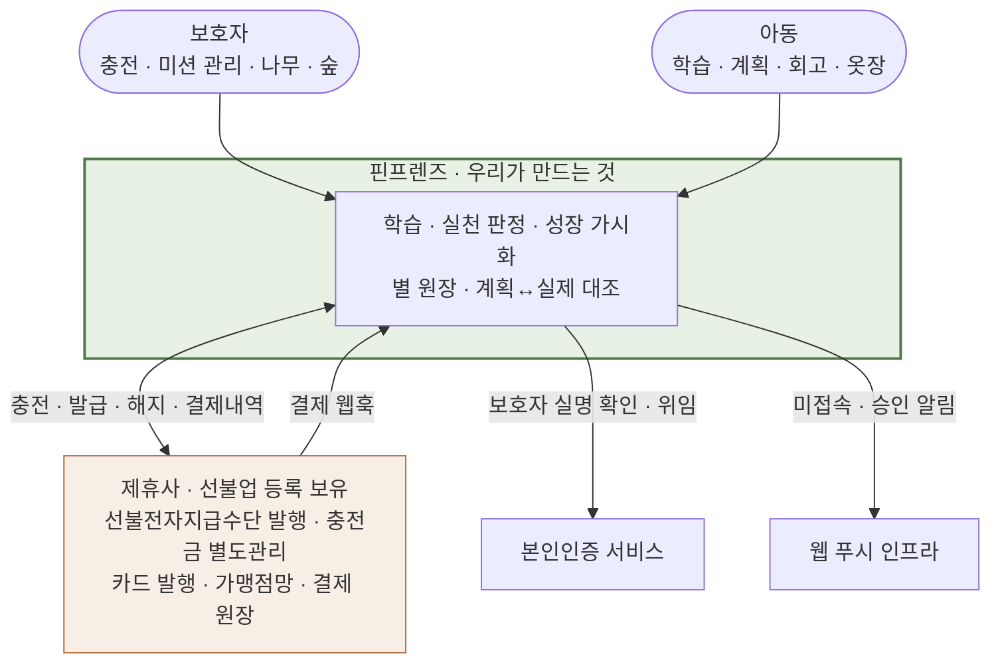
```mermaid
flowchart TB
    G(["보호자<br/>충전 · 미션 관리 · 나무 · 숲"])
    C(["아동<br/>학습 · 계획 · 회고 · 옷장"])

    subgraph SYS["핀프렌즈 · 우리가 만드는 것"]
        APP["학습 · 실천 판정 · 성장 가시화<br/>별 원장 · 계획↔실제 대조"]
    end

    PART["제휴사 · 선불업 등록 보유<br/>선불전자지급수단 발행 · 충전금 별도관리<br/>카드 발행 · 가맹점망 · 결제 원장"]
    AUTH["본인인증 서비스"]
    PUSH["웹 푸시 인프라"]

    G --> APP
    C --> APP
    APP <-->|"충전 · 발급 · 해지 · 결제내역"| PART
    PART -->|"결제 웹훅"| APP
    APP -->|"보호자 실명 확인 · 위임"| AUTH
    APP -->|"미접속 · 승인 알림"| PUSH

    style SYS fill:#e8f2e4,stroke:#4F7A4A,stroke-width:2px
    style PART fill:#f7eee6,stroke:#B36B3A
```

> **경계에서 읽어야 할 것 두 가지**
> ① **이용한도와 업종 제한은 우리가 정하지 않는다** — 제휴사 정책에 종속된다(REQ-NF-015 · ADR-004). 따라서 가용성 목표도 제휴사 SLA를 넘을 수 없다.
> ② **위치정보는 어느 화살표에도 없다** — 수집 경로 자체가 존재하지 않는다(ADR-002 · REQ-NF-009).

### 1.2 컴포넌트 다이어그램 — 시스템 내부 구조

**이 그림이 말하는 것:** 모듈 9개의 호출 방향이다. **화살표가 한 방향으로만 흐른다** — 계약(`contracts`)을 제외하면 순환 참조가 없다.

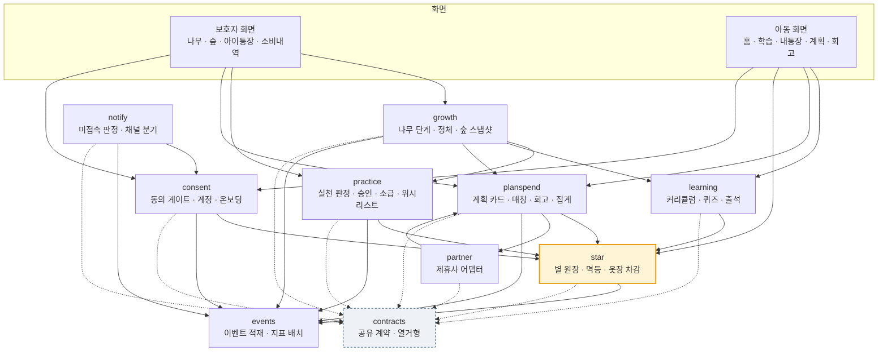
```mermaid
flowchart TB
    subgraph UI["화면"]
        GUI["보호자 화면<br/>나무 · 숲 · 아이통장 · 소비내역"]
        CUI["아동 화면<br/>홈 · 학습 · 내통장 · 계획 · 회고"]
    end

    CON["consent<br/>동의 게이트 · 계정 · 온보딩"]
    LRN["learning<br/>커리큘럼 · 퀴즈 · 출석"]
    PRC["practice<br/>실천 판정 · 승인 · 소급 · 위시리스트"]
    STR["star<br/>별 원장 · 멱등 · 옷장 차감"]
    GRW["growth<br/>나무 단계 · 정체 · 숲 스냅샷"]
    PLN["planspend<br/>계획 카드 · 매칭 · 회고 · 집계"]
    NTF["notify<br/>미접속 판정 · 채널 분기"]
    PTN["partner<br/>제휴사 어댑터"]
    EVT["events<br/>이벤트 적재 · 지표 배치"]
    CTR["contracts<br/>공유 계약 · 열거형"]

    GUI --> GRW
    GUI --> PRC
    GUI --> PLN
    GUI --> CON
    CUI --> LRN
    CUI --> PLN
    CUI --> STR
    CUI --> CON

    CON --> STR
    LRN --> STR
    PRC --> STR
    PLN --> STR
    PLN --> PTN
    GRW --> PRC
    GRW --> LRN
    GRW --> PLN
    NTF --> CON
    PTN --> PLN

    STR --> EVT
    PRC --> EVT
    GRW --> EVT
    PLN --> EVT
    NTF --> EVT
    CON --> EVT

    CON -.-> CTR
    LRN -.-> CTR
    PRC -.-> CTR
    STR -.-> CTR
    GRW -.-> CTR
    PLN -.-> CTR
    NTF -.-> CTR
    PTN -.-> CTR

    style CTR fill:#eef2f7,stroke:#2A567E,stroke-dasharray: 4 3
    style STR fill:#fff4d6,stroke:#e69500,stroke-width:2px
```

> **`star` 가 강조된 이유** — 여섯 모듈이 별 원장을 호출한다. 정합성 오류율 0%가 협상 불가인 이유가 여기 있다. **한 모듈이 잘못 기입하면 여섯 경로가 함께 오염된다.**
> **점선은 계약 참조**다. 모듈은 서로의 내부를 보지 않고 `contracts` 의 타입만 주고받는다(REQ-TEC-002).

### 1.3 모듈 책임과 경계

| 모듈 | 책임 | 하지 않는 것 |
| --- | --- | --- |
| `consent` | 동의 상태 · 계정 · 온보딩 단계 저장 · 아동 세션 가드 | 학습·실천 판정을 하지 않는다 |
| `learning` | 커리큘럼 · 퀴즈 채점 · 출석 · 이수 판정 | **별을 직접 지급하지 않는다** — `star` 에 위임 |
| `practice` | 실천 판정 · 미션 승인 · 소급 · 위시리스트 | 나무 단계를 계산하지 않는다 |
| `star` | 별 증감 이중 기입 · 멱등 · 옷장 차감 · 정산 | **어떤 행동이 실천인지 판단하지 않는다** — 트리거 코드만 받는다 |
| `growth` | 나무 단계 · 정체 판정 · 숲 스냅샷 · 델타 | 실천을 인정하지 않는다 — 결과만 읽는다 |
| `planspend` | 계획 카드 · 결제 매칭 · 두 갈래 회고 · 업종 집계 | 결제를 발생시키지 않는다 |
| `notify` | 미접속 판정 · 채널 분기 · 발송 시간대 | 알림 내용의 근거를 계산하지 않는다 |
| `partner` | 제휴사 어댑터 · 웹훅 수신 · 환불 | 업종 코드를 정의하지 않는다 |
| `events` | 이벤트 적재 · 오프라인 보정 · 지표 배치 | 지표의 의미를 해석하지 않는다 |

> **경계가 가장 자주 무너지는 지점** — `learning` 이 편의상 별을 직접 지급하는 것이다. 그렇게 되면 트리거 경로 구분(LEARNING/PRACTICE)이 두 곳에 생기고 **WPA 분자가 조용히 오염된다.** 그래서 별 지급은 `star` 한 곳에만 둔다.

---

## 2. 유스케이스

### 2.1 유스케이스 다이어그램

**이 그림이 말하는 것:** 행위자 4종이 할 수 있는 일이다. **아동은 독립 로그인을 하지 않으므로** 보호자 세션 안에서만 등장한다.

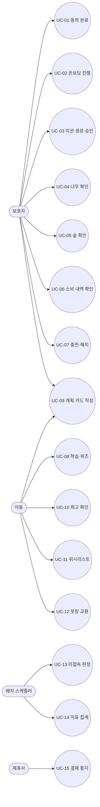
```mermaid
flowchart LR
    G(["보호자"])
    C(["아동"])
    S(["배치 스케줄러"])
    P(["제휴사"])

    UC01(("UC-01 동의 완료"))
    UC02(("UC-02 온보딩 진행"))
    UC03(("UC-03 미션 생성·승인"))
    UC04(("UC-04 나무 확인"))
    UC05(("UC-05 숲 확인"))
    UC06(("UC-06 소비 내역 확인"))
    UC07(("UC-07 충전·해지"))
    UC08(("UC-08 학습·퀴즈"))
    UC09(("UC-09 계획 카드 작성"))
    UC10(("UC-10 회고 확인"))
    UC11(("UC-11 위시리스트"))
    UC12(("UC-12 옷장 교환"))
    UC13(("UC-13 미접속 판정"))
    UC14(("UC-14 지표 집계"))
    UC15(("UC-15 결제 통지"))

    G --> UC01
    G --> UC02
    G --> UC03
    G --> UC04
    G --> UC05
    G --> UC06
    G --> UC07
    G --> UC09
    C --> UC08
    C --> UC09
    C --> UC10
    C --> UC11
    C --> UC12
    S --> UC13
    S --> UC14
    P --> UC15
```

> **UC-09가 두 행위자에 걸린 이유** — 계획 카드는 **보호자도 아동도 적을 수 있다.** 아동에게 전용 스마트폰이 없는 가정을 전제했기 때문이다(§8.2 · ADR-002).

### 2.2 유스케이스 명세

| ID | 유스케이스 | 행위자 | 선행 조건 | 정상 흐름 요약 | 관련 요구사항 |
| :-: | --- | :-: | --- | --- | --- |
| **UC-01** | 법정대리인 동의 완료 | 보호자 | 계정 생성 | 동의 → 상태 저장 → 아동 화면 잠금 해제 | REQ-NF-008 |
| **UC-02** | 온보딩 5단계 진행 | 보호자 | UC-01 | 단계별 저장 → 중단 → 재진입 시 이어서 | REQ-FUNC-007 |
| **UC-03** | 미션 생성 · 승인 · 거절 | 보호자 | UC-01 | 조건·금액 설정 → 아동 완료 → 승인 → ⭐1 | REQ-FUNC-002 · 010 |
| **UC-04** | 성장 나무 확인 | 보호자 | 실천 1건 이상 | 4영역 단계 · 실천 근거 · 정체 원인 열람 | REQ-FUNC-001 |
| **UC-05** | 월간 숲 확인 | 보호자 | 전월 데이터 | 전월 대비 델타 7항목 · 획득 별 열람 | REQ-FUNC-009 |
| **UC-06** | 소비 내역 확인 | 보호자 | 결제 1건 이상 | 전월 증감액 · 업종별 집계 열람 | REQ-FUNC-013 |
| **UC-07** | 충전 · 해지 | 보호자 | 카드 발급 완료 | 제휴사 호출 → 잔액 반영 / 전액 환불 | REQ-NF-013 |
| **UC-08** | 학습 · 퀴즈 · 출석 | 아동 | UC-01 | 학습 완주 → 퀴즈 → ⭐1 → 이수 기록 | REQ-FUNC-003 |
| **UC-09** | 계획 카드 작성 | 보호자 · 아동 | UC-01 | 어디서 · 업종 · 금액 입력 → 저장 | REQ-FUNC-008 |
| **UC-10** | 회고 확인 | 아동 | 결제 발생 | 대조 화면 → [확인했어요] → 갈래별 처리 | REQ-FUNC-008 |
| **UC-11** | 위시리스트 | 아동 | UC-01 | 목표 설정 → 30·70·100% 도달 → 각 ⭐1 | REQ-FUNC-012 |
| **UC-12** | 옷장 교환 | 아동 | 별 보유 | 아이템 선택 → 원장 차감 → 반영 | REQ-FUNC-005 |
| **UC-13** | 미접속 판정 | 스케줄러 | — | 4시간 주기 판정 → 채널 분기 → 발송 | REQ-FUNC-011 |
| **UC-14** | 지표 집계 | 스케줄러 | — | 주간 WPA · 일일 정산 · 규제 스캔 | 중립판 §9.1 |
| **UC-15** | 결제 통지 | 제휴사 | 카드 결제 | 웹훅 수신 → 서명 검증 → 매칭 트리거 | REQ-FUNC-008 |

> **UC-04의 선행 조건이 「실천 1건 이상」이 아닌 이유** — 0건일 때도 화면은 열린다. 다만 **빈 화면이 아니라 안내**가 나온다(ACE-1.1). 선행 조건을 걸면 그 경로를 설계에서 놓친다.

---

## 3. 데이터 설계

### 3.1 ERD — 개체와 관계

**이 그림이 말하는 것:** 중립판 §6.4의 테이블 11종을 관계까지 펼친 것이다. **점선 위쪽이 `identity` 스키마, 아래쪽이 `activity` 스키마**이며 둘은 애플리케이션 계층에서만 만난다(REQ-TEC-006).

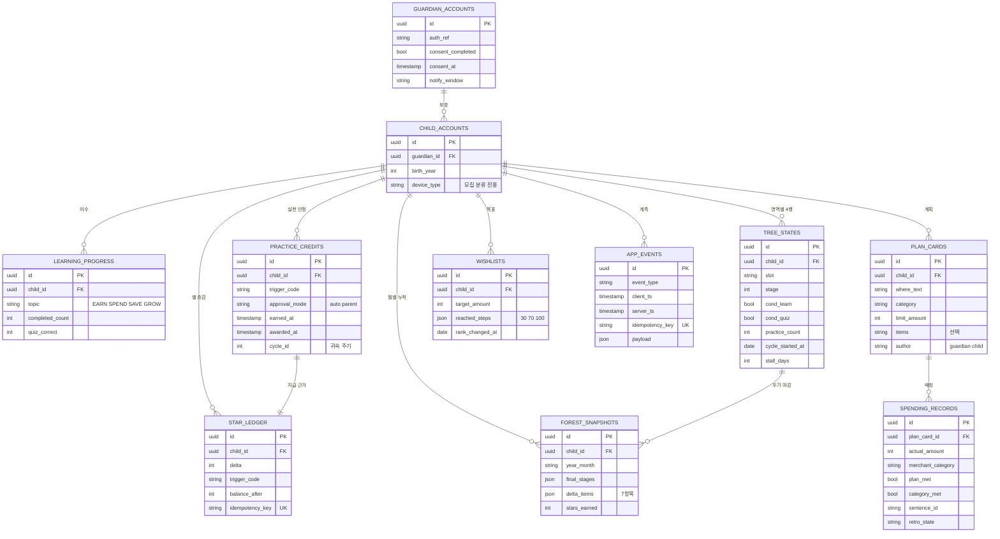
```mermaid
erDiagram
    GUARDIAN_ACCOUNTS ||--o{ CHILD_ACCOUNTS : "보호"
    CHILD_ACCOUNTS ||--o{ LEARNING_PROGRESS : "이수"
    CHILD_ACCOUNTS ||--o{ PRACTICE_CREDITS : "실천 인정"
    CHILD_ACCOUNTS ||--o{ STAR_LEDGER : "별 증감"
    CHILD_ACCOUNTS ||--o{ TREE_STATES : "영역별 4행"
    CHILD_ACCOUNTS ||--o{ FOREST_SNAPSHOTS : "월별 누적"
    CHILD_ACCOUNTS ||--o{ PLAN_CARDS : "계획"
    CHILD_ACCOUNTS ||--o{ WISHLISTS : "목표"
    CHILD_ACCOUNTS ||--o{ APP_EVENTS : "계측"
    PLAN_CARDS ||--o{ SPENDING_RECORDS : "매칭"
    PRACTICE_CREDITS ||--|| STAR_LEDGER : "지급 근거"
    TREE_STATES ||--o{ FOREST_SNAPSHOTS : "주기 마감"

    GUARDIAN_ACCOUNTS {
        uuid id PK
        string auth_ref
        bool consent_completed
        timestamp consent_at
        string notify_window
    }
    CHILD_ACCOUNTS {
        uuid id PK
        uuid guardian_id FK
        int birth_year
        string device_type "모집 분류 전용"
    }
    LEARNING_PROGRESS {
        uuid id PK
        uuid child_id FK
        string topic "EARN SPEND SAVE GROW"
        int completed_count
        int quiz_correct
    }
    PRACTICE_CREDITS {
        uuid id PK
        uuid child_id FK
        string trigger_code
        string approval_mode "auto parent"
        timestamp earned_at
        timestamp awarded_at
        int cycle_id "귀속 주기"
    }
    STAR_LEDGER {
        uuid id PK
        uuid child_id FK
        int delta
        string trigger_code
        int balance_after
        string idempotency_key UK
    }
    TREE_STATES {
        uuid id PK
        uuid child_id FK
        string slot
        int stage
        bool cond_learn
        bool cond_quiz
        int practice_count
        date cycle_started_at
        int stall_days
    }
    FOREST_SNAPSHOTS {
        uuid id PK
        uuid child_id FK
        string year_month
        json final_stages
        json delta_items "7항목"
        int stars_earned
    }
    PLAN_CARDS {
        uuid id PK
        uuid child_id FK
        string where_text
        string category
        int limit_amount
        string items "선택"
        string author "guardian child"
    }
    SPENDING_RECORDS {
        uuid id PK
        uuid plan_card_id FK
        int actual_amount
        string merchant_category
        bool plan_met
        bool category_met
        string sentence_id
        string retro_state
    }
    WISHLISTS {
        uuid id PK
        uuid child_id FK
        int target_amount
        json reached_steps "30 70 100"
        date rank_changed_at
    }
    APP_EVENTS {
        uuid id PK
        string event_type
        timestamp client_ts
        timestamp server_ts
        string idempotency_key UK
        json payload
    }
```

> **`PRACTICE_CREDITS.cycle_id` 가 왜 별도 컬럼인가** — 소급 지급 때 **⭐는 지금 주고 나무 조건은 과거 주기에 귀속**해야 한다(ACE-6.2). 지급 시각으로 귀속을 계산하면 다음 주기 나무가 부풀려진다.
> **`STAR_LEDGER` 에 현금 전환 필드가 없다** — 없는 것이 설계다. 스캔이 이 부재를 매일 확인한다(S4 · REQ-TEC-009).

### 3.2 상태 다이어그램 — 데이터의 생애

#### SM-01 동의 · 계정 상태

**이 그림이 말하는 것:** 아동 화면은 `ACTIVE` 에서만 열린다. 세션이 만료되면 **동의로 되돌아간다** — 동의는 캐시하지 않는다(ACE-8.2).

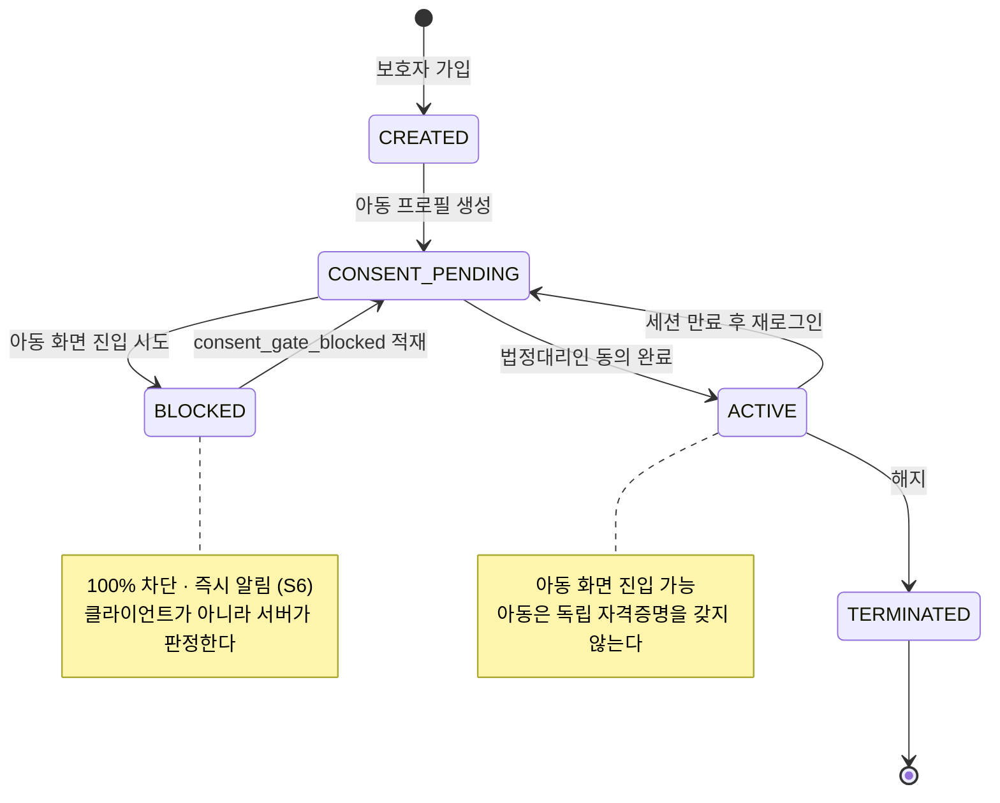
```mermaid
stateDiagram-v2
    [*] --> CREATED : 보호자 가입
    CREATED --> CONSENT_PENDING : 아동 프로필 생성
    CONSENT_PENDING --> ACTIVE : 법정대리인 동의 완료
    CONSENT_PENDING --> BLOCKED : 아동 화면 진입 시도
    BLOCKED --> CONSENT_PENDING : consent_gate_blocked 적재
    ACTIVE --> CONSENT_PENDING : 세션 만료 후 재로그인
    ACTIVE --> TERMINATED : 해지
    TERMINATED --> [*]

    note right of BLOCKED
        100% 차단 · 즉시 알림 (S6)
        클라이언트가 아니라 서버가 판정한다
    end note
    note right of ACTIVE
        아동 화면 진입 가능
        아동은 독립 자격증명을 갖지 않는다
    end note
```

#### SM-02 미션 승인 상태

**이 그림이 말하는 것:** `BACKFILLED` 가 별도 상태인 이유는 **⭐와 나무 조건의 귀속 시점이 다르기 때문**이다.

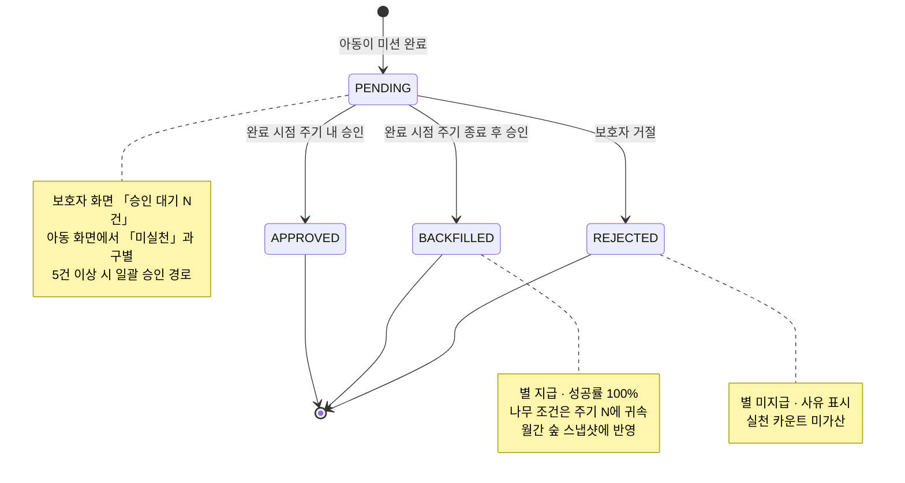
```mermaid
stateDiagram-v2
    [*] --> PENDING : 아동이 미션 완료
    PENDING --> APPROVED : 완료 시점 주기 내 승인
    PENDING --> BACKFILLED : 완료 시점 주기 종료 후 승인
    PENDING --> REJECTED : 보호자 거절
    APPROVED --> [*]
    BACKFILLED --> [*]
    REJECTED --> [*]

    note right of PENDING
        보호자 화면 「승인 대기 N건」
        아동 화면에서 「미실천」과 구별
        5건 이상 시 일괄 승인 경로
    end note
    note right of BACKFILLED
        별 지급 · 성공률 100%
        나무 조건은 주기 N에 귀속
        월간 숲 스냅샷에 반영
    end note
    note right of REJECTED
        별 미지급 · 사유 표시
        실천 카운트 미가산
    end note
```

#### SM-03 나무 단계 상태

**이 그림이 말하는 것:** 승급은 세 조건의 논리곱이고, **주기 초기화는 영역마다 다르다.** 벌기·잘 쓰기·모으기는 매달, 불리기는 적금 만기다.

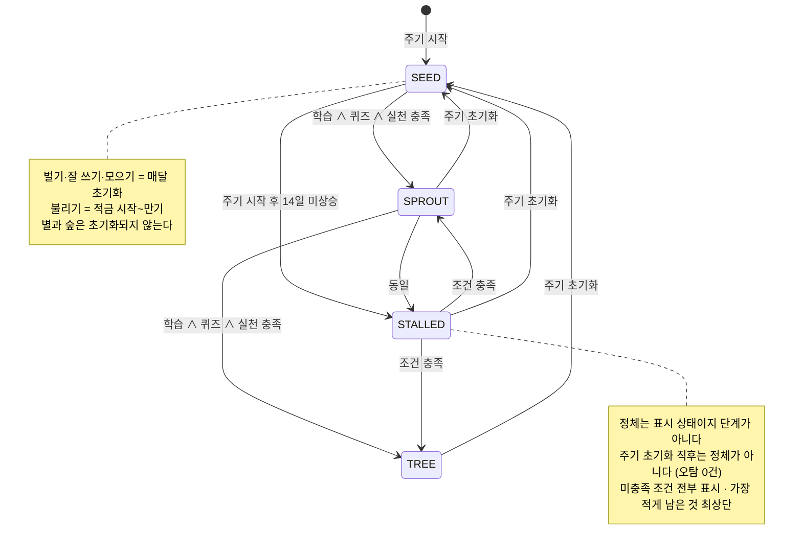
```mermaid
stateDiagram-v2
    [*] --> SEED : 주기 시작
    SEED --> SPROUT : 학습 ∧ 퀴즈 ∧ 실천 충족
    SPROUT --> TREE : 학습 ∧ 퀴즈 ∧ 실천 충족
    SEED --> STALLED : 주기 시작 후 14일 미상승
    SPROUT --> STALLED : 동일
    STALLED --> SPROUT : 조건 충족
    STALLED --> TREE : 조건 충족
    TREE --> SEED : 주기 초기화
    SPROUT --> SEED : 주기 초기화
    STALLED --> SEED : 주기 초기화

    note right of STALLED
        정체는 표시 상태이지 단계가 아니다
        주기 초기화 직후는 정체가 아니다 (오탐 0건)
        미충족 조건 전부 표시 · 가장 적게 남은 것 최상단
    end note
    note right of SEED
        벌기·잘 쓰기·모으기 = 매달 초기화
        불리기 = 적금 시작~만기
        별과 숲은 초기화되지 않는다
    end note
```

#### SM-04 계획↔결제 매칭 상태

**이 그림이 말하는 것:** ⭐ 판정은 **금액 단독**이다. 업종 불일치는 회고를 분기시킬 뿐 ⭐를 막지 않는다(ADR-008).

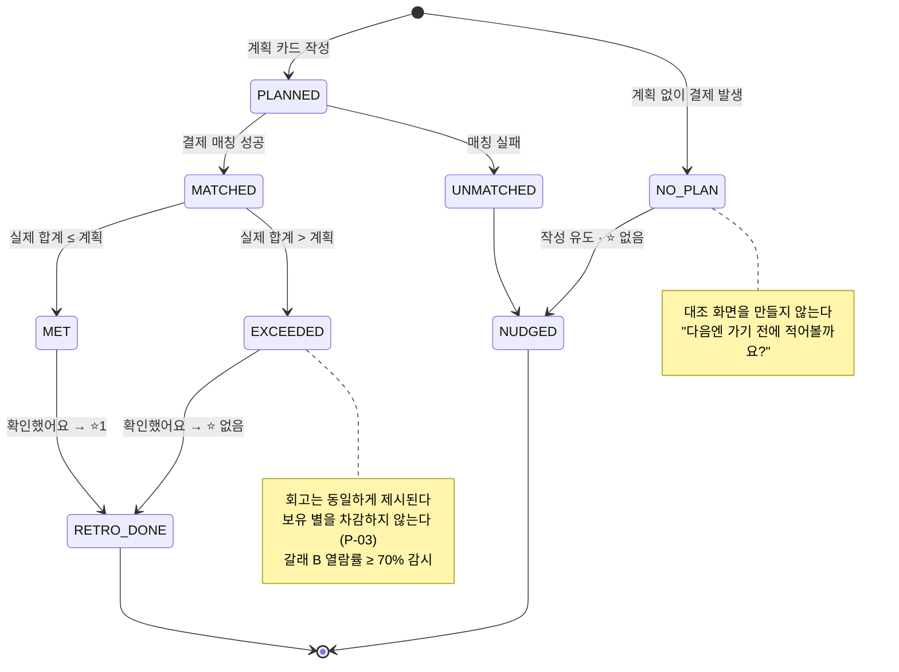
```mermaid
stateDiagram-v2
    [*] --> PLANNED : 계획 카드 작성
    [*] --> NO_PLAN : 계획 없이 결제 발생
    PLANNED --> MATCHED : 결제 매칭 성공
    PLANNED --> UNMATCHED : 매칭 실패
    MATCHED --> MET : 실제 합계 ≤ 계획
    MATCHED --> EXCEEDED : 실제 합계 > 계획
    MET --> RETRO_DONE : 확인했어요 → ⭐1
    EXCEEDED --> RETRO_DONE : 확인했어요 → ⭐ 없음
    NO_PLAN --> NUDGED : 작성 유도 · ⭐ 없음
    UNMATCHED --> NUDGED
    RETRO_DONE --> [*]
    NUDGED --> [*]

    note right of EXCEEDED
        회고는 동일하게 제시된다
        보유 별을 차감하지 않는다 (P-03)
        갈래 B 열람률 ≥ 70% 감시
    end note
    note right of NO_PLAN
        대조 화면을 만들지 않는다
        "다음엔 가기 전에 적어볼까요?"
    end note
```

### 3.3 데이터베이스 물리 설계 요점

| 항목 | 설계 | 근거 |
| --- | --- | --- |
| **스키마 분리** | `identity`(계정 2종) / `activity`(나머지 9종). 앱 역할이 **동시에 조인할 수 없다** | REQ-NF-009 · REQ-TEC-006 |
| **RLS** | 보호자 소유 데이터만 접근. 타 보호자 자녀 조회 차단 | REQ-NF-011 |
| **파티셔닝** | `app_events` 주차 단위 선언적 파티셔닝. 생성·회전은 배치가 수행 | REQ-TEC-004 예외 |
| **멱등 키** | `star_ledger` · `app_events` 에 `idempotency_key` **유니크 제약** | REQ-TEC-011 |
| **이중 기입** | 별 증감은 원장에 두 번 기입하고 일일 정산이 대조 | REQ-NF-006 |
| **금지 필드** | 좌표 · 얼굴 이미지 · 별↔저금통 전환 컬럼 **부재**. 배포 시·일 1회 스캔 | S1 · S2 · S4 |
| **커넥션** | 앱은 풀러(트랜잭션 모드), 마이그레이션은 직결 | REQ-TEC-005 |

> **파티셔닝이 필요한 이유** — 이벤트 10종은 주차 단위로 조회된다(WPA · 회고 체류 · 열람률). 파티션이 없으면 주차 집계가 전체 스캔이 되고, 그 비용이 **지표 배치를 느리게 만들어 D+1 마감을 놓치게** 한다.

---

## 4. 정적 구조 — 클래스 다이어그램

> 클래스명은 **중립판 §5 추적성 매트릭스의 구현 단위**와 동일하다. 이름을 바꾸면 SRS와의 추적이 끊긴다.

### 4.1 Consent & Account — 동의가 먼저다

**이 그림이 말하는 것:** 아동 화면으로 가는 모든 길목에 `ChildSessionGuard` 가 서 있다. `ConsentGateService.assertConsented()` 는 **서버에서만** 호출되며, 클라이언트 판정은 설계에 없다.

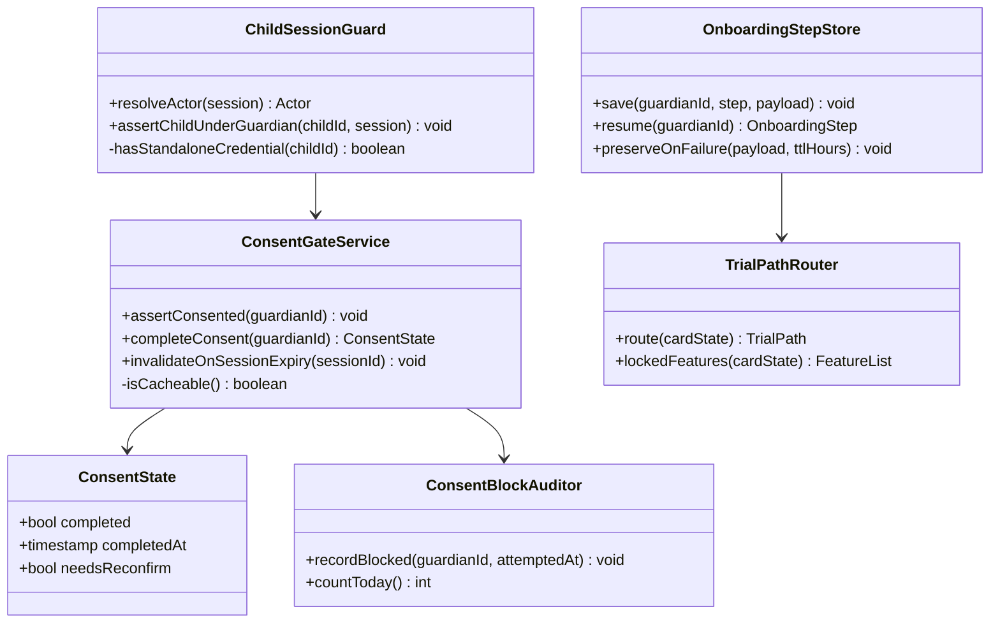
```mermaid
classDiagram
    class ConsentGateService {
        +assertConsented(guardianId) void
        +completeConsent(guardianId) ConsentState
        +invalidateOnSessionExpiry(sessionId) void
        -isCacheable() boolean
    }
    class ChildSessionGuard {
        +resolveActor(session) Actor
        +assertChildUnderGuardian(childId, session) void
        -hasStandaloneCredential(childId) boolean
    }
    class ConsentBlockAuditor {
        +recordBlocked(guardianId, attemptedAt) void
        +countToday() int
    }
    class OnboardingStepStore {
        +save(guardianId, step, payload) void
        +resume(guardianId) OnboardingStep
        +preserveOnFailure(payload, ttlHours) void
    }
    class TrialPathRouter {
        +route(cardState) TrialPath
        +lockedFeatures(cardState) FeatureList
    }
    class ConsentState {
        +bool completed
        +timestamp completedAt
        +bool needsReconfirm
    }

    ConsentGateService --> ConsentState
    ConsentGateService --> ConsentBlockAuditor
    ChildSessionGuard --> ConsentGateService
    OnboardingStepStore --> TrialPathRouter
```

> **`isCacheable()` 이 `private` 이고 항상 `false` 인 이유** — 동의를 캐시하지 않는다는 규칙을 **호출자가 선택할 수 없게** 하려는 것이다. 공개 기능으로 두면 언젠가 성능을 이유로 켜진다(ACE-8.2).
> **`hasStandaloneCredential()` 은 감사용이다** — 항상 `false` 여야 하며, `true` 가 나오면 S5 알림이 된다.

### 4.2 Learning · Star Ledger — 별은 한 곳에서만 지급된다

**이 그림이 말하는 것:** `learning` 은 별을 직접 만들지 않는다. **`TriggerDispatcher` 에 트리거 코드를 넘길 뿐**이고, 경로 구분(LEARNING/PRACTICE)은 `StarTrigger` 계약이 갖는다.

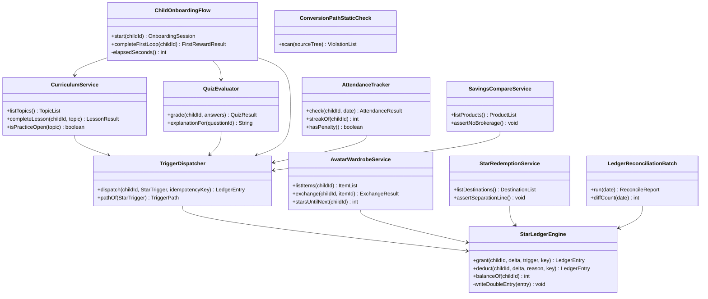
```mermaid
classDiagram
    class CurriculumService {
        +listTopics() TopicList
        +completeLesson(childId, topic) LessonResult
        +isPracticeOpen(topic) boolean
    }
    class QuizEvaluator {
        +grade(childId, answers) QuizResult
        +explanationFor(questionId) String
    }
    class ChildOnboardingFlow {
        +start(childId) OnboardingSession
        +completeFirstLoop(childId) FirstRewardResult
        -elapsedSeconds() int
    }
    class AttendanceTracker {
        +check(childId, date) AttendanceResult
        +streakOf(childId) int
        +hasPenalty() boolean
    }
    class SavingsCompareService {
        +listProducts() ProductList
        +assertNoBrokerage() void
    }
    class TriggerDispatcher {
        +dispatch(childId, StarTrigger, idempotencyKey) LedgerEntry
        +pathOf(StarTrigger) TriggerPath
    }
    class StarLedgerEngine {
        +grant(childId, delta, trigger, key) LedgerEntry
        +deduct(childId, delta, reason, key) LedgerEntry
        +balanceOf(childId) int
        -writeDoubleEntry(entry) void
    }
    class AvatarWardrobeService {
        +listItems(childId) ItemList
        +exchange(childId, itemId) ExchangeResult
        +starsUntilNext(childId) int
    }
    class StarRedemptionService {
        +listDestinations() DestinationList
        +assertSeparationLine() void
    }
    class LedgerReconciliationBatch {
        +run(date) ReconcileReport
        +diffCount(date) int
    }
    class ConversionPathStaticCheck {
        +scan(sourceTree) ViolationList
    }

    CurriculumService --> TriggerDispatcher
    QuizEvaluator --> TriggerDispatcher
    ChildOnboardingFlow --> CurriculumService
    ChildOnboardingFlow --> QuizEvaluator
    ChildOnboardingFlow --> TriggerDispatcher
    AttendanceTracker --> TriggerDispatcher
    SavingsCompareService --> TriggerDispatcher
    TriggerDispatcher --> StarLedgerEngine
    AvatarWardrobeService --> StarLedgerEngine
    StarRedemptionService --> StarLedgerEngine
    LedgerReconciliationBatch --> StarLedgerEngine
```

> **`isPracticeOpen(topic)` 이 `learning` 에 있는 이유** — 「불리기」는 학습만 열리고 실천은 닫혀 있다. 화면이 **"곧 열려요"** 를 보이려면 커리큘럼 쪽이 이 사실을 알아야 한다(AC-2.4).
> **`AttendanceTracker.hasPenalty()` 가 항상 `false` 인 이유** — 출석이 끊겨도 감소·벌칙 연출을 두지 않는다(P-23). 함수로 남긴 것은 **언젠가 스트릭 보상을 넣으려 할 때 이 선언이 먼저 걸리게** 하기 위해서다.
> **`ConversionPathStaticCheck` 는 런타임 클래스가 아니다** — 빌드 게이트다. 클래스 다이어그램에 넣은 이유는 **별 분리선이 코드 구조로 강제된다는 사실을 설계에 남기기 위해서**다(REQ-TEC-008).

### 4.3 Practice · Growth — 실천이 나무를 움직인다

**이 그림이 말하는 것:** `GrowthTreeRenderer` 는 실천을 인정하지 않는다. **`PracticeCredit` 을 읽기만** 한다. 승급 판정과 실천 판정을 분리해야 「실천 0건 승급 0건」을 한 곳에서 보증할 수 있다.

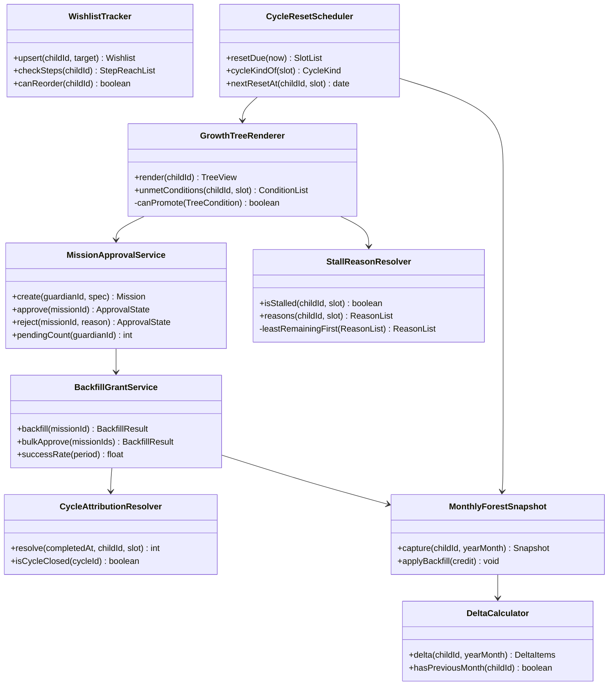
```mermaid
classDiagram
    class MissionApprovalService {
        +create(guardianId, spec) Mission
        +approve(missionId) ApprovalState
        +reject(missionId, reason) ApprovalState
        +pendingCount(guardianId) int
    }
    class BackfillGrantService {
        +backfill(missionId) BackfillResult
        +bulkApprove(missionIds) BackfillResult
        +successRate(period) float
    }
    class CycleAttributionResolver {
        +resolve(completedAt, childId, slot) int
        +isCycleClosed(cycleId) boolean
    }
    class WishlistTracker {
        +upsert(childId, target) Wishlist
        +checkSteps(childId) StepReachList
        +canReorder(childId) boolean
    }
    class GrowthTreeRenderer {
        +render(childId) TreeView
        +unmetConditions(childId, slot) ConditionList
        -canPromote(TreeCondition) boolean
    }
    class StallReasonResolver {
        +isStalled(childId, slot) boolean
        +reasons(childId, slot) ReasonList
        -leastRemainingFirst(ReasonList) ReasonList
    }
    class MonthlyForestSnapshot {
        +capture(childId, yearMonth) Snapshot
        +applyBackfill(credit) void
    }
    class DeltaCalculator {
        +delta(childId, yearMonth) DeltaItems
        +hasPreviousMonth(childId) boolean
    }
    class CycleResetScheduler {
        +resetDue(now) SlotList
        +cycleKindOf(slot) CycleKind
        +nextResetAt(childId, slot) date
    }

    MissionApprovalService --> BackfillGrantService
    BackfillGrantService --> CycleAttributionResolver
    BackfillGrantService --> MonthlyForestSnapshot
    GrowthTreeRenderer --> StallReasonResolver
    GrowthTreeRenderer --> MissionApprovalService
    MonthlyForestSnapshot --> DeltaCalculator
    CycleResetScheduler --> MonthlyForestSnapshot
    CycleResetScheduler --> GrowthTreeRenderer
```

> **`canPromote()` 가 `private` 인 이유** — 승급 판정은 **한 곳에서만** 일어나야 한다. 공개하면 화면 코드가 자기 방식으로 판정하기 시작하고, 그때부터 「실천 0건 승급 0건」을 증명할 수 없다(ADR-006).
> **`cycleKindOf(slot)` 이 필요한 이유** — 벌기·잘 쓰기·모으기는 매달, 불리기는 **적금 시작~만기**다. 주기 종류가 영역마다 다르므로 초기화 시점을 슬롯별로 물어야 한다(§6.2.1).
> **`hasPreviousMonth()` 가 공개인 이유** — 전월 데이터가 없으면 **델타를 0으로 그리는 게 아니라 아예 다른 문구**를 보여야 한다. 화면이 먼저 물어봐야 한다(ACE-1.2).

### 4.4 Plan & Spending — 사전과 사후를 한 고리로

**이 그림이 말하는 것:** `RetroBrancher` 가 두 갈래를 만든다. 판정은 `PlanMatchResult`(금액)로 하고, `CategoryMatch`(업종)는 **문장만 분기**시킨다.

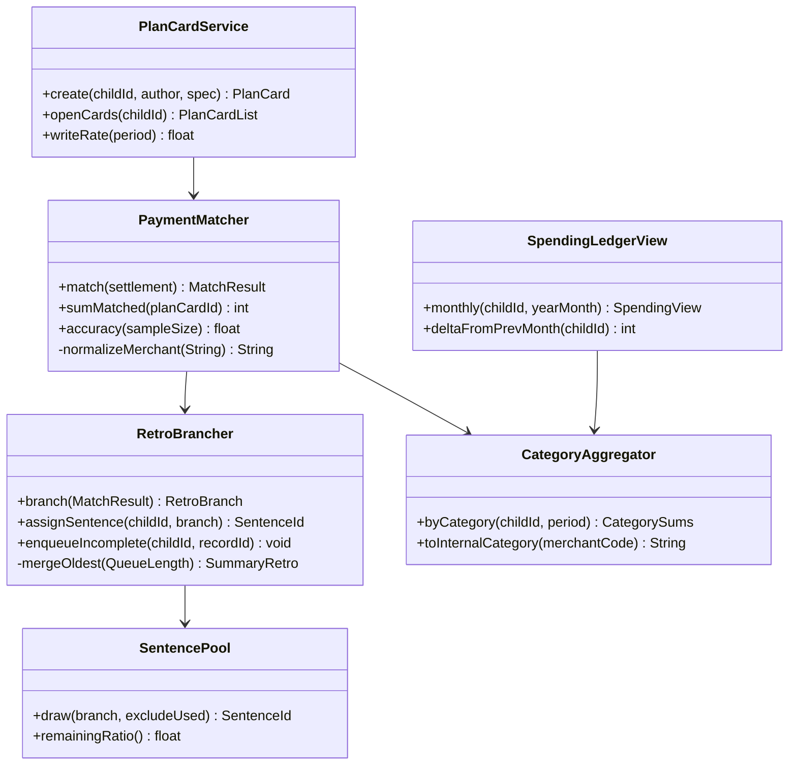
```mermaid
classDiagram
    class PlanCardService {
        +create(childId, author, spec) PlanCard
        +openCards(childId) PlanCardList
        +writeRate(period) float
    }
    class PaymentMatcher {
        +match(settlement) MatchResult
        +sumMatched(planCardId) int
        +accuracy(sampleSize) float
        -normalizeMerchant(String) String
    }
    class RetroBrancher {
        +branch(MatchResult) RetroBranch
        +assignSentence(childId, branch) SentenceId
        +enqueueIncomplete(childId, recordId) void
        -mergeOldest(QueueLength) SummaryRetro
    }
    class SpendingLedgerView {
        +monthly(childId, yearMonth) SpendingView
        +deltaFromPrevMonth(childId) int
    }
    class CategoryAggregator {
        +byCategory(childId, period) CategorySums
        +toInternalCategory(merchantCode) String
    }
    class SentencePool {
        +draw(branch, excludeUsed) SentenceId
        +remainingRatio() float
    }

    PlanCardService --> PaymentMatcher
    PaymentMatcher --> RetroBrancher
    PaymentMatcher --> CategoryAggregator
    RetroBrancher --> SentencePool
    SpendingLedgerView --> CategoryAggregator
```

> **`writeRate()` 가 서비스의 공개 기능인 이유** — 계획 카드 작성률은 **이 기능의 생존 조건**이다(E3 · AC-4.4). 분석 도구가 아니라 제품이 스스로 알고 있어야 하는 값이다.
> **`mergeOldest()` 가 `private` 인 이유** — 큐 3건 초과 시 병합은 정책이지 호출자의 선택이 아니다(ACE-5.2).

### 4.5 Notification · Partner — 도달을 약속하지 않는다

**이 그림이 말하는 것:** `ChannelFallbackRouter` 는 **발송 시도**를 책임지고 도달을 약속하지 않는다. 문자 경로는 D-01 미해소이므로 `isEnabled()` 가 `false` 를 반환한다.

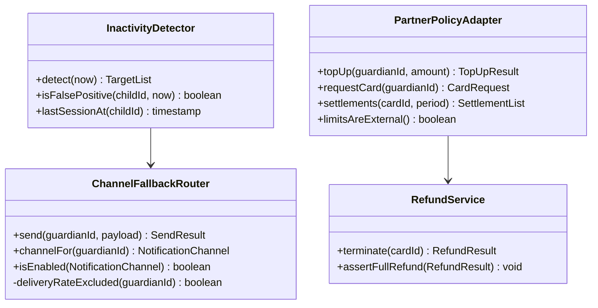
```mermaid
classDiagram
    class InactivityDetector {
        +detect(now) TargetList
        +isFalsePositive(childId, now) boolean
        +lastSessionAt(childId) timestamp
    }
    class ChannelFallbackRouter {
        +send(guardianId, payload) SendResult
        +channelFor(guardianId) NotificationChannel
        +isEnabled(NotificationChannel) boolean
        -deliveryRateExcluded(guardianId) boolean
    }
    class PartnerPolicyAdapter {
        +topUp(guardianId, amount) TopUpResult
        +requestCard(guardianId) CardRequest
        +settlements(cardId, period) SettlementList
        +limitsAreExternal() boolean
    }
    class RefundService {
        +terminate(cardId) RefundResult
        +assertFullRefund(RefundResult) void
    }

    InactivityDetector --> ChannelFallbackRouter
    PartnerPolicyAdapter --> RefundService
```

> **`limitsAreExternal()` 이 항상 `true` 인 이유** — 이용한도·업종 제한을 우리가 정하지 않는다는 사실을 **코드가 선언**하게 했다. 언젠가 한도 설정 화면을 만들려 할 때 이 함수가 먼저 걸린다(REQ-NF-015).
> **`deliveryRateExcluded()`** — 푸시 차단 계정은 도달률 분모에서 빠진다. 빼지 않으면 지표가 채널 문제를 제품 문제로 보이게 한다(ACE-7.1).

### 4.6 Events · Ops — 계측과 감시

**이 그림이 말하는 것:** 이벤트는 **상태 변경과 같은 트랜잭션**에서 적재된다. `IdempotencyGuard` 가 원장과 이벤트 양쪽의 중복을 막는다.

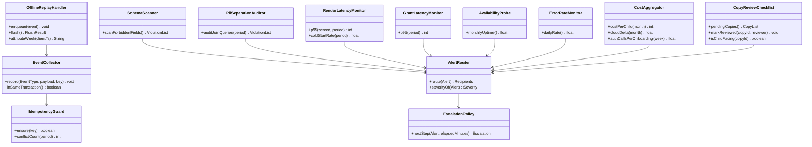
```mermaid
classDiagram
    class EventCollector {
        +record(EventType, payload, key) void
        +inSameTransaction() boolean
    }
    class IdempotencyGuard {
        +ensure(key) boolean
        +conflictCount(period) int
    }
    class OfflineReplayHandler {
        +enqueue(event) void
        +flush() FlushResult
        +attributeWeek(clientTs) String
    }
    class SchemaScanner {
        +scanForbiddenFields() ViolationList
    }
    class PiiSeparationAuditor {
        +auditJoinQueries(period) ViolationList
    }
    class RenderLatencyMonitor {
        +p95(screen, period) int
        +coldStartRate(period) float
    }
    class GrantLatencyMonitor {
        +p95(period) int
    }
    class AvailabilityProbe {
        +monthlyUptime() float
    }
    class ErrorRateMonitor {
        +dailyRate() float
    }
    class CopyReviewChecklist {
        +pendingCopies() CopyList
        +markReviewed(copyId, reviewer) void
        +isChildFacing(copyId) boolean
    }
    class CostAggregator {
        +costPerChild(month) int
        +cloudDelta(month) float
        +authCallsPerOnboarding(week) float
    }
    class AlertRouter {
        +route(Alert) Recipients
        +severityOf(Alert) Severity
    }
    class EscalationPolicy {
        +nextStep(Alert, elapsedMinutes) Escalation
    }

    EventCollector --> IdempotencyGuard
    OfflineReplayHandler --> EventCollector
    SchemaScanner --> AlertRouter
    PiiSeparationAuditor --> AlertRouter
    RenderLatencyMonitor --> AlertRouter
    GrantLatencyMonitor --> AlertRouter
    AvailabilityProbe --> AlertRouter
    ErrorRateMonitor --> AlertRouter
    CostAggregator --> AlertRouter
    CopyReviewChecklist --> AlertRouter
    AlertRouter --> EscalationPolicy
```

> **`inSameTransaction()` 이 공개인 이유** — 테스트가 이 사실을 검증할 수 있어야 한다. 이벤트가 별도 트랜잭션에서 적재되면 **롤백된 실천이 지표에 남는다**(REQ-TEC-012).
> **`CopyReviewChecklist` 가 감시 대상인 이유** — 아동에게 노출되는 문구는 **법정 의무**(알기 쉬운 언어 · P-12)라 미검수 문구가 배포되면 규제 위반이다. 검수를 사람의 기억이 아니라 목록으로 관리한다(REQ-NF-014).
> **모든 감시 클래스가 `AlertRouter` 로 모이는 이유** — 수신자·SLA·에스컬레이션을 **한 곳에서 결정**해야 D-02 미해소 상태에서 채널을 한 번에 바꿀 수 있다.

---

## 5. 동적 흐름 — 시퀀스 다이어그램

### SD-01 동의 게이트 → 아동 온보딩 첫 보상

**이 흐름이 답하는 것:** 아동이 처음 앱을 열었을 때 5분 안에 첫 보상까지 닿는가(AC-9.1). 동의 확인은 **서버에서 매 진입마다** 일어난다.

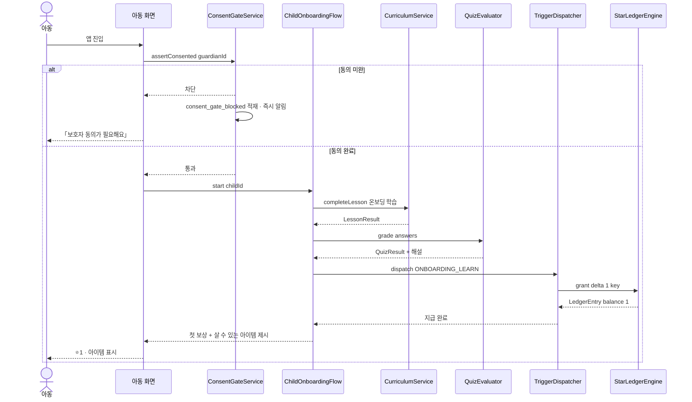
```mermaid
sequenceDiagram
    actor C as 아동
    participant UI as 아동 화면
    participant CG as ConsentGateService
    participant OF as ChildOnboardingFlow
    participant CS as CurriculumService
    participant QE as QuizEvaluator
    participant TD as TriggerDispatcher
    participant SL as StarLedgerEngine

    C->>UI: 앱 진입
    UI->>CG: assertConsented guardianId
    alt 동의 미완
        CG-->>UI: 차단
        CG->>CG: consent_gate_blocked 적재 · 즉시 알림
        UI-->>C: 「보호자 동의가 필요해요」
    else 동의 완료
        CG-->>UI: 통과
        UI->>OF: start childId
        OF->>CS: completeLesson 온보딩 학습
        CS-->>OF: LessonResult
        OF->>QE: grade answers
        QE-->>OF: QuizResult + 해설
        OF->>TD: dispatch ONBOARDING_LEARN
        TD->>SL: grant delta 1 key
        SL-->>TD: LedgerEntry balance 1
        TD-->>OF: 지급 완료
        OF-->>UI: 첫 보상 + 살 수 있는 아이템 제시
        UI-->>C: ⭐1 · 아이템 표시
    end
```

> **이 트리거는 WPA 분자에 들어가지 않는다** — 온보딩 학습은 LEARNING 경로다. 분자에 넣으면 **가입만 해도 실천 지표가 오른다**(중립판 §9.1).

### SD-02 미션 완료 → 승인 → ⭐ 지급 → 나무 갱신

**이 흐름이 답하는 것:** 실천 하나가 화면에서 눈에 보이게 반영되는 경로다. **동일 세션 내 반영**이 전제다(AC-2.1).

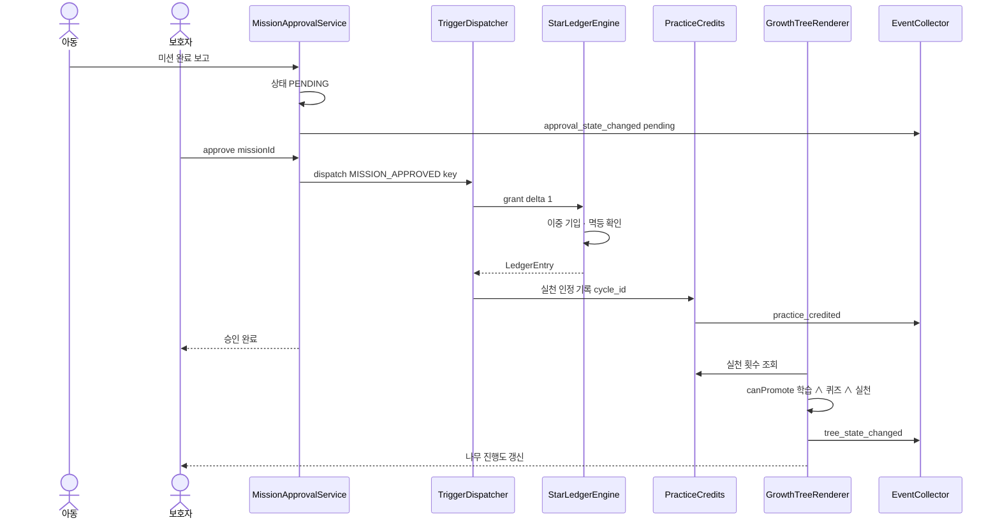
```mermaid
sequenceDiagram
    actor C as 아동
    actor G as 보호자
    participant MA as MissionApprovalService
    participant TD as TriggerDispatcher
    participant SL as StarLedgerEngine
    participant PC as PracticeCredits
    participant GT as GrowthTreeRenderer
    participant EV as EventCollector

    C->>MA: 미션 완료 보고
    MA->>MA: 상태 PENDING
    MA->>EV: approval_state_changed pending
    G->>MA: approve missionId
    MA->>TD: dispatch MISSION_APPROVED key
    TD->>SL: grant delta 1
    SL->>SL: 이중 기입 · 멱등 확인
    SL-->>TD: LedgerEntry
    TD->>PC: 실천 인정 기록 cycle_id
    PC->>EV: practice_credited
    MA-->>G: 승인 완료
    GT->>PC: 실천 횟수 조회
    GT->>GT: canPromote 학습 ∧ 퀴즈 ∧ 실천
    GT->>EV: tree_state_changed
    GT-->>G: 나무 진행도 갱신
```

> **⭐ 지급과 나무 갱신이 분리된 이유** — 별은 즉시, 나무는 조건 판정 후다. 같은 트랜잭션에 묶으면 **조건 계산이 지급 지연(p95 ≤ 800ms)을 잠식**한다.

### SD-03 승인 지연 → 소급 지급 → 주기 귀속

**이 흐름이 답하는 것:** 보호자가 늦어도 아동의 실천이 사라지지 않으면서, **다음 주기 나무는 부풀지 않는** 경로다(ACE-6.2).

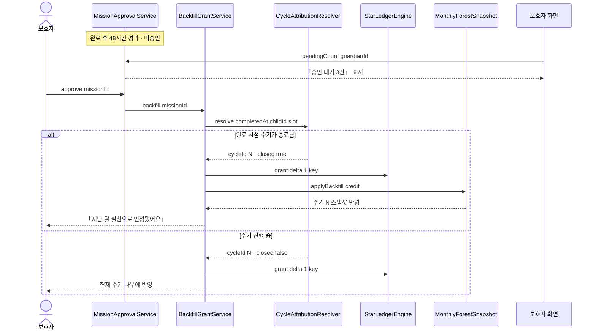
```mermaid
sequenceDiagram
    actor G as 보호자
    participant MA as MissionApprovalService
    participant BG as BackfillGrantService
    participant CA as CycleAttributionResolver
    participant SL as StarLedgerEngine
    participant FS as MonthlyForestSnapshot
    participant UI as 보호자 화면

    Note over MA: 완료 후 48시간 경과 · 미승인
    UI->>MA: pendingCount guardianId
    MA-->>UI: 「승인 대기 3건」 표시
    G->>MA: approve missionId
    MA->>BG: backfill missionId
    BG->>CA: resolve completedAt childId slot
    alt 완료 시점 주기가 종료됨
        CA-->>BG: cycleId N · closed true
        BG->>SL: grant delta 1 key
        BG->>FS: applyBackfill credit
        FS-->>BG: 주기 N 스냅샷 반영
        BG-->>G: 「지난 달 실천으로 인정됐어요」
    else 주기 진행 중
        CA-->>BG: cycleId N · closed false
        BG->>SL: grant delta 1 key
        BG-->>G: 현재 주기 나무에 반영
    end
```

> **⭐는 지금, 나무는 그때** — 이 분기가 없으면 지연 승인이 쌓인 계정의 다음 달 나무가 **실제보다 크게** 보인다.

### SD-04 계획 카드 작성 → 결제 → 매칭 → 두 갈래 회고

**이 흐름이 답하는 것:** 이 제품의 핵심 고리다. **사전(적기) → 소비 → 사후(맞춰보기)** 가 한 흐름으로 닫힌다.

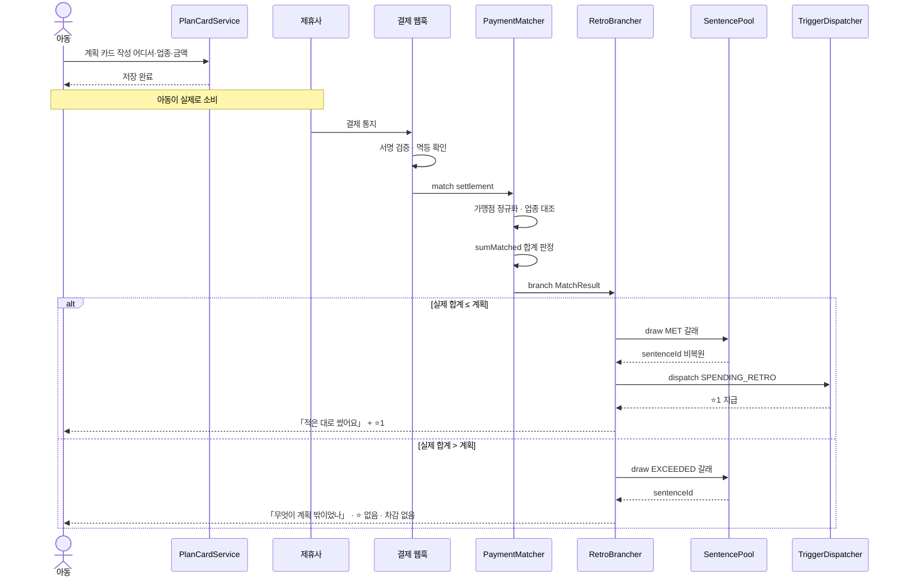
```mermaid
sequenceDiagram
    actor C as 아동
    participant PS as PlanCardService
    participant PT as 제휴사
    participant WH as 결제 웹훅
    participant PM as PaymentMatcher
    participant RB as RetroBrancher
    participant SP as SentencePool
    participant TD as TriggerDispatcher

    C->>PS: 계획 카드 작성 어디서·업종·금액
    PS-->>C: 저장 완료
    Note over C,PT: 아동이 실제로 소비
    PT->>WH: 결제 통지
    WH->>WH: 서명 검증 · 멱등 확인
    WH->>PM: match settlement
    PM->>PM: 가맹점 정규화 · 업종 대조
    PM->>PM: sumMatched 합계 판정
    PM->>RB: branch MatchResult
    alt 실제 합계 ≤ 계획
        RB->>SP: draw MET 갈래
        SP-->>RB: sentenceId 비복원
        RB->>TD: dispatch SPENDING_RETRO
        TD-->>RB: ⭐1 지급
        RB-->>C: 「적은 대로 썼어요」 + ⭐1
    else 실제 합계 > 계획
        RB->>SP: draw EXCEEDED 갈래
        SP-->>RB: sentenceId
        RB-->>C: 「무엇이 계획 밖이었나」 · ⭐ 없음 · 차감 없음
    end
```

> **⭐가 「확인」이 아니라 「지킴」에 붙는다** — 확인만 해도 별을 주면 참은 날과 안 참은 날이 같아지고, **나무와 숲이 거짓 신호**를 보낸다(v13 §5-3).

### SD-05 계획 없는 결제 → 작성 유도

**이 흐름이 답하는 것:** 남은 사각지대의 처리다. **대조할 것이 없으므로 대조 화면을 만들지 않는다.**

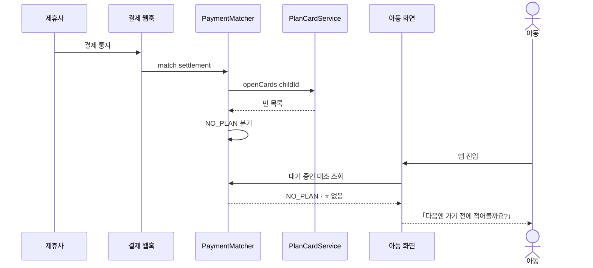
```mermaid
sequenceDiagram
    participant PT as 제휴사
    participant WH as 결제 웹훅
    participant PM as PaymentMatcher
    participant PS as PlanCardService
    participant UI as 아동 화면
    actor C as 아동

    PT->>WH: 결제 통지
    WH->>PM: match settlement
    PM->>PS: openCards childId
    PS-->>PM: 빈 목록
    PM->>PM: NO_PLAN 분기
    C->>UI: 앱 진입
    UI->>PM: 대기 중인 대조 조회
    PM-->>UI: NO_PLAN · ⭐ 없음
    UI-->>C: 「다음엔 가기 전에 적어볼까요?」
```

> **이 경로가 곧 미대응 사각지대다** — 자동 발동이 없으므로 **적지 않고 나간 소비는 잡히지 않는다.** 작성률(E3)이 이 경로의 크기를 결정한다(ADR-002).

### SD-06 성장 나무 조회 — 5초 예산 안에서

**이 흐름이 답하는 것:** 보호자가 화면을 열고 5초 안에 「무엇이 달라졌는지」를 읽으려면 렌더가 얼마나 빨라야 하는가(REQ-NF-001).

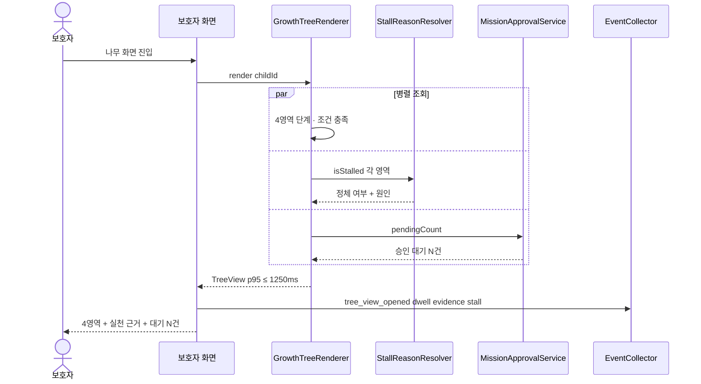
```mermaid
sequenceDiagram
    actor G as 보호자
    participant UI as 보호자 화면
    participant GT as GrowthTreeRenderer
    participant SR as StallReasonResolver
    participant MA as MissionApprovalService
    participant EV as EventCollector

    G->>UI: 나무 화면 진입
    UI->>GT: render childId
    par 병렬 조회
        GT->>GT: 4영역 단계 · 조건 충족
    and
        GT->>SR: isStalled 각 영역
        SR-->>GT: 정체 여부 + 원인
    and
        GT->>MA: pendingCount
        MA-->>GT: 승인 대기 N건
    end
    GT-->>UI: TreeView p95 ≤ 1250ms
    UI->>EV: tree_view_opened dwell evidence stall
    UI-->>G: 4영역 + 실천 근거 + 대기 N건
```

> **세 조회를 병렬로 두는 이유** — 순차로 하면 1,250ms 예산을 넘긴다. **예산을 넘으면 5초 회상 테스트 자체가 오염**되므로 AC-1.1이 성립하지 않는다.

### SD-07 월간 숲 스냅샷과 전월 델타

**이 흐름이 답하는 것:** 「전월 대비 변화」가 만들어지는 경로와, **첫 달에 델타를 그리지 않는** 분기다.

```mermaid
sequenceDiagram
    participant CR as 주기 초기화 배치
    participant FS as MonthlyForestSnapshot
    participant DC as DeltaCalculator
    participant TS as TreeStates
    participant UI as 보호자 화면
    actor G as 보호자

    CR->>FS: capture childId yearMonth
    FS->>TS: 4영역 최종 단계 조회
    FS->>FS: 학습·실천·소비 집계 · 총 획득 별
    FS-->>CR: Snapshot 적재
    G->>UI: 숲 화면 진입
    UI->>DC: hasPreviousMonth childId
    alt 전월 데이터 있음
        DC-->>UI: true
        UI->>DC: delta childId yearMonth
        DC-->>UI: DeltaItems 7항목
        UI-->>G: 전월 대비 변화 + 이번 달 획득 별
    else 첫 달
        DC-->>UI: false
        UI-->>G: 「다음 달부터 비교할 수 있어요」
    end
```

> **델타 0과 「비교 불가」는 다르다** — 0으로 그리면 보호자는 **「변화가 없다」로 읽는다**(ACE-1.2).

### SD-08 72시간 미접속 판정 → 채널 분기

**이 흐름이 답하는 것:** 아동이 멈춘 것을 보호자가 3일 안에 아는 경로와, **오탐을 만들지 않는** 조건이다.

```mermaid
sequenceDiagram
    participant CRON as pg_cron 4시간 주기
    participant EP as /api/cron/inactivity
    participant ID as InactivityDetector
    participant CF as ChannelFallbackRouter
    participant EV as EventCollector
    actor G as 보호자

    CRON->>EP: POST X-Cron-Secret
    EP->>EP: 시크릿 검증 · 불일치 시 404
    EP->>ID: detect now
    ID->>ID: 최종 접속 + 72h 경과 대상 수집
    loop 대상마다
        ID->>ID: isFalsePositive 판정 시점 재접속?
        alt 재접속함
            ID-->>EP: 발송하지 않음 오탐 0건
        else 미접속 유지
            ID->>CF: send guardianId 멈춘 지점 포함
            CF->>CF: channelFor 푸시 구독 여부
            alt 푸시 구독 있음
                CF-->>G: Web Push
            else 구독 없음 또는 차단
                CF->>CF: 앱 내 배너 큐 적재
                CF->>CF: deliveryRateExcluded true
            end
            CF->>EV: inactivity_notified channel sent_at
        end
    end
```

> **문자 경로가 이 그림에 없다** — D-01 미해소이므로 **구현하지 않는다.** 그림에 그려 두면 있는 것처럼 읽힌다(§8 대장).

### SD-09 오프라인 실천 → 재연결 → 멱등 반영

**이 흐름이 답하는 것:** 아동 기기가 오프라인일 때 실천이 유실되지 않으면서 **중복 지급도 되지 않는** 경로다(ACE-2.1).

```mermaid
sequenceDiagram
    actor C as 아동
    participant SW as Service Worker
    participant Q as IndexedDB 큐
    participant OR as OfflineReplayHandler
    participant IG as IdempotencyGuard
    participant SL as StarLedgerEngine

    Note over C,Q: 네트워크 없음
    C->>SW: 실천 완료
    SW->>Q: enqueue event clientTs key
    Q-->>C: 로컬 반영 표시
    Note over SW: 재연결
    SW->>OR: flush
    OR->>IG: ensure key
    alt 최초 처리
        IG-->>OR: 진행 허용
        OR->>SL: grant delta 1 key
        SL-->>OR: LedgerEntry
        OR->>OR: attributeWeek clientTs
    else 이미 처리됨
        IG-->>OR: 중복 · 무해 종료
    end
    OR-->>C: 반영 완료 ≤ 60초
```

> **주차 귀속이 `clientTs` 인 이유** — 서버 도착 시각으로 귀속하면 **오프라인 기간의 실천이 다음 주차로 밀려** WPA가 왜곡된다.

### SD-10 WPA 주간 배치

**이 흐름이 답하는 것:** 북극성 지표가 만들어지는 경로다. **분모 3조건**이 여기서 적용된다.

```mermaid
sequenceDiagram
    participant CRON as pg_cron 주 1회
    participant EP as /api/cron/wpa-batch
    participant PC as PracticeCredits
    participant CA as ChildAccounts
    participant AR as AlertRouter

    CRON->>EP: ISO 주 마감 D+1
    EP->>PC: 주차 내 practice_credited distinct child
    PC-->>EP: 분자
    EP->>CA: 활성 아동 스냅샷
    CA->>CA: 동의 완료 ∧ 계정 7일 경과 ∧ 28일 내 세션
    CA-->>EP: 분모
    EP->>EP: WPA = 분자 ÷ 분모
    EP->>EP: PASS HOLD FAIL 판정
    alt 전주 대비 -10%p 이상 하락
        EP->>AR: route 북극성 경보
        AR-->>AR: 제품 담당 · 24시간 내 원인 분석
    end
```

> **분모에 「계정 7일 경과」가 있는 이유** — 온보딩 직후 계정을 분모에 넣으면 **가입이 늘수록 WPA가 떨어진다.** 지표가 성장을 벌주게 된다.

---

## 6. 논리 흐름 — 플로차트

### FC-01 나무 승급 판정

**이 판단이 답하는 것:** 언제 나무가 자라는가. **실천이 0이면 다른 두 조건을 아무리 채워도 여기서 멈춘다.**

```mermaid
flowchart TD
    S(["조건 갱신 발생"]) --> L{"학습 이수<br/>충족?"}
    L -- "아니오" --> STAY["미승급<br/>남은 조건 표시"]
    L -- "예" --> Q{"퀴즈 정답 수<br/>충족?"}
    Q -- "아니오" --> STAY
    Q -- "예" --> P{"실천 횟수<br/>≥ 1?"}
    P -- "아니오" --> BLOCK["미승급<br/>「실천 N회 남음」 명시"]
    P -- "예" --> UP["단계 상승<br/>tree_state_changed"]
    BLOCK --> STAY
    STAY --> E(["종료"])
    UP --> E

    style BLOCK fill:#ffe0e0,stroke:#c00,stroke-width:2px
    style UP fill:#e8f2e4,stroke:#4F7A4A
```

> **`BLOCK` 이 별도 분기인 이유** — 학습·퀴즈 미충족과 **실천 0건은 표시 문구가 달라야** 한다. 전자는 "더 배우면 돼요", 후자는 "해 보면 자라요"다.

### FC-02 정체 판정과 원인 표시

**이 판단이 답하는 것:** 언제 「정체」라고 말하는가. **주기 초기화 직후는 정체가 아니다.**

```mermaid
flowchart TD
    S(["보호자가 영역 열람"]) --> D{"주기 시작 후<br/>14일 경과?"}
    D -- "아니오" --> NORMAL["정상 진행 중 표시<br/>정체로 표시하지 않음"]
    D -- "예" --> UP{"이 주기에<br/>단계 상승 있었나?"}
    UP -- "예" --> NORMAL
    UP -- "아니오" --> STALL["정체 판정"]
    STALL --> R{"미충족 조건<br/>개수?"}
    R -- "1개" --> ONE["해당 조건 표시"]
    R -- "복수" --> MANY["전부 표시<br/>가장 적게 남은 것 최상단"]
    ONE --> LOG["stall_reason_shown 적재"]
    MANY --> LOG
    NORMAL --> E(["종료"])
    LOG --> E

    style NORMAL fill:#f2f2f2,stroke:#888
    style MANY fill:#fff4d6,stroke:#e69500
```

> **「가장 적게 남은 것 최상단」이 규칙인 이유** — 다음 행동을 **하나로 좁혀** 주기 위해서다. 전부 나열만 하면 보호자는 무엇부터 할지 모른다(ACE-3.1).

### FC-03 계획↔실제 판정 — 금액 단독

**이 판단이 답하는 것:** ⭐를 줄지 말지. **업종은 판정에 들어가지 않는다.**

```mermaid
flowchart TD
    S(["결제 매칭 완료"]) --> H{"계획 카드<br/>존재?"}
    H -- "없음" --> NP["NO_PLAN<br/>⭐ 없음 · 작성 유도"]
    H -- "있음" --> SUM["매칭된 결제 합계 산출"]
    SUM --> A{"실제 합계<br/>≤ 계획 금액?"}
    A -- "예" --> MET["MET · plan_met true"]
    A -- "아니오" --> EXC["EXCEEDED · plan_met false"]
    MET --> C{"계획 업종과<br/>일치?"}
    C -- "일치" --> M1["기본 회고 문장"]
    C -- "불일치" --> M2["「업종 다름」 갈래 문장<br/>category_met false"]
    M1 --> STAR["⭐1 지급"]
    M2 --> STAR
    EXC --> NOSTAR["회고만 제시<br/>⭐ 없음 · 차감 없음"]
    NP --> E(["종료"])
    STAR --> E
    NOSTAR --> E

    style STAR fill:#e8f2e4,stroke:#4F7A4A
    style NOSTAR fill:#fff4d6,stroke:#e69500
    style M2 fill:#fff4d6,stroke:#e69500
```

> **업종 불일치가 ⭐를 막지 않는 이유** — 업종 코드 상세도는 제휴사 종속이라 우리가 통제할 수 없다. 매칭 오류가 곧 미지급이 되면 **아동이 시스템 오류로 보상을 잃는다**(ADR-008).

### FC-04 회고 문장 배정 — 비복원과 큐 병합

**이 판단이 답하는 것:** 같은 문장이 반복되지 않게 하면서, 밀린 회고를 어떻게 처리하는가.

```mermaid
flowchart TD
    S(["회고 배정 요청"]) --> Q{"미완 회고<br/>큐 길이?"}
    Q -- "3건 이하" --> ORDER["순서대로 제시"]
    Q -- "3건 초과" --> MERGE["오래된 건을<br/>「요약 회고」로 병합"]
    ORDER --> POOL{"갈래별 미사용<br/>문장 있음?"}
    MERGE --> POOL
    POOL -- "있음" --> DRAW["비복원 추출<br/>배정 이력 기록"]
    POOL -- "없음" --> ALERT["운영 알림<br/>풀 확장 요구"]
    DRAW --> R{"잔여율<br/>≤ 20%?"}
    R -- "예" --> WARN["잔여 경고 발송"]
    R -- "아니오" --> E(["종료"])
    WARN --> E
    ALERT --> E

    style ALERT fill:#ffe0e0,stroke:#c00,stroke-width:2px
    style MERGE fill:#fff4d6,stroke:#e69500
```

> **잔여 20%에서 미리 알리는 이유** — 비복원 추출은 유한하다. 소진된 뒤에 알면 **「재노출 ≤ 2/8」이 이미 깨진 뒤**다(ACE-5.1).

### FC-05 미접속 알림 채널 분기

**이 판단이 답하는 것:** 누구에게 어떤 채널로 보내고, **무엇을 도달률에서 뺄 것인가.**

```mermaid
flowchart TD
    S(["72시간 경과 판정"]) --> RE{"판정 시점<br/>재접속?"}
    RE -- "예" --> SKIP["발송하지 않음<br/>오탐 0건"]
    RE -- "아니오" --> DEL{"앱 삭제<br/>감지?"}
    DEL -- "예" --> REINST["「재설치 안내」 문구<br/>다른 이벤트 코드"]
    DEL -- "아니오" --> SUB{"푸시 구독<br/>보유?"}
    SUB -- "예" --> PUSH["Web Push 발송<br/>도달 여부 계측"]
    SUB -- "아니오" --> BANNER["앱 내 배너 큐<br/>도달률 분모에서 제외"]
    BANNER -.->|"D-01 승인 시"| SMS["문자 대체 발송"]
    PUSH --> LOG["inactivity_notified 적재"]
    BANNER --> LOG
    REINST --> LOG
    SKIP --> E(["종료"])
    LOG --> E

    style SKIP fill:#f2f2f2,stroke:#888
    style SMS fill:#ffe0e0,stroke:#c00,stroke-dasharray: 5 5
```

> **점선은 미구현이다** — D-01이 닫히기 전까지 문자 경로는 **코드에 없다.** 그림에서 실선으로 그리면 있는 것으로 읽힌다.

### FC-06 별 지급 멱등 판정

**이 판단이 답하는 것:** 같은 사건이 두 번 들어와도 별이 한 번만 나가게 하는 지점이다.

```mermaid
flowchart TD
    S(["지급 요청 trigger key"]) --> K{"idempotency_key<br/>이미 존재?"}
    K -- "예" --> NOOP["무해 종료<br/>기존 결과 반환"]
    K -- "아니오" --> TX["트랜잭션 시작"]
    TX --> W["원장 이중 기입"]
    W --> EV["practice_credited 동일 트랜잭션 적재"]
    EV --> C{"커밋 성공?"}
    C -- "예" --> DONE["잔액 반영 p95 ≤ 800ms"]
    C -- "아니오" --> ROLL["전부 롤백<br/>이벤트도 함께 롤백"]
    NOOP --> E(["종료"])
    DONE --> E
    ROLL --> E

    style NOOP fill:#f2f2f2,stroke:#888
    style ROLL fill:#ffe0e0,stroke:#c00
```

> **이벤트를 같은 트랜잭션에 넣는 이유** — 따로 적재하면 **롤백된 실천이 지표에 남는다.** WPA가 실제보다 높아진다(REQ-TEC-012).

---

## 7. 계측 파이프라인 — 데이터 흐름

**이 그림이 말하는 것:** 이벤트 10종이 어디서 나와 어디로 흘러 지표가 되는가. **오프라인 경로가 별도로 표시**된 이유는 주차 귀속 기준이 다르기 때문이다.

```mermaid
flowchart LR
    subgraph SRC["발생원"]
        A1["consent<br/>consent_gate_blocked<br/>onboarding_step"]
        A2["star · practice<br/>star_ledger_entry<br/>practice_credited<br/>approval_state_changed"]
        A3["growth<br/>tree_state_changed<br/>tree_view_opened<br/>forest_view_opened"]
        A4["planspend<br/>retro_viewed"]
        A5["notify<br/>inactivity_notified"]
    end

    OFF["오프라인 큐<br/>IndexedDB"]
    EC["EventCollector<br/>상태 변경과 동일 트랜잭션"]
    EVT[("app_events<br/>주차 파티션")]

    subgraph BATCH["배치"]
        B1["WPA 주간 D+1"]
        B2["별 정산 일 1회"]
        B3["규제·보안 스캔 일 1회"]
        B4["문장 풀 잔여 일 1회"]
    end

    AR["AlertRouter<br/>수신자 · SLA · 에스컬레이션"]
    DASH["운영 지표 화면<br/>PASS HOLD FAIL"]

    A1 --> EC
    A2 --> EC
    A3 --> EC
    A4 --> EC
    A5 --> EC
    A2 -.->|"오프라인 발생"| OFF
    OFF -->|"재연결 flush · clientTs 귀속"| EC
    EC --> EVT
    EVT --> B1
    EVT --> B2
    EVT --> B3
    EVT --> B4
    B1 --> DASH
    B1 --> AR
    B2 --> AR
    B3 --> AR
    B4 --> AR
    AR --> DASH

    style EC fill:#e8f2e4,stroke:#4F7A4A,stroke-width:2px
    style OFF fill:#fff4d6,stroke:#e69500,stroke-dasharray: 4 3
```

| 이벤트 | 산출 지표 | 배치 |
| --- | --- | :-: |
| `practice_credited` | **WPA(북극성)** · 7일 내 첫 실천 인정률 | 주간 |
| `star_ledger_entry` | 정합성 오류율 · 멱등 충돌 | 일간 |
| `tree_state_changed` | 월말 영역 성장률 · 정체 일수 | 월간 |
| `tree_view_opened` | 실천 근거 · 정체 원인 열람률 | 월간 |
| `forest_view_opened` | 보호자 확인 시간 · 델타 항목 수 · 익월 재방문 | 월간 |
| `retro_viewed` | 회고 체류 중위 · 재노출률 · 갈래별 열람률 | 주간 |
| `approval_state_changed` | 소급 성공률 · 48h 초과 대기 비율 | 주간 |
| `inactivity_notified` | 탐지 일수 · 채널별 도달률 | 주간 |
| `onboarding_step` | 온보딩 퍼널 · 3단계 이탈률 | 주간 |
| `consent_gate_blocked` | **규제 알림 — 1건 이상 즉시** | 실시간 |

---

## 8. 성능 예산 배분

**이 표가 말하는 것:** AC에서 역산한 상한을 구간별로 나눈 것이다. 합이 상한을 넘으면 **해당 수용 기준이 성립하지 않는다**(ADR-007).

```mermaid
flowchart LR
    subgraph TREE["성장 나무 p95 ≤ 1,250ms — 5초 노출의 25%"]
        T1["인증·동의 확인<br/>80ms"] --> T2["4영역 단계 조회<br/>300ms"]
        T2 --> T3["정체 판정·원인<br/>250ms"]
        T3 --> T4["승인 대기 조회<br/>120ms"]
        T4 --> T5["렌더·첫 페인트<br/>400ms"]
        T5 --> T6["여유<br/>100ms"]
    end

    style T6 fill:#f2f2f2,stroke:#888
```

| 화면 · 동작 | 상한 | 역산 근거 | 초과 시 |
| --- | :-: | --- | --- |
| 🌳 성장 나무 렌더 | **1,250 ms** | AC-1.1이 **5초 노출**이므로 렌더가 25%를 넘으면 회상 테스트가 오염된다 | 3일 연속 초과 → 아키텍처 재검토 |
| 🌲 월간 숲 렌더 | **2,000 ms** | AC-1.3이 *"60초 이내 3개 지목"* — 렌더가 3%를 넘으면 과업 시간을 잠식한다 | 동일 |
| ⭐ 지급 반영 | **800 ms** | AC-2.1이 *"동일 세션 내 반영"* — 아동 세션 이탈이 잦아 1초 내 체감이 전제 | 동일 |
| 오프라인 재연결 반영 | **60 s** | ACE-2.1 명시값 | — (AC 확정치) |
| 미접속 알림 발송 지연 | **6 h** | 배치 주기 4시간 + 처리 여유 | 배치 주기 단축 |
| 월 가용성 | **≥ 99.0%** | 제휴사 SLA 미확인 상태의 보수적 하한 | `min(자체, 제휴사)` 로 갱신 |
| API 오류율 | **≤ 0.5%** | 일반 모바일 관행값 | 3일 연속 초과 → 릴리즈 중단 |
| 별 정합성 오류율 | **0%** | **협상 불가** — 아동이 모은 것을 잃는 경험 | 30분 내 확인 · 재설정 트리거 없음 |

> **콜드 스타트가 예산 밖에 있다** — 서버리스 첫 요청은 위 배분에 포함되지 않는다. **발생률을 따로 관측**해 상한 초과의 원인이 설계인지 콜드 스타트인지 구분한다(반영판 §8 Y7).

---

## 9. 요구사항 ↔ 설계 산출물 추적표

| 요구사항 | 클래스 | 시퀀스 | 플로차트 | 상태도 |
| --- | --- | :-: | :-: | :-: |
| REQ-FUNC-001 성장 나무 | `GrowthTreeRenderer` · `StallReasonResolver` · `CycleResetScheduler` | SD-06 | FC-01 · FC-02 | SM-03 |
| REQ-FUNC-002 미션 루프 | `MissionApprovalService` | SD-02 | — | SM-02 |
| REQ-FUNC-003 학습·퀴즈·출석 | `CurriculumService` · `QuizEvaluator` · `AttendanceTracker` | SD-01 | — | — |
| REQ-FUNC-004 별 지급 엔진 | `StarLedgerEngine` · `TriggerDispatcher` | SD-02 | FC-06 | — |
| REQ-FUNC-005 아바타·옷장 | `AvatarWardrobeService` | — | — | — |
| REQ-FUNC-006 아동 온보딩 | `ChildOnboardingFlow` | SD-01 | — | SM-01 |
| REQ-FUNC-007 보호자 온보딩 | `OnboardingStepStore` · `ConsentGateService` | SD-01 | — | SM-01 |
| REQ-FUNC-008 계획↔실제 | `PlanCardService` · `PaymentMatcher` · `RetroBrancher` | SD-04 · SD-05 | FC-03 · FC-04 | SM-04 |
| REQ-FUNC-009 월간 숲 | `MonthlyForestSnapshot` · `DeltaCalculator` | SD-07 | — | — |
| REQ-FUNC-010 소급 지급 | `BackfillGrantService` · `CycleAttributionResolver` | SD-03 | — | SM-02 |
| REQ-FUNC-011 미접속 알림 | `InactivityDetector` · `ChannelFallbackRouter` | SD-08 | FC-05 | — |
| REQ-FUNC-012 위시리스트 | `WishlistTracker` | — | — | — |
| REQ-FUNC-013 소비 내역 | `SpendingLedgerView` · `CategoryAggregator` | — | — | — |
| REQ-FUNC-014 예적금 비교 | `SavingsCompareService` | — | — | — |
| REQ-FUNC-015 체험 경로 | `TrialPathRouter` | — | — | — |
| REQ-FUNC-016 별 목적지 확장 | `StarRedemptionService` | — | — | — |
| REQ-NF-001 · 002 성능 | `RenderLatencyMonitor` · `GrantLatencyMonitor` | SD-06 | — | — |
| REQ-NF-003 오프라인 | `OfflineReplayHandler` · `IdempotencyGuard` | SD-09 | FC-06 | — |
| REQ-NF-004 · 005 가용성 | `AvailabilityProbe` · `ErrorRateMonitor` | — | — | — |
| REQ-NF-006 정합성 | `LedgerReconciliationBatch` | SD-02 | FC-06 | — |
| REQ-NF-007 소급 성공률 | `BackfillGrantService` | SD-03 | — | SM-02 |
| REQ-NF-008 동의 게이트 | `ConsentGateService` · `ConsentBlockAuditor` | SD-01 | — | SM-01 |
| REQ-NF-009 데이터 최소 수집 | `SchemaScanner` · `PiiSeparationAuditor` | — | — | — |
| REQ-NF-010 별 분리 | `ConversionPathStaticCheck` | — | — | — |
| REQ-NF-011 계정 종속 | `ChildSessionGuard` | SD-01 | — | SM-01 |
| REQ-NF-013 전액 환불 | `RefundService` | — | — | — |
| REQ-NF-015 제휴사 종속 | `PartnerPolicyAdapter` | SD-04 | — | — |
| REQ-NF-016 원가 | `CostAggregator` | — | — | — |
| REQ-NF-017 모니터링 | `AlertRouter` · `EscalationPolicy` | SD-10 | — | — |
| REQ-NF-014 아동 문구 | `CopyReviewChecklist` | — | — | — |
| 중립판 §9.1 WPA | `EventCollector` | SD-10 | — | — |

> **SDD가 새로 도입한 클래스 2종** — `EventCollector`(적재 진입점)와 `ConsentState`(값 타입)는 SRS 추적성 매트릭스에 없다. **요구사항을 늘린 것이 아니라 구현을 나눈 결과**이므로, SRS를 고치지 않고 여기 남긴다.
> **다이어그램이 없는 요구사항이 있는 이유** — 판단 분기나 시간 순서가 없는 요구사항은 **클래스 하나로 충분**하다. 그림을 채우려고 흐름을 만들지 않았다.

---

*작성자: 서비스분석 혜원 · 검토자: 개발팀 리드 · 승인자: 제품기획 유림*
*근거 문서 SRS-FINFRIENDS-MVP-001 · SRS-FINFRIENDS-TEC-001 — 본 문서는 요구사항을 신설하지 않는다*
