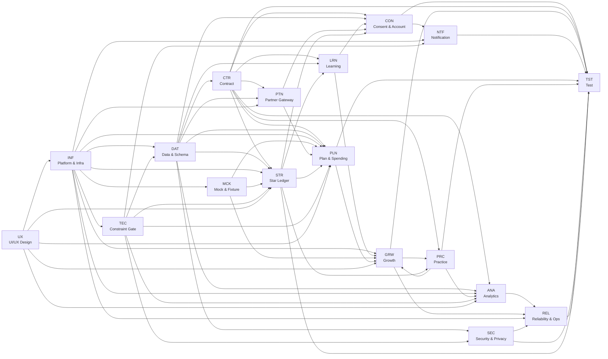

# [총괄] 개발 실행 계획

**문서 ID:** PLAN-FINFRIENDS-001

**개정 버전:** 1.0

**날짜:** 2026-08-26

**근거 문서:** TASK-FINFRIENDS-MVP-001 (`[TaskList]FinFriends-Task-List.md`)

> ⚙️ **이 문서는 생성물이다.** `python3 tools/gen_exec_plan.py` 로 재생성한다. 일정·임계 경로·Gantt는 태스크 데이터에서 계산한 결과이며 수기로 고치지 않는다.

---

## 1. 요약

| 항목 | 값 |
| --- | :-: |
| 태스크 | **68건** |
| 총 공수 | **244 person-day** |
| DAG 레벨 | **12단계** |
| 임계 경로 | **46일 · 12단계** |
| 자원 제약 완료 | **91일** |
| 트랙 구성 | **6레인** — 플랫폼1 · 백엔드2 · 프론트1 · 디자인1 · QA1 |

> **공수 환산** — 복잡도 H **5일** · M **3일** · L **1일**. 실측 없이 상대 규모만 반영한 값이며, 확정 견적이 아니라 **순서와 병목을 드러내기 위한 척도**다.

## 2. 실행 전략

### 2.1 네 가지 원칙

1. **게이트 우선** — `TEC-001` 제약 게이트를 가장 먼저 세운다. 나중에 세우면 그때까지의 위반이 한꺼번에 드러난다.
2. **계약 우선** — `CTR-001` · `CTR-002` 가 없으면 두 태스크가 같은 계약을 다르게 구현해도 탐지되지 않는다.
3. **디자인 선행** — `UX-001` 은 선행 태스크가 없다. 프론트 태스크가 대기하지 않도록 첫날 착수한다.
4. **규제 먼저** — `CON-002` 동의 게이트는 아동 화면 전부의 선행 조건이다. 늦추면 아동 기능이 통째로 밀린다.

### 2.2 착수 전 외부 블로커

| 블로커 | 막는 태스크 | 확정 시점 |
| --- | --- | --- |
| **D1** 제휴사 수수료율 · SLA · 업종 코드 상세도 | PTN-001 · PTN-003 · PLN-002 | 제휴 계약 체결 전 |
| **D-03** 본인인증 위임 가능 여부 | CON-003 · PTN-001 | 온보딩 착수 전 |
| **D3** 학습 4영역 원고 | DAT-003 · LRN-001 | LRN-001 착수 전 |
| **D4** 3D/아바타 사양 | STR-003 · UX-003 | 제작 착수 전 (B4 게이트) |
| **D2** 예적금 법률 검토 | LRN-003 | Could Have — 미확정 시 이월 |

## 3. 의존성 구조

### 3.1 Epic 수준 DAG

### 3.2 임계 경로

**46영업일 · 12단계** — 이 사슬이 전체 일정의 하한이다.

```mermaid
flowchart LR
    INF_001["INF-001<br/>Next.js App Router 앱 생<br/>3d"]
    INF_003["INF-003<br/>Supabase · Prisma 연결 및<br/>3d"]
    INF_001 --> INF_003
    DAT_001["DAT-001<br/>Prisma 스키마 2분할 (identi<br/>5d"]
    INF_003 --> DAT_001
    CTR_001["CTR-001<br/>Server Action 입출력 계약 ·<br/>5d"]
    DAT_001 --> CTR_001
    CTR_002["CTR-002<br/>도메인 열거형 계약 6종 — 트리거 · <br/>3d"]
    CTR_001 --> CTR_002
    STR_001["STR-001<br/>별 원장 엔진 — 트리거 8종 · 이중 <br/>5d"]
    CTR_002 --> STR_001
    PRC_005["PRC-005<br/>실천 판정 원장과 practice_cre<br/>5d"]
    STR_001 --> PRC_005
    GRW_001["GRW-001<br/>나무 상태 엔진 — 승급 조건 논리곱과 <br/>5d"]
    PRC_005 --> GRW_001
    GRW_002["GRW-002<br/>정체 판정 14일과 원인 조건 단위 표시<br/>3d"]
    GRW_001 --> GRW_002
    GRW_003["GRW-003<br/>성장 나무 화면 (RSC) — 4영역 ·<br/>3d"]
    GRW_002 --> GRW_003
    REL_002["REL-002<br/>성능 계측 — 화면 p95와 콜드 스타트<br/>3d"]
    GRW_003 --> REL_002
    TST_005["TST-005<br/>성능·부하 테스트와 게이트 판정<br/>3d"]
    REL_002 --> TST_005
    classDef crit fill:#ffe0e0,stroke:#c00,stroke-width:2px
    class INF_001,INF_003,DAT_001,CTR_001,CTR_002,STR_001,PRC_005,GRW_001,GRW_002,GRW_003,REL_002,TST_005 crit
```

| # | 태스크 | 기능 | 공수 |
| :-: | :-: | --- | :-: |
| 1 | **INF-001** | Next.js App Router 앱 생성 · Vercel 연결 · 환경 변수 배선 | 3d |
| 2 | **INF-003** | Supabase · Prisma 연결 및 커넥션 경로 분리 | 3d |
| 3 | **DAT-001** | Prisma 스키마 2분할 (identity / activity) 및 RLS 기반 | 5d |
| 4 | **CTR-001** | Server Action 입출력 계약 · ActionResult · 인가 가드 시그니처 | 5d |
| 5 | **CTR-002** | 도메인 열거형 계약 6종 — 트리거 · 판정 · 상태 · 채널 | 3d |
| 6 | **STR-001** | 별 원장 엔진 — 트리거 8종 · 이중 기입 · 멱등 | 5d |
| 7 | **PRC-005** | 실천 판정 원장과 practice_credited 적재 | 5d |
| 8 | **GRW-001** | 나무 상태 엔진 — 승급 조건 논리곱과 영역별 주기 | 5d |
| 9 | **GRW-002** | 정체 판정 14일과 원인 조건 단위 표시 | 3d |
| 10 | **GRW-003** | 성장 나무 화면 (RSC) — 4영역 · 실천 근거 · 대기 N건 | 3d |
| 11 | **REL-002** | 성능 계측 — 화면 p95와 콜드 스타트 발생률 | 3d |
| 12 | **TST-005** | 성능·부하 테스트와 게이트 판정 | 3d |
| | | **합계** | **46d** |

### 3.3 병목 — 후행이 많은 태스크

| 태스크 | 후행 수 | 밀리면 |
| :-: | :-: | --- |
| **STR-001** | 11 | 11개 태스크가 함께 밀린다 |
| **DAT-001** | 9 | 9개 태스크가 함께 밀린다 |
| **CTR-002** | 8 | 8개 태스크가 함께 밀린다 |
| **INF-001** | 6 | 6개 태스크가 함께 밀린다 |
| **TEC-002** | 6 | 6개 태스크가 함께 밀린다 |
| **UX-001** | 6 | 6개 태스크가 함께 밀린다 |

## 4. 일정

### 4.1 트랙별 Gantt

```mermaid
gantt
    title 핀프렌즈 MVP 실행 일정 (영업일 기준)
    dateFormat X
    axisFormat %s
    section 플랫폼
    INF-001 Next.js App Rout :crit, INF_001, 0, 3
    INF-003 Supabase · Prism :crit, INF_003, 3, 6
    TEC-001 제약 게이트 5종 구축 — p :TEC_001, 6, 11
    INF-004 PWA 구성 — Service :INF_004, 11, 14
    TEC-002 Cron 진입점 골격과 시크릿 :TEC_002, 14, 17
    SEC-002 RLS 정책과 결합 조회 차단 :SEC_002, 17, 22
    SEC-001 규제·보안 스캔 배치 — S1 :SEC_001, 22, 25
    REL-001 알림 라우팅 · 대응 SLA  :REL_001, 30, 33
    STR-002 별 원장 일일 정산 배치와 불 :STR_002, 38, 41
    REL-003 원가 집계 — C_child  :REL_003, 41, 42
    STR-004 별↔저금통 분리 정적 검사 편 :STR_004, 42, 43
    PLN-006 회고 문장 풀 잔여율 감시 배 :PLN_006, 62, 63
    REL-002 성능 계측 — 화면 p95와  :crit, REL_002, 81, 84
    section 백엔드1
    DAT-001 Prisma 스키마 2분할 ( :crit, DAT_001, 6, 11
    CTR-001 Server Action 입출 :crit, CTR_001, 11, 16
    DAT-002 app_events 주차 파티 :DAT_002, 17, 20
    CON-001 Supabase Auth 보호 :CON_001, 20, 23
    PTN-002 결제 웹훅 수신 — 서명 검증 :PTN_002, 23, 28
    CON-002 법정대리인 동의 게이트 — 서 :CON_002, 28, 33
    STR-001 별 원장 엔진 — 트리거 8종 :crit, STR_001, 33, 38
    PLN-001 소비 계획 카드 CRUD —  :PLN_001, 38, 41
    PLN-002 계획↔실제 결제 매칭 — 정확 :PLN_002, 41, 46
    CON-003 보호자 온보딩 5단계 — 세션 :CON_003, 46, 49
    CON-004 아동 온보딩 — 5분 내 첫  :CON_004, 49, 52
    PRC-001 미션 루프 — 조건·금액 사전 :PRC_001, 52, 55
    LRN-002 출석체크 — 벌칙·감소 연출  :LRN_002, 55, 56
    LRN-003 예적금 비교·선택 화면 — 중 :LRN_003, 56, 59
    ANA-002 WPA 주간 배치 — 분자·분 :ANA_002, 59, 64
    PLN-005 소비 내역 — 전월 대비 증감 :PLN_005, 64, 67
    CON-005 카드 없이 학습부터 시작하는  :CON_005, 67, 70
    STR-005 별의 옷장 외 목적지 (분리선 :STR_005, 70, 73
    PRC-002 ⭐ 소급 지급과 주기 귀속 :PRC_002, 73, 78
    PRC-003 승인 대기 5건 이상 일괄 승 :PRC_003, 78, 81
    section 백엔드2
    MCK-001 화면용 목 픽스처 — 정상 · :MCK_001, 6, 9
    DAT-003 학습 콘텐츠 4영역 시드 ·  :DAT_003, 11, 14
    DAT-004 업종 분류 사전과 가맹점 매칭 :DAT_004, 14, 17
    PTN-001 제휴사 어댑터 — 카드 발급  :PTN_001, 17, 22
    CTR-002 도메인 열거형 계약 6종 —  :crit, CTR_002, 22, 25
    ANA-001 인앱 이벤트 10종 적재 규약 :ANA_001, 25, 30
    PTN-003 결제 내역 동기화와 업종 코드 :PTN_003, 30, 33
    LRN-001 커리큘럼 4영역 · 퀴즈 ·  :LRN_001, 33, 36
    NTF-001 Web Push 구독 관리와  :NTF_001, 36, 39
    ANA-003 오프라인 이벤트 큐 — Ind :ANA_003, 39, 44
    PRC-005 실천 판정 원장과 practi :crit, PRC_005, 44, 49
    NTF-002 72시간 미접속 판정 배치 — :NTF_002, 49, 54
    PRC-004 위시리스트 — 30·70·10 :PRC_004, 54, 57
    PLN-003 두 갈래 회고 — 지킴 ⭐1  :PLN_003, 57, 62
    GRW-001 나무 상태 엔진 — 승급 조건 :crit, GRW_001, 62, 67
    NTF-003 채널 폴백 — 앱 내 배너 큐 :NTF_003, 67, 70
    GRW-004 월간 숲 스냅샷과 전월 대비  :GRW_004, 70, 75
    GRW-002 정체 판정 14일과 원인 조건 :crit, GRW_002, 75, 78
    section 프론트
    INF-002 Tailwind CSS + s :INF_002, 3, 6
    STR-003 아바타 · 옷장 — Lotti :STR_003, 38, 43
    PLN-004 계획 카드 · 대조 · 회고  :PLN_004, 62, 65
    ANA-004 운영 지표 화면 — 북극성 · :ANA_004, 65, 68
    GRW-005 월간 숲 화면 (RSC) —  :GRW_005, 75, 78
    GRW-003 성장 나무 화면 (RSC) — :crit, GRW_003, 78, 81
    section 디자인
    UX-001 디자인 토큰과 컴포넌트 기준  :UX_001, 0, 3
    UX-002 보호자 화면 정의 — 성장 나 :UX_002, 3, 8
    UX-004 계획 카드 · 대조 · 두 갈 :UX_004, 8, 13
    UX-003 아동 홈 — 아바타 · 옷장  :UX_003, 13, 16
    UX-005 온보딩 · 동의 · 운영 화면 :UX_005, 16, 19
    UX-006 빈 상태 · 잠금 · 오류 문 :UX_006, 19, 22
    section QA
    TST-001 계약 스냅샷 · 열거형 회귀  :TST_001, 25, 28
    TST-003 규제 상수 자동 테스트 100 :TST_003, 33, 38
    TST-002 별 정합성 · 멱등 · 소급  :TST_002, 78, 83
    TST-004 수용 기준 51건 시나리오 테 :TST_004, 83, 88
    TST-005 성능·부하 테스트와 게이트 판 :crit, TST_005, 88, 91
```

### 4.2 스프린트별 착수

| 스프린트 | 태스크 | 건수 |
| :-: | --- | :-: |
| **S0** | INF-001 · INF-002 · INF-003 · UX-001 · UX-002 · UX-003 · UX-004 · UX-005 · UX-006 | 9 |
| **S1** | CTR-001 · DAT-001 · DAT-002 · DAT-003 · DAT-004 · INF-004 · MCK-001 · SEC-001 · SEC-002 · TEC-001 · TEC-002 | 11 |
| **S2** | ANA-001 · CON-001 · CON-002 · CTR-002 · LRN-001 · NTF-001 · PLN-001 · PTN-001 · PTN-002 · PTN-003 · STR-001 · TST-001 | 12 |
| **S3** | ANA-002 · ANA-003 · CON-003 · CON-004 · CON-005 · GRW-001 · LRN-002 · LRN-003 · NTF-002 · NTF-003 · PLN-002 · PLN-003 · PLN-005 · PRC-001 · PRC-004 · PRC-005 · REL-001 · REL-003 · STR-002 · STR-003 · STR-004 · STR-005 · TST-003 | 23 |
| **S4** | ANA-004 · GRW-002 · GRW-003 · GRW-004 · GRW-005 · PLN-004 · PLN-006 · PRC-002 · PRC-003 · TST-002 | 10 |
| **S5** | REL-002 · TST-004 · TST-005 | 3 |

### 4.3 레인 가동률

| 레인 | 인원 | 배정 공수 | 가동률 |
| --- | :-: | :-: | :-: |
| 플랫폼 | 1 | 37d | 41% |
| 백엔드 | 2 | 144d | 79% |
| 프론트 | 1 | 20d | 22% |
| 디자인 | 1 | 22d | 24% |
| QA | 1 | 21d | 23% |

> 가동률이 낮은 레인은 **증원 대상이 아니다.** 임계 경로를 제약하지 않으므로 인원을 늘려도 완료일이 앞당겨지지 않는다.

## 5. 게이트와 중단 조건

| 게이트 | 조건 | 미달 시 |
| --- | --- | --- |
| **제약 게이트** (상시) | `prebuild` 5종 통과 | 배포 차단 |
| **α 내부** | 규제 상수 자동 테스트 100% · 별 원장 불일치 0건 · 보안 S1~S6 0건 | α 진입 불가 |
| **β 클로즈드** | E4 PASS(첫 실천 인정률 ≥ 60%) · E1 PASS(회상 ≥ 6/8) · WPA ≥ 5/8 | 로드맵 재검토 |
| **일반 공개** | WPA ≥ 55% 2주 연속 · 정지→인지 ≤ 3일 · 정합성 오류 0건 · **미해소 3건 처리** | 공개 보류 |

## 6. 리스크

| # | 리스크 | 일정 영향 | 완화 |
| :-: | --- | --- | --- |
| R-1 | **D1 제휴사 조건 미확정** | PTN·PLN 계열 전체 대기 | 계획 카드 CRUD(PLN-001)만 선행하고 매칭(PLN-002)을 분리 착수 |
| R-2 | **D3 콘텐츠 원고 지연** | LRN·DAT 계열 대기 | 시드 스키마를 먼저 확정하고 원고는 후속 주입 |
| R-3 | **제약 게이트 지연** | 위반이 누적된 뒤 한꺼번에 드러남 | TEC-001을 최우선 배치 (원칙 1) |
| R-4 | **D-01 문자 채널 미승인** | NTF-003 일부 미구현 | 배너로 개시하고 미구현을 대장에 남김 |
| R-5 | 계획 카드 작성률 미달 | PLN 계열 재설계 | 운영 4주 실측(E3) 후 판정 |

## 7. 검증 결과

| 검사 | 결과 |
| --- | :-: |
| 선행-후행 시간 역전 | **0건** |
| 레인 내 시간 중복 | **0건** |
| Gantt 배치 | **68/68건 · 중복 0** |
| DAG 노드 | **68/68 · 누락 0** |
| DAG 간선 | **122건** |
| 임계 경로 = 하한 | **46일** (자원 제약 완료 91일) |

---

*생성: `python3 tools/gen_exec_plan.py` · 단일 원천: `tools/tasks_data.py`*
