# [압축 수행 일정] 핀프렌즈

**문서 ID:** PLAN-FINFRIENDS-FAST-001

**개정 버전:** 1.0

**날짜:** 2026-08-26

**근거 문서:** PLAN-FINFRIENDS-001 (`docs/plan-docs/[Plan]FinFriends-Execution-Plan.md`)

> ⚙️ **이 문서는 생성물이다.** `python3 tools/gen_fasttrack_plan.py` 로 재생성한다.

> **기본 계획을 대체하지 않는다.** 병렬 가능한 태스크를 최대한 동시에 수행했을 때 어디까지 줄어드는지를 계산한 **대안**이다.

---

## 1. 결론

| 안 | 인원 | 완료 | 평균 가동률 |
| --- | :-: | :-: | :-: |
| 기본안 (PLAN-FINFRIENDS-001) | 6명 | **91일** | 45% |
| **압축안** (PLAN-FINFRIENDS-FAST-001) | **14명** | **46일** | 38% |
| 임계 경로 하한 | — | **46일** | — |

**46일이 하한이다** — 임계 경로가 46영업일이므로 인원을 아무리 넣어도 그 아래로는 내려가지 않는다. 압축안은 하한에 도달하는 **최소 인원**을 탐색한 결과다.

기본안 대비 **45일 단축 · 8명 증원**이다.

## 2. 증원 탐색 과정

한 명씩 늘려 보고 **완료일이 가장 많이 줄어드는 레인**을 골랐다. 더 늘려도 줄지 않으면 멈춘다.

| 단계 | 구성 | 인원 | 완료 | 직전 대비 |
| :-: | --- | :-: | :-: | :-: |
| 0 | 플랫폼1 · 백엔드2 · 프론트1 · 디자인1 · QA1 | 6 | 91일 | — |
| 1 | 플랫폼1 · 백엔드3 · 프론트1 · 디자인1 · QA1 | 7 | 72일 | −19일 |
| 2 | 플랫폼1 · 백엔드4 · 프론트1 · 디자인1 · QA1 | 8 | 62일 | −10일 |
| 3 | 플랫폼1 · 백엔드5 · 프론트1 · 디자인1 · QA1 | 9 | 58일 | −4일 |
| 4 | 플랫폼1 · 백엔드5 · 프론트2 · 디자인1 · QA1 | 10 | 56일 | −2일 |
| 5 | 플랫폼1 · 백엔드5 · 프론트2 · 디자인1 · QA2 | 11 | 51일 | −5일 |
| 6 | 플랫폼1 · 백엔드6 · 프론트2 · 디자인1 · QA2 | 12 | 48일 | −3일 |
| 7 | 플랫폼1 · 백엔드7 · 프론트2 · 디자인1 · QA2 | 13 | 47일 | −1일 |
| 8 | 플랫폼1 · 백엔드7 · 프론트2 · 디자인1 · QA3 | 14 | 46일 | −1일 |

> **증원이 통한 레인은 백엔드 · 프론트 · QA 셋이다.** 나머지는 늘려도 완료일이 줄지 않아 그대로 뒀다.

> 🔴 **수익 체감 지점은 9명 · 58일이다.** 여기까지 33일을 줄이는 데 3명이 들었고, 남은 12일을 더 줄이려면 **5명이 추가로** 든다. 인당 단축 효과가 11.0일에서 2.4일로 떨어진다.

## 3. 레인별 부하

| 레인 | 기본안 인원 | 압축안 인원 | 배정 공수 | 압축안 가동률 |
| --- | :-: | :-: | :-: | :-: |
| 플랫폼 | 1 | **1** | 37d | 80% |
| 백엔드 | 2 | **7** | 144d | 45% |
| 프론트 | 1 | **2** | 20d | 22% |
| 디자인 | 1 | **1** | 22d | 48% |
| QA | 1 | **3** | 21d | 15% |

**병목은 백엔드 레인이다.** 배정 공수 144d 를 기본안 2명이 나눠 지므로 의존성이 풀려도 사람이 없어 기다린다.

### 3.1 왜 공수 계산보다 많은 인원이 필요한가

공수만 나누면 훨씬 적게 나온다. 그런데도 인원이 더 드는 이유는 **일이 고르게 퍼지지 않기 때문**이다.

| 레인 | 공수 ÷ 하한일수 | 이론 최소 | 압축안 | 최대 동시 작업 | 평균 동시 |
| --- | :-: | :-: | :-: | :-: | :-: |
| 플랫폼 | 37d ÷ 46일 = 0.80 | 1명 | **1명** | **1건** | 0.8건 |
| 백엔드 | 144d ÷ 46일 = 3.13 | 4명 | **7명** | **7건** | 3.1건 |
| 프론트 | 20d ÷ 46일 = 0.43 | 1명 | **2명** | **2건** | 0.4건 |
| 디자인 | 22d ÷ 46일 = 0.48 | 1명 | **1명** | **1건** | 0.5건 |
| QA | 21d ÷ 46일 = 0.46 | 1명 | **3명** | **3건** | 0.5건 |

**인원을 정하는 것은 총 공수가 아니라 피크다.** 백엔드 레인은 평균 동시 3.1건인데 **21~29일차에 7건이 몰린다.** 이 피크를 받지 못하면 밀린 작업이 임계 경로 뒷부분을 잡아먹어 46일이 성립하지 않는다.

백엔드 피크 구간에 동시 진행되는 7건:

- `ANA-001` 인앱 이벤트 10종 적재 규약 구현
- `CON-002` 법정대리인 동의 게이트 — 서버 판정과 차단 계측
- `LRN-001` 커리큘럼 4영역 · 퀴즈 · 해설 · 이수 판정
- `NTF-001` Web Push 구독 관리와 발송 시간대 설정
- `PTN-002` 결제 웹훅 수신 — 서명 검증과 멱등 처리
- `PTN-003` 결제 내역 동기화와 업종 코드 수집
- `STR-001` 별 원장 엔진 — 트리거 8종 · 이중 기입 · 멱등

> 그래서 압축안의 가동률이 낮다(백엔드 45%). **상시 필요한 인원이 아니라 피크를 받기 위한 인원**이며, 피크가 지나면 놀게 된다. §5의 주차별 투입 조정이 필요한 이유다.

## 4. 압축안 Gantt

```mermaid
gantt
    title 압축안 — 임계 경로 하한 도달 편성
    dateFormat X
    axisFormat %s
    section 플랫폼
    INF-001 Next.js App Ro :crit, INF_001, 0, 3
    INF-003 Supabase · Pri :crit, INF_003, 3, 6
    TEC-001 제약 게이트 5종 구축 — :TEC_001, 6, 11
    INF-004 PWA 구성 — Servi :INF_004, 11, 14
    TEC-002 Cron 진입점 골격과 시 :TEC_002, 14, 17
    SEC-002 RLS 정책과 결합 조회  :SEC_002, 17, 22
    SEC-001 규제·보안 스캔 배치 —  :SEC_001, 22, 25
    REL-001 알림 라우팅 · 대응 SL :REL_001, 25, 28
    STR-002 별 원장 일일 정산 배치와 :STR_002, 28, 31
    REL-003 원가 집계 — C_chil :REL_003, 31, 32
    STR-004 별↔저금통 분리 정적 검사 :STR_004, 32, 33
    PLN-006 회고 문장 풀 잔여율 감시 :PLN_006, 36, 37
    REL-002 성능 계측 — 화면 p95 :crit, REL_002, 40, 43
    section 백엔드1
    DAT-001 Prisma 스키마 2분할 :crit, DAT_001, 6, 11
    CTR-001 Server Action  :crit, CTR_001, 11, 16
    DAT-002 app_events 주차  :DAT_002, 17, 20
    PTN-002 결제 웹훅 수신 — 서명  :PTN_002, 21, 26
    PLN-002 계획↔실제 결제 매칭 —  :PLN_002, 26, 31
    PLN-003 두 갈래 회고 — 지킴 ⭐ :PLN_003, 31, 36
    GRW-004 월간 숲 스냅샷과 전월 대 :GRW_004, 36, 41
    section 백엔드2
    MCK-001 화면용 목 픽스처 — 정상 :MCK_001, 6, 9
    DAT-003 학습 콘텐츠 4영역 시드  :DAT_003, 11, 14
    PTN-001 제휴사 어댑터 — 카드 발 :PTN_001, 16, 21
    PTN-003 결제 내역 동기화와 업종  :PTN_003, 21, 24
    ANA-003 오프라인 이벤트 큐 — I :ANA_003, 25, 30
    PLN-005 소비 내역 — 전월 대비  :PLN_005, 31, 34
    PRC-002 ⭐ 소급 지급과 주기 귀속 :PRC_002, 34, 39
    PRC-003 승인 대기 5건 이상 일괄 :PRC_003, 39, 42
    section 백엔드3
    DAT-004 업종 분류 사전과 가맹점  :DAT_004, 11, 14
    CON-001 Supabase Auth  :CON_001, 16, 19
    ANA-001 인앱 이벤트 10종 적재  :ANA_001, 20, 25
    NTF-002 72시간 미접속 판정 배치 :NTF_002, 25, 30
    CON-005 카드 없이 학습부터 시작하 :CON_005, 30, 33
    STR-005 별의 옷장 외 목적지 (분 :STR_005, 33, 36
    section 백엔드4
    CTR-002 도메인 열거형 계약 6종  :crit, CTR_002, 16, 19
    CON-002 법정대리인 동의 게이트 — :CON_002, 19, 24
    PRC-005 실천 판정 원장과 prac :crit, PRC_005, 24, 29
    ANA-002 WPA 주간 배치 — 분자 :ANA_002, 29, 34
    GRW-002 정체 판정 14일과 원인  :crit, GRW_002, 34, 37
    section 백엔드5
    STR-001 별 원장 엔진 — 트리거  :crit, STR_001, 19, 24
    CON-003 보호자 온보딩 5단계 —  :CON_003, 24, 27
    PRC-004 위시리스트 — 30·70· :PRC_004, 27, 30
    NTF-003 채널 폴백 — 앱 내 배너 :NTF_003, 30, 33
    section 백엔드6
    LRN-001 커리큘럼 4영역 · 퀴즈  :LRN_001, 19, 22
    PLN-001 소비 계획 카드 CRUD  :PLN_001, 22, 25
    PRC-001 미션 루프 — 조건·금액  :PRC_001, 25, 28
    LRN-003 예적금 비교·선택 화면 — :LRN_003, 28, 31
    section 백엔드7
    NTF-001 Web Push 구독 관리 :NTF_001, 19, 22
    CON-004 아동 온보딩 — 5분 내  :CON_004, 24, 27
    LRN-002 출석체크 — 벌칙·감소 연 :LRN_002, 27, 28
    GRW-001 나무 상태 엔진 — 승급  :crit, GRW_001, 29, 34
    section 프론트1
    INF-002 Tailwind CSS + :INF_002, 3, 6
    STR-003 아바타 · 옷장 — Lot :STR_003, 24, 29
    PLN-004 계획 카드 · 대조 · 회 :PLN_004, 36, 39
    GRW-005 월간 숲 화면 (RSC)  :GRW_005, 41, 44
    section 프론트2
    ANA-004 운영 지표 화면 — 북극성 :ANA_004, 34, 37
    GRW-003 성장 나무 화면 (RSC) :crit, GRW_003, 37, 40
    section 디자인
    UX-001 디자인 토큰과 컴포넌트 기 :UX_001, 0, 3
    UX-002 보호자 화면 정의 — 성장 :UX_002, 3, 8
    UX-004 계획 카드 · 대조 · 두 :UX_004, 8, 13
    UX-003 아동 홈 — 아바타 · 옷 :UX_003, 13, 16
    UX-005 온보딩 · 동의 · 운영  :UX_005, 16, 19
    UX-006 빈 상태 · 잠금 · 오류 :UX_006, 19, 22
    section QA1
    TST-001 계약 스냅샷 · 열거형 회 :TST_001, 19, 22
    TST-003 규제 상수 자동 테스트 1 :TST_003, 24, 29
    TST-002 별 정합성 · 멱등 · 소 :TST_002, 39, 44
    section QA2
    TST-004 수용 기준 51건 시나리오 :TST_004, 40, 45
    section QA3
    TST-005 성능·부하 테스트와 게이트 :crit, TST_005, 43, 46
```

## 5. 주의

| # | 내용 |
| :-: | --- |
| 1 | ⚠️ **온보딩 시간이 일정에 없다.** −45일은 추가 인원이 즉시 생산성을 낸다는 가정이며, **이 맥락을 아는 인력일 때만** 성립한다 |
| 2 | **가동률이 떨어진다.** 인원을 늘리면 대기 시간이 늘어 1인당 효율은 낮아진다. 총 공수는 같다 |
| 3 | **백엔드 외 레인은 늘리지 않았다.** 임계 경로를 제약하지 않으므로 증원이 순수 비용이다 |
| 4 | 외부 블로커(D1 · D-03 · D3)가 열리지 않으면 **어떤 편성으로도 압축되지 않는다** |

## 6. 검증

| 검사 | 결과 |
| --- | :-: |
| 선행-후행 역전 | **0건** |
| 레인 내 중복 | **0건** |
| Gantt 배치 | **68/68** |
| 완료 = 임계 경로 | **46일 = 46일** ✅ |

---

*생성: `python3 tools/gen_fasttrack_plan.py` · 단일 원천: `tools/tasks_data.py`*
