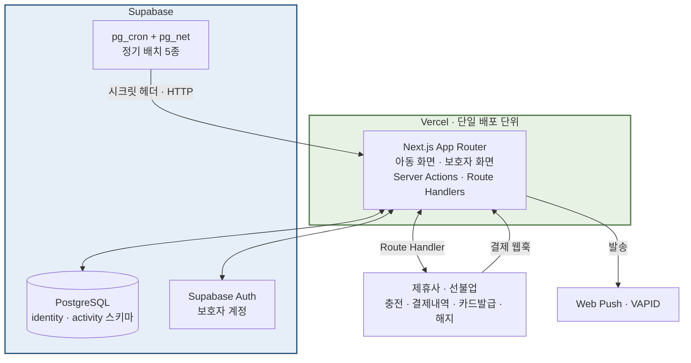
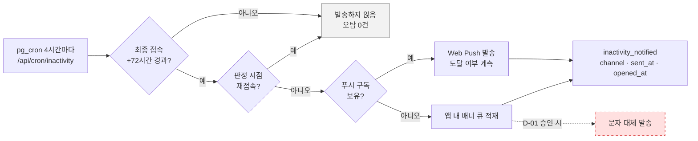

# [SRS 문서] 핀프렌즈 (기술제약 반영판)

# 소프트웨어 요구사항 명세서 (SRS) · 기술제약 반영판

**문서 ID:** SRS-FINFRIENDS-TEC-001

**개정 버전:** 1.0

**날짜:** 2026-08-26

**표준:** ISO/IEC/IEEE 29148:2018 — 확장 절은 근거 조항을 명시한다

**기준 문서:** SRS-FINFRIENDS-MVP-001 (`[SRS]FinFriends-SRS-v1_0.md` · 기술 중립판)

**문서 계열:** 기술 **반영판** — 중립판을 **대체하지 않는 병렬 문서**다. 요구사항 ID(REQ-FUNC · REQ-NF)는 두 문서가 공유한다.

---

## 1. 서론

### 1.1 목적

기술 중립판이 **무엇을 만들 것인가**를 정의한다면, 본 문서는 **주어진 스택으로 어떻게 성립시킬 것인가**를 정의한다.

구체적으로 세 가지를 한다.

1. 기술 제약 **C-TEC-001 ~ 007**을 **검증 가능한 요구사항 REQ-TEC-001 ~ 015**로 전환한다 — 위반하면 빌드가 실패하도록.
2. 제약을 정확히 적용했을 때 **중립판의 요구사항이 그대로는 성립하지 않는 지점**을 숨기지 않고 §8 대장에 전량 기록한다.
3. 태스크로 쪼갤 수 있도록 **구현 단위**(Server Action · Route Handler · RSC · Cron · 배치)를 확정한다.

### 1.2 범위

본 문서가 다루는 것과 다루지 않는 것을 먼저 못 박는다.

| | 내용 |
| --- | --- |
| **In** | 배포 토폴로지 · 모듈 경계 · 서버 진입점 · 데이터 접근 규약 · 배치 수단 · 제약 검사 게이트 · 제약이 깨뜨린 요구사항의 조정 근거 |
| **Out** | 요구사항 자체의 신설·삭제. **중립판에 없는 기능은 본 문서에서도 만들지 않는다** |
| **Out** | 화면 디자인·카피 — 중립판 §4.1과 프로토타입이 정의한다 |

### 1.3 두 문서의 관계

| 구분 | 기술 중립판 | 기술 반영판 (본 문서) |
| --- | --- | --- |
| 문서 ID | SRS-FINFRIENDS-MVP-001 | SRS-FINFRIENDS-TEC-001 |
| 답하는 질문 | 무엇을 만드는가 | 이 스택으로 어떻게 성립시키는가 |
| 요구사항 | REQ-FUNC-001~017 · REQ-NF-001~018 | 좌측을 **승계** + REQ-TEC-001~015 **신설** |
| 스택 언급 | **없음** | 전제 |
| 충돌 시 | 요구사항이 우선 — 조정하려면 §8에 근거를 남긴다 | |

> **읽는 순서** — 중립판 §4(요구사항) → 본 문서 §8(무엇이 깨졌나) → 본 문서 §4.3(무엇을 새로 지키나) → 본 문서 §6(어떻게 만드나).

### 1.4 정의 · 약어

중립판 §1.3을 승계하고, 본 문서에서만 쓰는 용어를 더한다.

| 용어 | 정의 |
| --- | --- |
| C-TEC | 발주 측이 지정한 **기술 스택 제약**. 협상 대상이 아니다 |
| REQ-TEC | C-TEC를 **검증 가능한 형태로 전환한 요구사항**. 검사 수단과 실패 조건을 갖는다 |
| ADR-T | 제약을 만족시키기 위한 **기술 결정 기록** |
| 서버 진입점 | 클라이언트 요청이 서버 코드에 닿는 지점 — Server Action · Route Handler · Cron 엔드포인트 |
| 제약 게이트 | 제약 위반을 **빌드 실패로 만드는 검사** — `prebuild` 단계에서 실행 |
| 공개 표면 | 모듈이 외부에 노출하는 유일한 진입 파일(`index.ts`). 그 밖의 경로로 import하면 게이트가 막는다 |

### 1.5 기술 제약 (C-TEC)

> 아래 7개 조항은 **설계 변수가 아니라 상수**다. 본 문서의 나머지 전부가 이 조항들에서 파생된다.

**시스템 내부 — 단일 통합 프레임워크**

| ID | 제약 |
| --- | --- |
| **C-TEC-001** | 모든 서비스는 **Next.js (App Router)** 기반의 단일 풀스택 프레임워크로 구현한다. 프론트엔드와 백엔드를 별도 분리하지 않는다 |
| **C-TEC-002** | 서버 측 로직(DB 접근 · API 호출 등)은 Next.js의 **Server Actions 또는 Route Handlers**를 사용하여 별도의 백엔드 서버 없이 구현한다 |
| **C-TEC-003** | 데이터베이스는 **Prisma + 로컬 Supabase**로 로컬 개발환경을 구성하고, 배포 시 **Supabase(PostgreSQL)** 를 사용하여 인프라 설정 복잡도를 최소화한다 |
| **C-TEC-004** | UI 및 스타일링은 **Tailwind CSS와 shadcn/ui**를 사용하여 일관된 디자인 코드를 생성하도록 강제한다 |

**시스템 외부 — 연결 및 AI 통합**

| ID | 제약 |
| --- | --- |
| **C-TEC-005** | (AI 호출 기능이 포함된 경우) AI 기능은 별도 자체 서버 구축 없이 **Vercel AI SDK**를 사용하여 Next.js에서 외부 API를 호출하는 형태로 구현한다 |
| **C-TEC-006** | 외부 AI 서비스 API 호출은 **Google Gemini API**를 기본으로 사용하며, **환경 변수 설정만으로 모델 교체가 가능하도록** SDK의 표준 인터페이스를 준수한다 |
| **C-TEC-007** | 배포 및 인프라 관리는 **Vercel** 플랫폼으로 단일화하며, **CI/CD 설정 없이 Git Push만으로** 배포를 자동화한다 |

#### 1.5.1 미해소 결정 3건 — 착수 전에 닫아야 한다

제약을 적용한 결과, **스택 밖의 외부 서비스 승인이 필요해진 항목**이 남았다. 기준안을 채택해 두되 미해소임을 명시한다(§8 · 중립판 §10.2 D7).

| ID | 미해소 항목 | 기준안 | 닫히지 않으면 |
| :-: | --- | --- | --- |
| **D-01** 🔴 | 미접속 알림의 **문자 대체 채널** — 외부 발송 사업자 1곳 승인 필요 | 웹 푸시 + 앱 내 배너로 개시하고 문자는 보류 | 중립판 **ACE-7.1(문자 대체 발송)이 미구현**으로 남고, AC-7.1의 「발송률 100%」를 **「발송 시도 100% · 도달률 별도 집계」로 재정의**해야 한다 |
| **D-02** 🟠 | 온콜 알림의 **아웃고잉 Webhook** 승인 | Slack Incoming Webhook 1개 | REQ-NF-017의 **30분 내 확인 · 2시간 에스컬레이션이 사람 눈에 의존**하게 된다. 규제 계층(S6)에는 권장하지 않는다 |
| **D-03** 🔴 | **보호자 본인인증** 수단 — 제휴사 위임 가능 여부 | 제휴사 카드 발급 플로우에 위임 | 위임이 불가하면 **고정 IP 화이트리스트를 요구하지 않는 사업자**로 한정해 직접 연동해야 한다(§8 X6) |

---

## 2. 이해관계자

중립판 §2를 승계한다. 본 문서에서 책임이 새로 생기는 역할만 적는다.

| 역할 | 본 문서에서의 책임 |
| --- | --- |
| 개발팀 리드 | REQ-TEC 승인 · 제약 게이트(§4.3) 통과 기준 판정 · ADR-T 승인 |
| 개발 엔지니어 | 모듈 경계 준수 · 서버 진입점 구현 · 게이트 스크립트 작성 |
| 개발 담당 | `prebuild` 게이트 운영 · 배포 파이프라인 관리 |
| 정책·법령 | REQ-TEC-006 · 009의 검사 항목이 규제 상수(중립판 §4.2)를 실제로 강제하는지 확인 |
| 사업 담당 | §1.5.1 D-01 · D-02 · D-03의 외부 승인 획득 |

---

## 3. 시스템 맥락 및 인터페이스

### 3.1 배포 토폴로지



> **이 그림이 말하는 것** — 배포 단위는 **Vercel의 Next.js 앱 하나**다. 중립판 §3의 내부 서비스 9종은 이 앱 **안의 모듈**이며 독립 프로세스가 아니다.
> **배치가 밖에서 안을 호출한다** — 스케줄러가 앱 안에 없으므로 `pg_cron`이 HTTP로 `/api/cron/*`를 깨운다(§6.3 · ADR-T02).

### 3.2 인터페이스 목록

중립판 §6.1을 승계하되, **본 스택에서의 구현 수단**을 확정한다.

| 경계 | 인터페이스 | 구현 수단 | 근거 |
| --- | --- | --- | --- |
| 제휴사 | 충전 요청 · 해지·환불 · 카드 발급 신청 | **Server Action** → 제휴사 REST 호출 | C-TEC-002 |
| 제휴사 | 결제 내역 조회 | **Route Handler**(`/api/partner/settlements`) + 주기 동기화 | C-TEC-002 |
| 제휴사 | **결제 웹훅 수신** | **Route Handler**(`/api/webhooks/payment`) · 서명 검증 · 멱등 | REQ-TEC-011 |
| 본인인증 | 보호자 실명 확인 | **제휴사 발급 플로우에 위임**(기준안) — §1.5.1 D-03 | ADR-T09 |
| 알림 | 미접속 · 승인 알림 | **Web Push(VAPID)** 발송을 Route Handler에서. 앱 내 배너 병행 | ADR-T07 |
| 배치 | 정기 작업 5종 | **`pg_cron` → `/api/cron/*`** | ADR-T02 |
| 계측 | 인앱 이벤트 10종 | **Server Action 내 동일 트랜잭션 적재** | REQ-TEC-012 |

### 3.3 모듈 구조

중립판 §3의 서비스 9종을 **디렉터리 경계**로 옮긴다. 경계는 선언이 아니라 **게이트가 강제**한다(REQ-TEC-002).

```
src/
  app/
    (guardian)/          보호자 화면 — 나무 · 숲 · 아이통장 · 소비내역 · 온보딩
    (child)/             아동 화면 — 홈 · 학습 · 내통장 · 계획카드 · 회고
    api/
      cron/*             배치 진입점 (pg_cron 전용 · 시크릿 헤더)
      webhooks/payment   제휴사 결제 웹훅
      partner/*          제휴사 조회 프록시
  modules/
    consent/             동의 게이트 · 계정 · 온보딩 단계 저장
    learning/            커리큘럼 · 퀴즈 · 출석 · 이수 판정
    practice/            실천 판정 · 미션 승인 · 소급 · 위시리스트
    star/                별 원장 · 멱등 · 정산 · 옷장 차감
    growth/              나무 단계 · 정체 판정 · 월간 숲 스냅샷 · 델타
    planspend/           계획 카드 · 결제 매칭 · 두 갈래 회고 · 문장 풀 · 업종 집계
    notify/              미접속 판정 · 채널 분기 · 발송 시간대
    events/              이벤트 적재 · 오프라인 보정 · 지표 배치
    partner/             제휴사 어댑터
  contracts/             모듈 간 공유 계약 (Zod DTO · ErrorCode · ActionResult)
  db/                    Prisma 클라이언트 · 스키마 · 마이그레이션
```

> **규약 ①** 모듈은 `index.ts`로만 노출한다. `modules/star/internal/...`를 다른 모듈이 import하면 게이트가 빌드를 실패시킨다.
> **규약 ②** Server Action은 **공개 엔드포인트와 동등**하다. 각 액션은 첫 줄에서 인가를 확인한다(§6.6).
> **규약 ③** 모듈 간 호출은 `contracts/`의 타입만 주고받는다. Prisma 모델을 모듈 밖으로 내보내지 않는다.

---

## 4. 구체적 요구사항

### 4.1 승계 — 중립판 요구사항 35건

중립판 §4.1(REQ-FUNC-001~017)과 §4.2(REQ-NF-001~018)를 **그대로 승계**한다. 본 문서는 그 요구사항을 다시 적지 않는다. 조정이 필요한 4건만 §4.2에 적는다.

### 4.2 조정된 요구사항 4건

> 제약을 정확히 적용하면 아래 4건은 **중립판 문구 그대로는 성립하지 않는다.** 조정 근거는 §8 대장에 있다.

| 요구사항 | 중립판 | 반영판 | 사유 |
| --- | --- | --- | --- |
| **REQ-FUNC-011** 미접속 알림 | 「보호자에게 **발송률 100%**」 | **발송 시도 100%** · 채널별 **도달률 별도 집계**. 문자 대체는 D-01 승인 시 개시 | 웹 푸시는 iOS에서 **홈 화면 설치(PWA)한 보호자에게만** 도달한다. 도달을 100%로 약속할 수 없다 |
| **REQ-FUNC-005** 아바타 | 「**사전 제작 3D** 아바타」 | **Lottie 기반 2.5D** 아바타 — 회전 대신 상태 전환 애니메이션 | Tailwind·shadcn/ui는 3D 렌더러가 아니다. 3D 유지 시 별도 런타임이 필요하고 D4 제작량·B4 선불 비용이 함께 커진다 |
| **REQ-NF-003** 오프라인 재연결 | 「재연결 후 **≤ 60초** 반영」 | 동일하되 **PWA(Service Worker + IndexedDB 큐)를 전제**로 성립한다. PWA 미승인 시 **온라인 전용으로 축소**하고 ACE-2.1을 폐기 | 서버 렌더 웹앱에는 오프라인 쓰기 큐가 없다 |
| **REQ-NF-017** 온콜 알림 | 「1건 이상 시 **즉시 알림** · 30분 내 확인」 | Webhook 승인(D-02) 전까지 **앱 내 운영 화면 + 배치 요약**으로 개시. 규제 계층(S6)만 예외적으로 즉시 채널 확보를 선결 조건으로 둔다 | 앱 밖으로 나가는 알림 채널이 스택에 없다 |

### 4.3 기술 요구사항 (REQ-TEC)

> C-TEC를 **검사 가능한 문장**으로 바꾼 것이다. 열 스키마는 중립판 §4와 동일하게 9열을 쓴다.

| ID | 제목 | 출처 | 우선순위 | 유형 | 검증 방식 | 인수 기준 | 상태 | 담당자 |
| --- | --- | --- | --- | --- | --- | --- | --- | --- |
| **REQ-TEC-001** | 단일 배포 단위 | C-TEC-001 | Must Have | Design Constraint | 저장소 구조 검토 · 배포 목록 확인 | 저장소에 **Next.js 앱 1개**만 존재하고 독립 서버 프로세스가 **0개**여야 한다. 별도 백엔드 저장소·서비스를 만들지 않는다 | Proposed | 개발팀 리드 |
| **REQ-TEC-002** | 모듈 공개 표면 강제 | C-TEC-001 | Must Have | Maintainability | 정적 검사(`prebuild`) — import 경로 규칙 | `src/modules/<m>/index.ts` **외 경로로의 교차 import 0건**. 위반 시 **빌드 실패** | Proposed | 개발 엔지니어 |
| **REQ-TEC-003** | 서버 진입점 제한 | C-TEC-002 | Must Have | Design Constraint | 코드 리뷰 + 정적 검사 | 서버 로직 진입점은 **Server Action · Route Handler · Cron 엔드포인트 3종뿐**이다. 그 밖의 상시 프로세스·워커를 두지 않는다 | Proposed | 개발 엔지니어 |
| **REQ-TEC-004** | DB 접근 단일화 | C-TEC-003 | Must Have | Design Constraint | 정적 검사 — raw 쿼리 심볼 검출 | 애플리케이션 코드의 DB 접근은 **Prisma 클라이언트만** 사용한다. raw SQL은 **마이그레이션과 파티션 관리에 한해** 허용하고 그 외 검출 시 **빌드 실패** | Proposed | 개발 엔지니어 |
| **REQ-TEC-005** | 커넥션 경로 분리 | C-TEC-003 | Must Have | Reliability | 환경 변수 검사 + 마이그레이션 리허설 | 애플리케이션은 **풀러(트랜잭션 모드)**, 마이그레이션은 **직결 포트**를 쓴다. `DATABASE_URL` / `DIRECT_URL` 이 서로 다른 값이어야 한다 | Proposed | 개발 담당 |
| **REQ-TEC-006** | 스키마 분리와 접근 제어 | C-TEC-003 · REQ-NF-009 | Must Have | Compliance | 스키마 스캔 + 쿼리 감사 로그(S3) | 아동 식별정보는 `identity` 스키마, 학습·실천 데이터는 `activity` 스키마에 둔다. **RLS를 켜고**, 두 스키마를 **결합 조회한 쿼리 0건**이어야 한다 | Proposed | 정책·법령 |
| **REQ-TEC-007** | UI 라이브러리 제한 | C-TEC-004 | Must Have | Design Constraint | 의존성 검사(`prebuild`) | UI는 **Tailwind CSS + shadcn/ui**로만 구성한다. 다른 UI 프레임워크·컴포넌트 킷 의존성 **0건**. 아바타 렌더러(Lottie)는 **명시적 예외 1건**으로 등록한다 | Proposed | 개발 엔지니어 |
| **REQ-TEC-008** | 금지 코드 경로 게이트 | REQ-NF-010 · S4 | Must Have | Compliance | 정적 분석(`prebuild`) | **별↔저금통 전환 함수·API 심볼 0건.** 검출 시 **빌드 실패**. 기능 플래그로 막는 방식은 허용하지 않는다 | Proposed | 개발 담당 |
| **REQ-TEC-009** | 금지 스키마 필드 게이트 | REQ-NF-009 · S1 · S2 | Must Have | Compliance | Prisma 스키마 스캔(`prebuild`) + 일 1회 DB 스캔 | **위치 좌표 필드 0건 · 얼굴 이미지 필드 0건.** 검출 시 **빌드 실패** | Proposed | 정책·법령 |
| **REQ-TEC-010** | 배치 수단 고정 | C-TEC-001 · 007 | Must Have | Reliability | 스케줄 등록 확인 + 호출 로그 | 정기 작업은 **`pg_cron` → `pg_net` → `/api/cron/*`** 경로로만 실행한다. 엔드포인트는 **시크릿 헤더 없이는 200을 반환하지 않는다**. 최소 주기 **6시간 이하**를 만족해야 한다 | Proposed | 개발 담당 |
| **REQ-TEC-011** | 쓰기 진입점 멱등 | REQ-NF-003 · 006 | Must Have | Reliability | 단위 테스트 + 유니크 제약 확인 | ⭐ 증감·실천 인정·결제 매칭의 모든 쓰기는 **`idempotency_key` 유니크 제약**을 갖는다. 동일 키 재요청 시 **중복 기입 0건** | Proposed | 개발 엔지니어 |
| **REQ-TEC-012** | 이벤트 적재 규약 | 중립판 §6.1 | Must Have | Design Constraint | 스키마 검사 + 적재 테스트 | 이벤트 10종은 **상태 변경과 동일 트랜잭션**에서 적재한다. `client_ts`·`server_ts`·`idempotency_key`가 **필수 컬럼**이며, 주차 귀속은 `client_ts` 기준이다 | Proposed | 개발 엔지니어 |
| **REQ-TEC-013** | 환경 변수 단일 출처 | C-TEC-006 · 007 | Must Have | Maintainability | 정적 검사 + 배포 환경 대조 | 시크릿·외부 엔드포인트·모델명은 **환경 변수로만** 주입한다. 코드 내 하드코딩 **0건**. 로컬·프리뷰·운영 3환경의 키 집합이 **동일**해야 한다 | Proposed | 개발 담당 |
| **REQ-TEC-014** | 배포 경로 단일화 | C-TEC-007 | Must Have | Operability | 배포 이력 검토 | 배포는 **Git Push → Vercel** 경로 하나뿐이다. 외부 CI 파이프라인을 두지 않으며, 모든 게이트는 **`prebuild` 단계**에서 실행돼 **실패 시 배포가 차단**된다 | Proposed | 개발 담당 |
| **REQ-TEC-015** | AI 호출 규약 (유보) | C-TEC-005 · 006 | Could Have | Design Constraint | 도입 시 코드 리뷰 · 모델 교체 테스트 | **현 판본의 AI 호출은 0건**이다(§8 C). 도입 시 **Vercel AI SDK 표준 인터페이스**로만 호출하고 **환경 변수 교체만으로 모델을 바꿀 수 있어야** 하며, 아동 노출 생성물은 **REQ-NF-014 문구 검수를 생성 파이프라인에 적용**한다 | Deferred | 개발팀 리드 |

**집계** — REQ-TEC **15건** (Must 14 · Could 1). 이 중 **빌드를 실패시키는 게이트 5건**: REQ-TEC-002 · 004 · 007 · 008 · 009.

---

## 5. 추적성 매트릭스 (REQ-TEC)

중립판 §5의 요구사항 추적성에 더해, 기술 요구사항의 **검사 수단**을 추적한다.

| REQ-TEC | 강제하는 요구사항 | 구현 위치 | 검사 수단 | 실패 시 |
| --- | --- | --- | --- | --- |
| REQ-TEC-001 | — (C-TEC-001) | 저장소 루트 | 구조 검토 | 리뷰 반려 |
| REQ-TEC-002 | 유지보수성 | `tools/check-boundaries` | `prebuild` 정적 검사 | **빌드 실패** |
| REQ-TEC-003 | — (C-TEC-002) | `src/app/**` | 코드 리뷰 | 리뷰 반려 |
| REQ-TEC-004 | — (C-TEC-003) | `src/db` | `prebuild` 심볼 검출 | **빌드 실패** |
| REQ-TEC-005 | REQ-NF-006 | 환경 변수 | 배포 전 대조 | 배포 차단 |
| REQ-TEC-006 | **REQ-NF-009** | Prisma 스키마 · RLS 정책 | 스키마 스캔 + 쿼리 감사(S3) | 즉시 알림 |
| REQ-TEC-007 | — (C-TEC-004) | `package.json` | `prebuild` 의존성 검사 | **빌드 실패** |
| REQ-TEC-008 | **REQ-NF-010** (S4) | `tools/check-forbidden` | `prebuild` 정적 분석 | **빌드 실패** |
| REQ-TEC-009 | **REQ-NF-009** (S1 · S2) | `tools/check-schema` | `prebuild` + 일 1회 스캔 | **빌드 실패** |
| REQ-TEC-010 | **REQ-FUNC-011** · REQ-NF-006 | `pg_cron` · `/api/cron/*` | 호출 로그 · 지연 계측 | 알림 |
| REQ-TEC-011 | **REQ-NF-003 · 006** | `modules/star` · `planspend` | 단위 테스트 · 유니크 제약 | 테스트 실패 |
| REQ-TEC-012 | 중립판 §9.1 WPA | `modules/events` | 적재 테스트 | 테스트 실패 |
| REQ-TEC-013 | — (C-TEC-006 · 007) | `.env` 스키마 | 배포 전 대조 | 배포 차단 |
| REQ-TEC-014 | — (C-TEC-007) | `package.json` `prebuild` | 배포 이력 | — |
| REQ-TEC-015 | — (C-TEC-005 · 006) | *(미사용)* | — | — |

---

## 6. 구현 규약

### 6.1 서버 진입점 목록

> 태스크 분해의 기준이 되는 표다. **여기에 없는 진입점은 만들지 않는다.**

| # | 진입점 | 종류 | 모듈 | 담당 요구사항 |
| :-: | --- | :-: | --- | --- |
| 1 | `completeConsent` | Server Action | consent | REQ-FUNC-007 · REQ-NF-008 |
| 2 | `saveOnboardingStep` | Server Action | consent | REQ-FUNC-007 |
| 3 | `completeLearning` · `submitQuiz` · `checkAttendance` | Server Action | learning | REQ-FUNC-003 · 004 |
| 4 | `createMission` · `approveMission` · `rejectMission` · `bulkApprove` | Server Action | practice | REQ-FUNC-002 · 010 |
| 5 | `createPlanCard` | Server Action | planspend | REQ-FUNC-008 |
| 6 | `confirmRetro` | Server Action | planspend | REQ-FUNC-008 |
| 7 | `upsertWishlist` · `reorderWishlist` | Server Action | practice | REQ-FUNC-012 |
| 8 | `purchaseWardrobeItem` | Server Action | star | REQ-FUNC-005 |
| 9 | `requestTopUp` · `requestCard` · `terminateCard` | Server Action | partner | REQ-FUNC-007 · REQ-NF-013 |
| 10 | `savePushSubscription` · `saveNotifyWindow` | Server Action | notify | REQ-FUNC-011 |
| 11 | 성장 나무 · 월간 숲 · 소비 내역 조회 | **RSC (Read)** | growth · planspend | REQ-FUNC-001 · 009 · 013 |
| 12 | `/api/webhooks/payment` | Route Handler | partner · planspend | REQ-FUNC-008 · REQ-TEC-011 |
| 13 | `/api/partner/settlements` | Route Handler | partner | REQ-FUNC-013 |
| 14 | `/api/cron/inactivity` | Cron | notify | REQ-FUNC-011 |
| 15 | `/api/cron/star-reconcile` | Cron | star | REQ-NF-006 |
| 16 | `/api/cron/wpa-batch` | Cron | events | 중립판 §9.1 |
| 17 | `/api/cron/compliance-scan` | Cron | events | S1 · S3 · S5 |
| 18 | `/api/cron/sentence-pool` | Cron | planspend | ACE-5.1 |
| 19 | `/api/cron/cycle-reset` | Cron | growth | 중립판 §6.2.1 주기 초기화 |

### 6.2 데이터 모델 — Prisma 배치

중립판 §6.4의 테이블 11종을 **두 스키마로 나눈다**(REQ-TEC-006).

| 스키마 | 테이블 | 근거 |
| --- | --- | --- |
| `identity` | `guardian_accounts` · `child_accounts` | 아동 식별정보 |
| `activity` | `learning_progress` · `practice_credits` · `star_ledger` · `tree_states` · `forest_snapshots` · `plan_cards` · `spending_records` · `wishlists` · `app_events` | 학습·실천 데이터 |

- **결합 조회 금지** — 두 스키마를 조인하는 쿼리는 감사 로그(S3)에서 검출한다. 화면이 아동 이름을 필요로 하면 **애플리케이션 계층에서 합친다.**
- **`app_events` 파티셔닝** — 주차 단위 선언적 파티셔닝. Prisma가 파티션을 관리하지 못하므로 **생성·회전을 raw SQL 마이그레이션**으로 두고 `/api/cron/*`에 회전 작업을 등록한다(REQ-TEC-004 예외).
- **금지 필드** — 좌표 · 얼굴 이미지 · 별↔저금통 전환 필드. `prebuild` 스캔이 막는다(REQ-TEC-009).

### 6.3 배치 규약

| 작업 | 주기 | 엔드포인트 | 근거 |
| --- | :-: | --- | --- |
| 72시간 미접속 판정 | **4시간** | `/api/cron/inactivity` | 발송 지연 p95 ≤ 6시간을 만족하려면 6시간보다 짧아야 한다 |
| 별 원장 정산 | 일 1회 | `/api/cron/star-reconcile` | REQ-NF-006 |
| WPA 집계 | 주 1회 (ISO 주 마감 D+1) | `/api/cron/wpa-batch` | 중립판 §9.1 |
| 규제·보안 스캔 | 일 1회 | `/api/cron/compliance-scan` | S1 · S3 · S5 |
| 회고 문장 풀 잔여 | 일 1회 | `/api/cron/sentence-pool` | ACE-5.1 |
| 나무 주기 초기화 | 일 1회 | `/api/cron/cycle-reset` | 영역별 주기 상이 |

> **인증** — 모든 Cron 엔드포인트는 `X-Cron-Secret` 헤더를 검증한다. 헤더가 없거나 불일치하면 **404를 반환**한다(존재 자체를 노출하지 않는다).
> **멱등** — 배치는 재실행될 수 있다. 실행 단위마다 `run_key`를 두고 중복 실행을 무해하게 만든다(REQ-TEC-011).

### 6.4 환경 변수

| 키 | 용도 | 비고 |
| --- | --- | --- |
| `DATABASE_URL` | 앱 커넥션 (풀러 · 트랜잭션 모드) | REQ-TEC-005 |
| `DIRECT_URL` | 마이그레이션 직결 | REQ-TEC-005 |
| `SUPABASE_URL` · `SUPABASE_ANON_KEY` · `SUPABASE_SERVICE_ROLE_KEY` | Auth · 서버 접근 | 서비스 롤 키는 서버 전용 |
| `CRON_SECRET` | Cron 엔드포인트 인증 | REQ-TEC-010 |
| `VAPID_PUBLIC_KEY` · `VAPID_PRIVATE_KEY` | 웹 푸시 | ADR-T07 |
| `PARTNER_API_BASE` · `PARTNER_API_KEY` · `PARTNER_WEBHOOK_SECRET` | 제휴사 연동 | 웹훅 서명 검증 |
| `OPS_WEBHOOK_URL` | 온콜 알림 | **D-02 승인 시** |
| `AI_MODEL` · `GOOGLE_GENERATIVE_AI_API_KEY` | AI 모델 교체 | **미사용** · REQ-TEC-015 |

### 6.5 알림 채널 구현



> **점선은 미해소다** — 문자 대체는 D-01 승인 전까지 **구현하지 않는다.** 중립판 ACE-7.1이 요구하는 경로이므로, 미승인 상태에서는 **미구현 항목으로 표시**한다.

### 6.6 접근 제어

| 대상 | 규약 |
| --- | --- |
| Server Action | **첫 줄에서 인가 확인.** 공개 엔드포인트와 동등하게 취급한다 |
| 아동 세션 | 독립 로그인 없음. **보호자 세션 하위 프로필**로만 성립한다(REQ-NF-011 · S5) |
| 동의 게이트 | 아동 화면 진입 전 서버에서 동의 상태를 확인한다. **클라이언트 판정 금지**(REQ-NF-008) |
| 서비스 롤 키 | 서버 코드에서만 사용. 클라이언트 번들 반입 시 **빌드 실패**(REQ-TEC-013) |

---

## 7. 향후 개선 사항

- **D-01 · D-02 · D-03 해소** — 셋 다 외부 승인이며, 닫히는 순간 §4.2의 조정을 되돌릴 수 있다
- **REQ-TEC-015 개시** — AI 도입 시 회고 문장 생성이 첫 후보다. 문구 검수를 생성 파이프라인에 편입하는 것이 선결 조건이다
- **PWA 확대** — REQ-NF-003의 오프라인 큐가 승인되면 iOS 웹 푸시 도달률도 함께 오른다
- **성능 실측 후 SLO 확정** — 서버리스 콜드 스타트 발생률을 REQ-NF-001과 함께 관측한다(중립판 §7.4)

---

# 확장 절

> §8~§9는 예시 SRS 양식에 대응 절이 없는 내용을 ISO/IEC/IEEE 29148:2018의 해당 조항 구성에 따라 확장한 것이다.

---

## 8. 제약 충돌 해소 대장

> **근거** — ISO/IEC/IEEE 29148:2018 **§9.6.7 Limitations**.
> 제약을 적용한 결과 **요구사항이 그대로는 성립하지 않는 지점**을 전량 기록한다. 조정한 것과 조정하지 못한 것을 구분한다.

### (A) 스택 밖 6건 — 채택안과 미해소 여부

| # | 요구사항 | 벗어나는 지점 | 저촉 | **채택안** | 미해소 |
| :-: | --- | --- | :-: | --- | :-: |
| **X1** | REQ-FUNC-011 | 알림 수신자는 보호자라 아동 기기와 무관하나, 웹 푸시는 **iOS에서 PWA 설치 + Safari 16.4 이상**을 요구해 미설치 보호자에게 도달하지 않는다. ACE-7.1의 **문자 대체는 외부 발송 사업자**가 필요하다 | C-TEC-001 · 007 | **Web Push(VAPID) + 앱 내 배너**로 개시. 지표를 **발송 시도 100% · 도달률 별도 집계**로 재정의(§4.2) | 🔴 **D-01** 문자 채널 |
| **X2** | REQ-FUNC-005 | Tailwind · shadcn/ui는 **3D 렌더러가 아니다** | C-TEC-004 | **Lottie 2.5D로 사양 변경** — D4 제작량·B4 선불 비용이 함께 내려간다. Lottie는 REQ-TEC-007의 **명시적 예외 1건**으로 등록 | 해소 |
| **X3** | REQ-NF-003 · ACE-2.1 | 서버 렌더 웹앱에 **오프라인 쓰기 큐가 없다** | C-TEC-001 | **Serwist(Service Worker) + Dexie(IndexedDB) 큐.** 서버의 `idempotency_key` 유니크 제약이 중복 지급 0건을 보증(REQ-TEC-011) | 해소 |
| **X4** | 정기 배치 5종 | **Next.js에 스케줄러가 없고**, Vercel Cron 무료 요금제는 일 1회라 발송 지연 p95 ≤ 6시간을 못 맞춘다 | C-TEC-001 · 007 | **Supabase `pg_cron` + `pg_net`** — C-TEC-003 범위 안이라 **스택을 넓히지 않는다**. 배치 로직은 Next.js에 남는다 | 해소 |
| **X5** | REQ-NF-017 | 「즉시 알림 · 30분 내 확인 · 2시간 에스컬레이션」에 **앱 밖 채널**이 필요하다 | C-TEC-001 | **아웃고잉 Webhook 1개**(본문에 아동 식별정보 미포함). 미승인 시 앱 내 운영 화면으로 개시 | 🟠 **D-02** |
| **X6** | REQ-FUNC-007 | 국내 본인인증 사업자 연동이 필요하고 일부는 **고정 IP 화이트리스트**를 요구해 서버리스와 맞지 않는다 | C-TEC-001 · 007 | **제휴사 카드 발급 플로우에 위임** — 중복 본인확인이 사라진다. 불가 시 **브라우저 SDK + 서버 토큰 검증** 방식으로 한정 | 🔴 **D-03** |

### (B) 스택 안 7건 — 구현 방식 확정

| # | 쟁점 | 확정한 방식 | 반영 위치 |
| :-: | --- | --- | --- |
| **Y1** | 내부 서비스 9종이 배포 단위로 오독될 수 있다 | **모듈 경계**로만 읽는다. route group + `src/modules/*` | §3.3 · REQ-TEC-002 |
| **Y2** | 단일 DB에서 「분리 저장」 보증 | **스키마 분리(`identity`/`activity`) + RLS** · Prisma multi-schema | §6.2 · REQ-TEC-006 |
| **Y3** | `app_events` 주차 파티셔닝 | Prisma가 파티션을 관리하지 못하므로 **raw SQL 마이그레이션** + 회전 배치 | §6.2 · REQ-TEC-004 예외 |
| **Y4** | S4 CI 게이트가 「CI/CD 없이」와 충돌해 보인다 | **충돌하지 않는다** — `prebuild` 스크립트가 **Vercel 빌드를 실패**시킨다 | REQ-TEC-008 · 014 · ADR-T08 |
| **Y5** | 제휴사 호출·웹훅의 허용 범위 | **C-TEC-002 Route Handlers 범위.** C-TEC-005 · 006은 **AI에만** 적용된다 | §3.2 · §6.1 |
| **Y6** | 별 원장 정합성 0%를 서버리스에서 보증 | **단일 트랜잭션 + `idempotency_key` 유니크 제약**, 풀러는 트랜잭션 모드, 마이그레이션은 직결 | REQ-TEC-005 · 011 |
| **Y7** | 렌더 p95 상한을 **콜드 스타트**가 잠식 | **서버 컴포넌트 + 캐시** 기본값, 콜드 스타트 발생률을 관측 항목에 추가 | §7 · REQ-NF-001 |

### (C) 적용 대상이 없는 조항 — C-TEC-005 · 006

현 판본의 요구사항 35건 중 **AI 호출을 요구하는 항목은 0건**이다. 회고 문장은 **사전 작성된 문장 풀에서 비복원 추출**하고(중립판 §6.3 규칙 11), 아바타는 **사전 제작 에셋**이다.

두 조항은 REQ-TEC-015로 **유보 상태로 등록**만 해 둔다. 도입 시점에 비로소 적용된다.

### (D) 요약

| 구분 | 건수 |
| --- | :-: |
| 조정 없이 성립 | 25 |
| **조정 후 성립** | 4 (§4.2) |
| **미해소** | **3** (D-01 · D-02 · D-03) |
| 적용 대상 없음 | 2 조항 (C-TEC-005 · 006) |

---

## 9. 설계 결정 근거 (ADR-T)

> **근거** — ISO/IEC/IEEE 29148:2018 **§9.6.16 Design constraints**.
> 중립판 §11의 ADR-001~008이 **제품 결정**이라면, 여기의 ADR-T는 **제약을 만족시키기 위한 기술 결정**이다.

| ADR-T | 결정 | 기각한 대안 | 대가 | 관련 |
| :-: | --- | --- | --- | --- |
| **T01** | 모듈 경계를 **디렉터리 + 공개 표면 + 정적 검사**로 강제한다 | 문서상 규약만 두기 — 규약은 지켜지지 않고, 단일 앱에서는 경계가 가장 먼저 무너진다 | 초기 스캐폴딩 비용과 import 규칙 학습이 필요하다 | REQ-TEC-002 |
| **T02** | 배치를 **`pg_cron`** 으로 돌린다 | ① Vercel Cron — 무료 요금제 **일 1회**라 6시간 요건 미달 ② 외부 스케줄러 — 스택 확장 | 스케줄이 **DB에 있고 코드에 없다.** 스케줄 변경이 마이그레이션이 된다 | REQ-TEC-010 · X4 |
| **T03** | 아동 식별정보를 **스키마 분리 + RLS**로 격리한다 | 컬럼 단위 암호화 — 결합 조회 자체를 막지 못해 REQ-NF-009의 「결합 조회 0건」을 보증할 수 없다 | 화면이 이름을 필요로 할 때 **애플리케이션 계층에서 합쳐야** 한다 | REQ-TEC-006 · Y2 |
| **T04** | 앱과 마이그레이션의 **커넥션 경로를 분리**한다 | 단일 URL — 풀러의 트랜잭션 모드에서 마이그레이션이 깨진다 | 환경 변수가 하나 늘고, 두 값이 어긋나면 배포가 실패한다 | REQ-TEC-005 · Y6 |
| **T05** | 아바타를 **Lottie 2.5D**로 만든다 | 3D 유지 — 렌더러·에셋 파이프라인·용량이 모두 늘고 저사양 기기에서 불안정하다 | **회전이 사라진다.** v13의 "3D · 회전" 사양을 바꾸는 결정이라 D4와 함께 승인이 필요하다 | REQ-FUNC-005 · X2 |
| **T06** | 오프라인 큐를 **Serwist + Dexie**로 얹는다 | 온라인 전용 축소 — ACE-2.1과 `client_ts` 주차 귀속이 함께 무의미해진다 | PWA 구성이 늘고, 서비스 워커 캐시 무효화를 관리해야 한다 | REQ-NF-003 · X3 |
| **T07** | 알림을 **Web Push + 앱 내 배너**로 개시한다 | 문자 우선 — 외부 사업자 승인이 착수를 막는다 | **도달률 100%를 약속할 수 없다.** 지표 재정의가 선행된다(§4.2) | REQ-FUNC-011 · X1 |
| **T08** | 제약 검사를 **`prebuild`** 에 넣는다 | 외부 CI — C-TEC-007 위반 | 로컬에서도 빌드가 느려진다. 검사 스크립트를 빠르게 유지해야 한다 | REQ-TEC-014 · Y4 |
| **T09** | 본인인증을 **제휴사에 위임**한다 | 직접 연동 — 고정 IP 요구 사업자는 서버리스와 맞지 않는다 | **제휴 계약에 종속**된다. 위임 불가 시 D-03이 되살아난다 | REQ-FUNC-007 · X6 |
| **T10** | AI 조항을 **유보 등록**만 한다 | 선제 도입 — 요구사항에 없는 기능을 만드는 것이라 범위 위반이다 | 도입 시점에 설계를 다시 해야 한다 | REQ-TEC-015 · (C) |

---

## 10. 검증 게이트

중립판 §9.5의 릴리즈 게이트에 **기술 게이트**를 더한다.

| 단계 | 기술 게이트 |
| :-: | --- |
| **모든 커밋** | `prebuild` 5종 통과 — 모듈 경계(002) · raw 쿼리(004) · UI 의존성(007) · 금지 심볼(008) · 금지 필드(009) |
| **α 내부** | Cron 6종 등록·호출 성공 · 웹훅 서명 검증 · 멱등 재요청 중복 0건 · 환경 변수 3환경 일치 |
| **β 클로즈드** | 웹 푸시 도달률 계측 개시 · 스키마 결합 조회 0건(S3) · 콜드 스타트 발생률 관측 |
| **일반 공개** | 미해소 3건(D-01 · D-02 · D-03) **처리 완료 또는 명시적 유예 결재** |

---

*작성자: 서비스분석 혜원 · 검토자: 개발팀 리드 · 승인자: 제품기획 유림*
*기준 문서 SRS-FINFRIENDS-MVP-001 v1.0 · 기술 제약 C-TEC-001~007*
